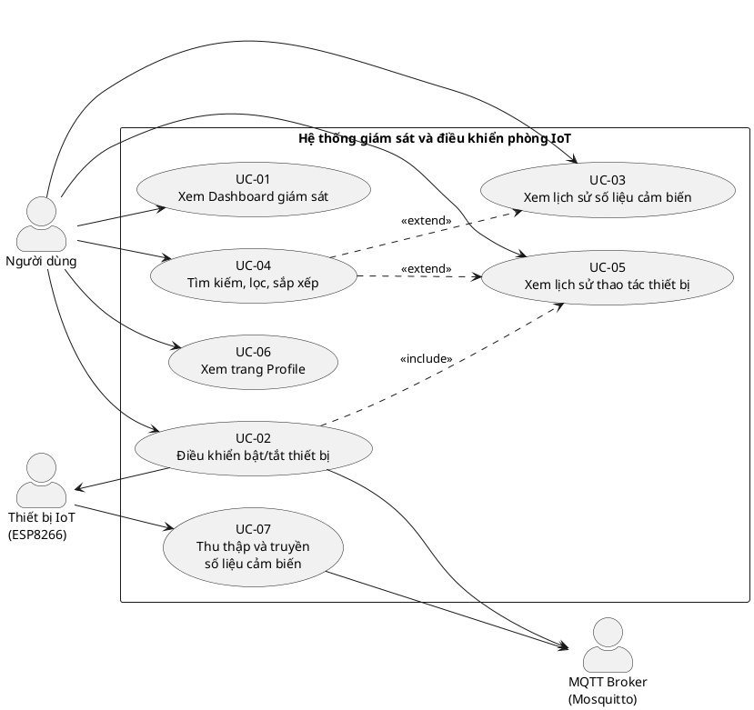
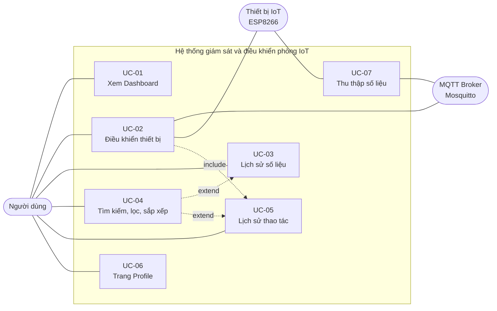

# SƠ ĐỒ VÀ ĐẶC TẢ USE CASE
## Hệ thống giám sát và điều khiển môi trường phòng dựa trên IoT

| | |
|---|---|
| **Phiên bản** | 2.0 |
| **Ngày** | 20/08/2026 |
| **Tài liệu liên quan** | `01-SRS.md` (§3) v0.5, `04-Database.md` v2.0, `03-Sequence.md`, `05-API.md` (§4.3) |
| **Vị trí trong báo cáo** | Chương 3 — Thiết kế chi tiết |

---

## MỤC LỤC

1. [Giới thiệu](#1-giới-thiệu)
2. [Tác nhân](#2-tác-nhân-actors)
3. [Sơ đồ Use Case](#3-sơ-đồ-use-case)
4. [Quan hệ giữa các Use Case](#4-quan-hệ-giữa-các-use-case)
5. [Đặc tả chi tiết](#5-đặc-tả-chi-tiết-use-case)
6. [Quy tắc nghiệp vụ](#6-quy-tắc-nghiệp-vụ-business-rules)
7. [Ma trận truy vết](#7-ma-trận-truy-vết-uc--fr)

---

## 1. GIỚI THIỆU

### 1.1 Mục đích
Tài liệu này trình bày mô hình Use Case của hệ thống: sơ đồ tổng thể, quan hệ giữa các use case, và đặc tả chi tiết từng use case theo mẫu chuẩn. Đây là đầu vào trực tiếp cho:
- `03-Sequence.md` — mỗi luồng chính tương ứng một sequence diagram.
- `05-API.md` — mỗi bước tương tác FE ↔ BE tương ứng một endpoint.
- Thiết kế Figma — mỗi use case tương ứng một hoặc một phần màn hình.

### 1.2 Quan hệ với SRS
`01-SRS.md` §3.2 mô tả use case ở **mức yêu cầu** (đủ để thống nhất phạm vi). Tài liệu này mở rộng ở **mức thiết kế**, bổ sung: tác nhân phụ, điều kiện kích hoạt, tần suất, luồng ngoại lệ có mã định danh, quy tắc nghiệp vụ, dữ liệu vào/ra.

Khi hai tài liệu mâu thuẫn, **tài liệu này là bản có hiệu lực** đối với chi tiết thiết kế; `01-SRS.md` là bản có hiệu lực đối với phạm vi và yêu cầu.

---

## 2. TÁC NHÂN (ACTORS)

| Tác nhân | Loại | Mô tả | Use case tham gia |
|---|---|---|---|
| **Người dùng** | Chính, con người | Người sử dụng phòng. Theo dõi số liệu môi trường và bật/tắt thiết bị qua giao diện web. Không cần kiến thức kỹ thuật. | UC-01 → UC-06 |
| **Thiết bị IoT (ESP8266)** | Chính (với UC-07), phụ | Vi điều khiển gắn cảm biến và thiết bị đầu ra. Tự động gửi số liệu theo chu kỳ và thực thi lệnh điều khiển. | UC-02, UC-07 |
| **MQTT Broker (Mosquitto)** | Phụ, hệ thống | Trung gian chuyển tiếp message giữa thiết bị IoT và backend. Không khởi tạo hành vi nghiệp vụ. | UC-02, UC-07 |

**Ghi chú về ranh giới hệ thống:** Backend, Frontend, PostgreSQL và Redis nằm **bên trong** ranh giới hệ thống nên không phải tác nhân. MQTT Broker được coi là tác nhân phụ vì nó là phần mềm bên thứ ba, cài đặt và vận hành độc lập.

---

## 3. SƠ ĐỒ USE CASE

### 3.1 Mã nguồn PlantUML *(dùng bản này để xuất ảnh chèn báo cáo)*

**Cách xuất ảnh:**
- Trực tuyến: dán mã vào <https://www.plantuml.com/plantuml/uml> → tải PNG/SVG.
- VS Code: cài extension *PlantUML* → `Alt+D` để xem trước → chuột phải để xuất.
- Lưu ảnh vào `docs/img/usecase-diagram.png` để chèn vào báo cáo.

### 3.2 Bản Mermaid *(để xem nhanh trên GitHub/Markdown)*

---

## 4. QUAN HỆ GIỮA CÁC USE CASE

| Quan hệ | Từ | Đến | Giải thích |
|---|---|---|---|
| `«extend»` | UC-04 | UC-03 | Người dùng **có thể** tìm kiếm/lọc/sắp xếp khi đang xem lịch sử số liệu. UC-03 vẫn hoàn thành trọn vẹn nếu người dùng không thao tác gì. |
| `«extend»` | UC-04 | UC-05 | Tương tự với bảng lịch sử thao tác. |
| `«include»` | UC-02 | UC-05 | Mỗi lần điều khiển **luôn luôn** sinh một bản ghi lịch sử thao tác — đây là hành vi bắt buộc, không phải tùy chọn. |

### 4.1 Vì sao UC-04 là `«extend»` chứ không phải `«include»`

Đây là điểm dễ nhầm và có thể bị hỏi khi vấn đáp:

- **Phân trang** là một phần của luồng chính UC-03/UC-05 — hệ thống luôn trả về dữ liệu đã phân trang (mặc định 10 bản ghi/trang, xem BR-08). Vì vậy phân trang **nằm trong luồng cơ sở**, không tách thành quan hệ riêng.
- **Tìm kiếm, lọc, sắp xếp** là hành vi tùy chọn do người dùng chủ động kích hoạt. Luồng cơ sở kết thúc thành công dù người dùng không dùng tới. Đây đúng định nghĩa của `«extend»`.

**Điểm mở rộng (extension point)** của UC-03 và UC-05: *"sau khi hệ thống hiển thị bảng dữ liệu"*.

---

## 5. ĐẶC TẢ CHI TIẾT USE CASE

---

### UC-01 — Xem Dashboard giám sát

| Thuộc tính | Nội dung |
|---|---|
| **Mã / Tên** | UC-01 — Xem Dashboard giám sát |
| **Tác nhân chính** | Người dùng |
| **Tác nhân phụ** | — |
| **Mô tả** | Người dùng theo dõi số liệu nhiệt độ, độ ẩm, ánh sáng hiện tại của phòng và diễn biến của chúng theo thời gian |
| **Độ ưu tiên** | Cao |
| **Tần suất** | Rất cao — là màn hình mặc định khi mở ứng dụng |
| **Kích hoạt** | Người dùng truy cập đường dẫn gốc `/` hoặc chọn mục "Dashboard" trên thanh điều hướng |
| **Tiền điều kiện** | Backend (tiến trình ASGI) đang chạy và truy cập được PostgreSQL |
| **Hậu điều kiện thành công** | Dashboard hiển thị số liệu mới nhất; kết nối WebSocket được thiết lập và giao diện tự cập nhật |
| **Hậu điều kiện thất bại** | Hiển thị thông báo lỗi; không thay đổi trạng thái hệ thống |

**Luồng chính**

| # | Tác nhân | Hành động |
|---|---|---|
| 1 | Người dùng | Truy cập trang Dashboard |
| 2 | Hệ thống | Gọi API lấy **số đo mới nhất của từng cảm biến** *(trả về một mảng)* và N chu kỳ gần nhất cho biểu đồ (mặc định N = 20, xem BR-10) |
| 3 | Hệ thống | Hiển thị **một thẻ số liệu cho mỗi cảm biến trong danh mục** — hiện là 3 thẻ: Nhiệt độ (°C), Độ ẩm (%), Ánh sáng (lux). Nhãn và đơn vị lấy từ danh mục, **không ghi cứng trong mã** (FR-17) |
| 4 | Hệ thống | Hiển thị biểu đồ đường diễn biến số liệu theo trục thời gian |
| 5 | Hệ thống | Gọi API lấy danh sách thiết bị kèm trạng thái hiện tại, hiển thị các công tắc |
| 6 | Hệ thống | Mở kết nối WebSocket tới `/ws/realtime/` |
| 7 | Hệ thống | Mỗi khi nhận sự kiện `sensor.data`, cập nhật thẻ số liệu và thêm điểm mới vào biểu đồ |

**Luồng thay thế**

| Mã | Điều kiện | Xử lý |
|---|---|---|
| A1 | Chưa có bản ghi cảm biến nào trong CSDL | Hiển thị `--` trên cả 3 thẻ, biểu đồ trống kèm dòng chữ "Chưa có dữ liệu" |
| A3 | Một cảm biến có trong danh mục nhưng chưa từng gửi số đo nào | Thẻ của cảm biến đó hiển thị `--`; hai thẻ còn lại vẫn hiện số liệu bình thường |
| A2 | Không nhận được số liệu mới quá 30 giây (BR-07) | Hiển thị nhãn "Thiết bị ngoại tuyến" cạnh tiêu đề; số liệu cũ vẫn giữ nguyên nhưng làm mờ |

**Luồng ngoại lệ**

| Mã | Điều kiện | Xử lý |
|---|---|---|
| E1 | Kết nối WebSocket bị ngắt | Hiển thị chỉ báo "Mất kết nối"; tự động thử kết nối lại mỗi 5 giây; khi thành công thì tải lại số liệu mới nhất |
| E2 | API trả về lỗi 5xx | Hiển thị thông báo "Không tải được dữ liệu" kèm nút "Thử lại" |

| | |
|---|---|
| **Quy tắc nghiệp vụ** | BR-02, BR-07, BR-10, BR-11 |
| **Dữ liệu vào** | Không có |
| **Dữ liệu ra** | Mảng số đo mới nhất — mỗi phần tử gồm mã cảm biến, tên, đơn vị, `value`, `recorded_at`; danh sách thiết bị kèm `current_state` |
| **Yêu cầu đặc biệt** | Độ trễ cập nhật ≤ 1 giây (NFR-02); biểu đồ giữ tối đa 20 chu kỳ gần nhất để không phình bộ nhớ trình duyệt |
| **FR liên quan** | FR-01, FR-02, FR-03, FR-12, FR-15, FR-17 |

---

### UC-02 — Điều khiển bật/tắt thiết bị

| Thuộc tính | Nội dung |
|---|---|
| **Mã / Tên** | UC-02 — Điều khiển bật/tắt thiết bị |
| **Tác nhân chính** | Người dùng |
| **Tác nhân phụ** | MQTT Broker, Thiết bị IoT (ESP8266) |
| **Mô tả** | Người dùng bật hoặc tắt một thiết bị (đèn, quạt) từ giao diện web và nhận xác nhận thực thi từ phần cứng |
| **Độ ưu tiên** | Cao — đây là use case trọng tâm của đồ án |
| **Tần suất** | Cao |
| **Kích hoạt** | Người dùng bấm công tắc của một thiết bị trên Dashboard |
| **Tiền điều kiện** | Broker đang chạy; thiết bị IoT đã kết nối và đang subscribe topic `device_control`; thiết bị tồn tại trong bảng `devices` |
| **Hậu điều kiện thành công** | Chân GPIO tương ứng đổi mức logic; `devices.current_state` được cập nhật; một bản ghi `action_history` có trạng thái `SUCCESS`; giao diện phản ánh trạng thái mới |
| **Hậu điều kiện thất bại** | Bản ghi `action_history` mang trạng thái `FAILED`; `devices.current_state` **không đổi**; giao diện trả công tắc về trạng thái cũ |

**Luồng chính**

| # | Tác nhân | Hành động |
|---|---|---|
| 1 | Người dùng | Bấm công tắc của thiết bị (ví dụ: bật "Đèn") |
| 2 | Frontend | Khóa công tắc để chặn bấm trùng (BR-04), gửi `POST /api/devices/{id}/control` **kèm `user_id` của người thao tác** (tùy chọn) |
| 3 | Backend | Kiểm tra thiết bị tồn tại, hành động hợp lệ (`ON` / `OFF`), và thiết bị không còn bản ghi `PENDING` nào (BR-04) |
| 4 | Backend | Sinh `request_id` duy nhất (BR-06) |
| 5 | Backend | Ghi bản ghi `action_history` với trạng thái `PENDING`, **lưu kèm `user_id`** (BR-12) — *«include» UC-05* |
| 6 | Backend | Publish lệnh lên topic `device_control` với QoS 1 |
| 7 | Broker | Chuyển tiếp lệnh tới thiết bị IoT |
| 8 | Thiết bị IoT | Đặt mức logic chân GPIO: `HIGH` nếu `ON`, `LOW` nếu `OFF` |
| 9 | Thiết bị IoT | Publish xác nhận lên topic `device_respond` kèm đúng `request_id` |
| 10 | Backend | MQTT worker nhận xác nhận, đối chiếu `request_id`, cập nhật `action_history` sang `SUCCESS` và cập nhật `devices.current_state` |
| 11 | Backend | Phát sự kiện `device.state` tới toàn bộ client qua WebSocket |
| 12 | Frontend | Mở khóa công tắc, cập nhật trạng thái, hiển thị thông báo thành công |

> Sequence diagram tương ứng: `03-Sequence.md` §2 (mức nghiệp vụ) và §3 (mức triển khai).

**Luồng thay thế**

| Mã | Điều kiện | Xử lý |
|---|---|---|
| A1 | Người dùng bấm lại công tắc khi lệnh trước còn `PENDING` | Công tắc đang bị khóa nên thao tác không có hiệu lực (BR-04) |
| A2 | Người dùng khác (tab khác) vừa đổi trạng thái cùng thiết bị | Sự kiện `device.state` đẩy về mọi client; giao diện đồng bộ theo trạng thái mới nhất |
| A3 | Yêu cầu không kèm `user_id` — lệnh phát bằng `mosquitto_pub`, script kiểm thử hoặc dữ liệu khởi tạo | Hệ thống vẫn thực hiện lệnh bình thường; bản ghi lịch sử để trống trường người thao tác, giao diện hiển thị `—` (BR-12) |

**Luồng ngoại lệ**

| Mã | Điều kiện | Xử lý |
|---|---|---|
| E1 | Quá 5 giây không nhận được message trên `device_respond` (BR-03) | Cập nhật `action_history` sang `FAILED`; đẩy thông báo lỗi qua WebSocket; Frontend trả công tắc về trạng thái cũ và hiện "Thiết bị không phản hồi" |
| E2 | Backend không kết nối được tới Broker | Trả về HTTP `503`; **không** ghi bản ghi `action_history`; Frontend hiện "Không kết nối được hệ thống điều khiển" |
| E3 | `id` thiết bị không tồn tại | Trả về HTTP `404` |
| E4 | Giá trị `action` không thuộc {`ON`, `OFF`} | Trả về HTTP `400` kèm mô tả lỗi |
| E5 | Nhận `device_respond` với `request_id` không tồn tại hoặc đã xử lý | Bỏ qua message, ghi log cảnh báo (chống lặp) |
| E6 | Thiết bị còn một bản ghi `action_history` ở trạng thái `PENDING` (BR-04) | Trả về HTTP `409` kèm mã lỗi `DEVICE_BUSY`; **không** ghi bản ghi mới; Frontend hiện "Thiết bị đang bận, thử lại sau vài giây" |

> **E6 là phần máy chủ của BR-04, bổ sung ở `05-API.md` §4.5.** Luồng thay thế A1 phía trên chỉ mô tả lớp bảo vệ ở Frontend, mà khóa công tắc chỉ có hiệu lực **trong một tab trình duyệt**. Kịch bản T-15 (mở hai tab) lách qua được: tab thứ hai không hề biết tab thứ nhất vừa gửi lệnh, vì trạng thái `PENDING` không sinh ra sự kiện WebSocket nào. Kết quả là hai bản ghi `PENDING` cho cùng một thiết bị và hai message trên `device_control`. Kiểm tra ở máy chủ là nơi **duy nhất** chặn được tình huống này; chi phí chỉ là một truy vấn `EXISTS` trên chỉ mục bộ phận `idx_action_pending` (`04-Database.md` §5.2). Bản ghi `PENDING` luôn tự thoát sau tối đa 6 giây nhờ vòng quét timeout, nên `409` không thể khóa thiết bị vĩnh viễn.

| | |
|---|---|
| **Quy tắc nghiệp vụ** | BR-03, BR-04, BR-05, BR-06, BR-12 |
| **Dữ liệu vào** | `device_id`, `action` (`ON`/`OFF`), `user_id` *(tùy chọn)* |
| **Dữ liệu ra** | `request_id`, `status`, `current_state` |
| **Yêu cầu đặc biệt** | Tổng độ trễ từ lúc bấm tới lúc LED đổi trạng thái ≤ 2 giây (NFR-01) |
| **FR liên quan** | FR-04, FR-05, FR-06, FR-08, FR-09, FR-18 |

---

### UC-03 — Xem lịch sử số liệu cảm biến

| Thuộc tính | Nội dung |
|---|---|
| **Mã / Tên** | UC-03 — Xem lịch sử số liệu cảm biến |
| **Tác nhân chính** | Người dùng |
| **Mô tả** | Người dùng tra cứu toàn bộ số liệu cảm biến đã ghi nhận dưới dạng bảng |
| **Độ ưu tiên** | Cao |
| **Tần suất** | Trung bình |
| **Kích hoạt** | Người dùng chọn mục "Data Sensor" trên thanh điều hướng |
| **Tiền điều kiện** | Backend đang chạy |
| **Hậu điều kiện thành công** | Bảng dữ liệu hiển thị đúng trang được yêu cầu |
| **Hậu điều kiện thất bại** | Hiển thị thông báo lỗi, không thay đổi trạng thái hệ thống |
| **Điểm mở rộng** | *Sau bước 4* — có thể kích hoạt UC-04 |

**Luồng chính**

| # | Tác nhân | Hành động |
|---|---|---|
| 1 | Người dùng | Chọn mục "Data Sensor" |
| 2 | Hệ thống | Gọi `GET /api/sensors` với tham số mặc định: trang 1, 10 bản ghi/trang, sắp xếp `recorded_at` giảm dần (BR-08, BR-09) |
| 3 | Hệ thống | Hiển thị bảng gồm các cột: **ID · Mã cảm biến · Cảm biến · Giá trị · Đơn vị · Thời gian** |
| 4 | Hệ thống | Hiển thị thanh phân trang ở góc dưới bên phải kèm tổng số bản ghi |

> **Mỗi dòng là một số đo của một cảm biến** (BR-11), không phải một cụm ba số đo như bản 1.3. Ba dòng liên tiếp thuộc cùng một chu kỳ lấy mẫu mang **cùng một mốc thời gian** và hiện theo thứ tự danh mục *Nhiệt độ → Độ ẩm → Ánh sáng*.
>
> **Vì sao có hai cột "Mã cảm biến" và "Cảm biến".** Mã (`room01_temp`) là chuỗi cố định đi trong payload MQTT và xuất hiện trong log — cũng là giá trị dùng cho tham số lọc `?sensor=`. Tên (`Nhiệt độ phòng`) là thứ người dùng đọc. Cả hai đều là **cột chuỗi**, và ô tìm kiếm tác động tới cả hai.
>
> **Vì sao không còn cột "Node".** Thông tin bo mạch đã chuyển lên bảng danh mục cảm biến (`sensor_device.node_id`), nên không lặp lại ở từng dòng số đo nữa. Khi lắp thêm bo thứ hai, người dùng phân biệt qua chính mã cảm biến — `room01_temp` với `room02_temp` — mà không cần thêm cột (FR-16).

**Luồng thay thế**

| Mã | Điều kiện | Xử lý |
|---|---|---|
| A1 | Bảng chưa có bản ghi nào | Hiển thị dòng "Không có dữ liệu"; ẩn thanh phân trang |
| A2 | Người dùng yêu cầu trang vượt quá số trang hiện có | Hiển thị trang trống kèm gợi ý quay lại trang 1 |

**Luồng ngoại lệ**

| Mã | Điều kiện | Xử lý |
|---|---|---|
| E1 | API lỗi hoặc quá thời gian chờ | Hiển thị "Không tải được dữ liệu" kèm nút "Thử lại" |

| | |
|---|---|
| **Quy tắc nghiệp vụ** | BR-08, BR-09, BR-11 |
| **Dữ liệu vào** | `page`, `page_size`, `ordering` (tùy chọn) |
| **Dữ liệu ra** | `count`, `next`, `previous`, `results[]` — mỗi phần tử gồm `id`, `sensor` (mã, tên, đơn vị), `value`, `recorded_at` |
| **Yêu cầu đặc biệt** | Phản hồi ≤ 500 ms với bảng tới 100.000 bản ghi (NFR-03) — cần index trên `recorded_at`. Bảng nay tăng **3 bản ghi mỗi chu kỳ**, nên `page_size` mặc định phải đủ lớn để một trang chứa được vài chu kỳ trọn vẹn |
| **FR liên quan** | FR-07, FR-10, FR-11, FR-17 |

---

### UC-04 — Tìm kiếm, lọc, sắp xếp dữ liệu

| Thuộc tính | Nội dung |
|---|---|
| **Mã / Tên** | UC-04 — Tìm kiếm, lọc, sắp xếp dữ liệu |
| **Tác nhân chính** | Người dùng |
| **Mô tả** | Người dùng thu hẹp và sắp xếp lại tập dữ liệu đang hiển thị trong bảng |
| **Độ ưu tiên** | Trung bình |
| **Tần suất** | Trung bình |
| **Quan hệ** | `«extend»` UC-03 và UC-05 |
| **Kích hoạt** | Người dùng nhập từ khóa, chọn bộ lọc, hoặc bấm vào tiêu đề cột |
| **Tiền điều kiện** | Đang ở màn hình Data Sensor hoặc Action History; bảng đã hiển thị |
| **Hậu điều kiện thành công** | Bảng hiển thị tập dữ liệu đã lọc/sắp xếp, đặt lại về trang 1 |

**Luồng chính**

| # | Tác nhân | Hành động |
|---|---|---|
| 1 | Người dùng | Nhập từ khóa vào ô tìm kiếm và/hoặc chọn khoảng thời gian (từ ngày — đến ngày) |
| 1b | Người dùng | *(tùy chọn, chỉ ở màn hình Data Sensor)* Chọn một cảm biến từ dropdown "Cảm biến", rồi nhập khoảng giá trị — ví dụ *Nhiệt độ phòng, từ 30 trở lên* |
| 1c | Người dùng | *(tùy chọn, chỉ ở màn hình Action History)* Chọn thiết bị, trạng thái, hành động hoặc **người thao tác** từ các dropdown |
| 2 | Frontend | Chờ 300 ms sau lần gõ cuối (debounce) rồi mới gửi yêu cầu, tránh gọi API liên tục |
| 3 | Hệ thống | Gọi API kèm tham số `search`, `ordering`, `recorded_at__gte` / `recorded_at__lte`, và — nếu đã chọn cảm biến — `sensor`, `value__gte` / `value__lte` |
| 4 | Hệ thống | Trả về dữ liệu đã lọc, đặt lại `page = 1` |
| 5 | Hệ thống | Cập nhật bảng và tổng số bản ghi khớp điều kiện |
| 6 | Người dùng | *(tùy chọn)* Bấm tiêu đề cột để đổi thứ tự sắp xếp — bấm lần đầu tăng dần, bấm lại giảm dần |
| 7 | Người dùng | *(tùy chọn)* Chuyển trang bằng thanh phân trang, giữ nguyên điều kiện lọc |

**Luồng thay thế**

| Mã | Điều kiện | Xử lý |
|---|---|---|
| A1 | Không có bản ghi nào khớp | Hiển thị "Không tìm thấy kết quả phù hợp" kèm nút "Xóa bộ lọc" |
| A2 | Người dùng xóa hết điều kiện lọc | Trở về trạng thái mặc định của UC-03/UC-05 |

**Luồng ngoại lệ**

| Mã | Điều kiện | Xử lý |
|---|---|---|
| E1 | Giá trị nhập vào ô lọc không đúng kiểu (ví dụ chữ cái ở ô giá trị) | Giao diện dùng ô nhập kiểu số nên không gõ được chữ; nếu vẫn gọi API trực tiếp với giá trị sai kiểu thì trả về HTTP `400` |
| E2 | Đầu khoảng lớn hơn cuối khoảng — áp dụng cho **cả khoảng thời gian lẫn khoảng giá trị** | Trả về HTTP `400`; giao diện tô đỏ đúng cặp ô nhập bị sai |
| E3 | `page_size` vượt giới hạn cho phép | Hệ thống tự giới hạn về 100 (BR-08) |
| E4 | Nhập khoảng giá trị mà **chưa chọn cảm biến** | Giao diện để hai ô Từ/Đến ở trạng thái vô hiệu nên không nhập được; nếu vẫn gọi API trực tiếp thì trả về HTTP `400` |

> **Vì sao có luồng E4.** Ba cảm biến đo ba đại lượng có **đơn vị khác nhau**. Điều kiện "giá trị từ 28 đến 30" áp chung cho cả bảng sẽ gộp *28 °C* với *28 lux* vào cùng một tập kết quả — một con số vô nghĩa. Ở mô hình cũ, vai trò này do dropdown "Cột" đảm nhiệm; nay dropdown "Cảm biến" thay thế nó và ràng buộc trở nên bắt buộc chứ không còn là tùy chọn.
>
> **Lưu ý về bản ghi thiếu số đo — đã hết hiệu lực.** Bản 1.3 cảnh báo rằng lọc theo khoảng giá trị sẽ loại các bản ghi có cột đó bằng `null`, khiến tổng số bản ghi nhỏ hơn dự kiến mà không có lỗi nào. Từ bản 2.0, cột `value` là `NOT NULL` — cảm biến không đọc được thì **không có dòng**, nên hiện tượng này không còn. Dòng chú thích tương ứng trên giao diện cũng đã được bỏ.

| | |
|---|---|
| **Quy tắc nghiệp vụ** | BR-08, BR-09 |
| **Dữ liệu vào** | `search`, `ordering`, `page`, `page_size`, khoảng thời gian, `sensor` + khoảng giá trị, bộ lọc thiết bị / trạng thái / hành động / người thao tác |
| **Dữ liệu ra** | Tập bản ghi đã lọc kèm thông tin phân trang |
| **Yêu cầu đặc biệt** | Điều kiện lọc phải được giữ nguyên khi chuyển trang |
| **FR liên quan** | FR-10, FR-11 |

---

### UC-05 — Xem lịch sử thao tác thiết bị

| Thuộc tính | Nội dung |
|---|---|
| **Mã / Tên** | UC-05 — Xem lịch sử thao tác thiết bị |
| **Tác nhân chính** | Người dùng |
| **Mô tả** | Người dùng tra cứu toàn bộ các lần bật/tắt thiết bị đã thực hiện kèm kết quả thực thi |
| **Độ ưu tiên** | Cao |
| **Tần suất** | Trung bình |
| **Kích hoạt** | Người dùng chọn mục "Action History"; hoặc được gọi tự động bởi UC-02 (ghi bản ghi) |
| **Tiền điều kiện** | Backend đang chạy |
| **Hậu điều kiện thành công** | Bảng lịch sử thao tác hiển thị đúng trang được yêu cầu |
| **Điểm mở rộng** | *Sau bước 3* — có thể kích hoạt UC-04 |

**Luồng chính**

| # | Tác nhân | Hành động |
|---|---|---|
| 1 | Người dùng | Chọn mục "Action History" |
| 2 | Hệ thống | Gọi `GET /api/actions` với tham số mặc định (trang 1, 10 bản ghi, `created_at` giảm dần) |
| 3 | Hệ thống | Hiển thị bảng gồm các cột: **ID · Thiết bị · Hành động · Người thao tác · Trạng thái · Độ trễ · Thời gian** |
| 4 | Hệ thống | Tô màu trạng thái để dễ đọc: `SUCCESS` xanh · `FAILED` đỏ · `PENDING` vàng |

> **Vì sao có cột "Người thao tác".** Cột này hiển thị `full_name` của người đã gửi lệnh (BR-12, FR-18) — trả lời trực tiếp câu hỏi *ai đã bật cái đèn này*. Cột **Thiết bị** hiển thị cả mã lẫn tên (`room01_lamp · Đèn phòng`) vì mã là thứ đi trong payload MQTT và xuất hiện trong log, còn tên là thứ người dùng đọc.
>
> Bản ghi không xác định được người thao tác hiển thị dấu `—`. Giao diện **không** ghi "Hệ thống" hay "Ẩn danh": hai chữ đó gợi ý rằng tồn tại một tài khoản mang tên như vậy, trong khi sự thật là *không biết ai*.

> **Vì sao có cột "Độ trễ".** Cột này hiển thị `latency_ms` — khoảng cách giữa `created_at` và `responded_at`, do API tính chứ không lưu thành cột trong CSDL (`04-Database.md` §4.3). Nó là **bằng chứng đo được của NFR-01** ngay trên giao diện: lệnh thành công thường vài trăm mili-giây, còn lệnh hết giờ luôn rơi vào dải 5.000–6.000 ms, đúng như BR-03 kèm chu kỳ quét 1 giây. Bản ghi còn `PENDING` chưa có `responded_at` nên ô này để dấu `—`.

**Luồng thay thế**

| Mã | Điều kiện | Xử lý |
|---|---|---|
| A1 | Chưa có thao tác nào | Hiển thị "Chưa có thao tác nào được thực hiện" |
| A2 | Có bản ghi đang ở trạng thái `PENDING` | Hiển thị biểu tượng đang chờ; tự cập nhật khi nhận sự kiện WebSocket |
| A3 | Bản ghi không xác định được người thao tác (BR-12) | Cột "Người thao tác" hiển thị dấu `—` |

**Luồng ngoại lệ**

| Mã | Điều kiện | Xử lý |
|---|---|---|
| E1 | API lỗi hoặc quá thời gian chờ | Hiển thị "Không tải được dữ liệu" kèm nút "Thử lại" |

| | |
|---|---|
| **Quy tắc nghiệp vụ** | BR-05, BR-08, BR-09, BR-12 |
| **Dữ liệu vào** | `page`, `page_size`, `ordering`, bộ lọc (tùy chọn, gồm cả lọc theo người thao tác) |
| **Dữ liệu ra** | `id`, `device.code`, `device.name`, `action`, `user` *(có thể `null`)*, `status`, `created_at`, `responded_at`, `latency_ms` |
| **Yêu cầu đặc biệt** | Không được mất bản ghi kể cả khi lệnh thất bại (NFR-06) |
| **FR liên quan** | FR-08, FR-10, FR-11, FR-18 |

---

### UC-06 — Xem trang Profile

| Thuộc tính | Nội dung |
|---|---|
| **Mã / Tên** | UC-06 — Xem trang Profile |
| **Tác nhân chính** | Người dùng (chủ yếu là giảng viên chấm bài) |
| **Mô tả** | Hiển thị thông tin nhóm thực hiện và các liên kết tới sản phẩm bàn giao |
| **Độ ưu tiên** | Thấp |
| **Tần suất** | Thấp |
| **Kích hoạt** | Người dùng chọn mục "Profile" |
| **Tiền điều kiện** | Không |
| **Hậu điều kiện thành công** | Trang hiển thị đầy đủ thông tin và 4 liên kết hoạt động |

**Luồng chính**

| # | Tác nhân | Hành động |
|---|---|---|
| 1 | Người dùng | Chọn mục "Profile" |
| 2 | Hệ thống | Hiển thị ảnh đại diện, họ tên, MSSV, lớp, tên đề tài, tên giảng viên hướng dẫn |
| 3 | Hệ thống | Hiển thị 4 liên kết: **GitHub repository · Báo cáo PDF · Figma design · API docs (Swagger/Postman)** |
| 4 | Người dùng | Bấm một liên kết, hệ thống mở trang đích ở tab mới |

**Luồng ngoại lệ**

| Mã | Điều kiện | Xử lý |
|---|---|---|
| E1 | Một liên kết chưa được cấu hình | Hiển thị nút ở trạng thái vô hiệu kèm chú thích "Đang cập nhật" |

| | |
|---|---|
| **Quy tắc nghiệp vụ** | — |
| **Dữ liệu vào** | Không có |
| **Dữ liệu ra** | Thông tin nhóm và các URL |
| **Yêu cầu đặc biệt** | Nội dung lấy từ cấu hình, không hard-code trong mã Frontend |
| **FR liên quan** | FR-13 |

---

### UC-07 — Thu thập và truyền số liệu cảm biến *(tự động)*

| Thuộc tính | Nội dung |
|---|---|
| **Mã / Tên** | UC-07 — Thu thập và truyền số liệu cảm biến |
| **Tác nhân chính** | Thiết bị IoT (ESP8266) |
| **Tác nhân phụ** | MQTT Broker |
| **Mô tả** | Thiết bị tự động đọc cảm biến theo chu kỳ, đóng gói và gửi số liệu về hệ thống để lưu trữ và hiển thị |
| **Độ ưu tiên** | Cao |
| **Tần suất** | Rất cao — mỗi 2 giây, khoảng 43.200 lần/ngày |
| **Kích hoạt** | Bộ định thời trên thiết bị (BR-01) |
| **Tiền điều kiện** | ESP8266 đã kết nối WiFi và Broker; MQTT worker đang chạy và subscribe `data_sensors` |
| **Hậu điều kiện thành công** | **Một bản ghi `sensor_data` cho mỗi cảm biến đọc được**, tất cả mang cùng một `recorded_at` (BR-11); sự kiện `sensor.data` được phát tới mọi client WebSocket |
| **Hậu điều kiện thất bại** | Không ghi bản ghi; ghi log lỗi; hệ thống vẫn hoạt động bình thường |

**Luồng chính**

| # | Tác nhân | Hành động |
|---|---|---|
| 1 | Thiết bị IoT | Đọc nhiệt độ và độ ẩm từ DHT11 |
| 2 | Thiết bị IoT | Đọc giá trị analog từ quang trở (A0) và quy đổi ra lux |
| 3 | Thiết bị IoT | Đóng gói dữ liệu thành chuỗi JSON kèm `device_id` |
| 4 | Thiết bị IoT | Publish lên topic `data_sensors` với QoS 0 |
| 5 | Broker | Chuyển tiếp message tới MQTT worker đang subscribe |
| 6 | Backend | Phân tích JSON; **tra danh mục cảm biến** theo cặp *(`node_id`, đại lượng đo)* để tìm cảm biến ứng với từng trường số đo |
| 7 | Backend | Kiểm tra từng số đo với ngưỡng `min_value`/`max_value` **riêng của cảm biến đó** (BR-02) |
| 8 | Backend | Tính `recorded_at` **một lần**, rồi ghi **mỗi số đo thành một bản ghi** `sensor_data` trong cùng một giao dịch (BR-11) |
| 9 | Backend | Gửi sự kiện `sensor.data` qua Redis channel layer để phát ra WebSocket — **một sự kiện cho cả chu kỳ**, không phải ba |

> **Vì sao ba bản ghi phải mang cùng một `recorded_at`.** Biểu đồ Dashboard xoay bảng theo mốc thời gian: mỗi mốc là một điểm trên trục hoành, ba đường lấy giá trị tại mốc đó. Nếu ba bản ghi lệch nhau dù chỉ vài micro-giây, mỗi mốc chỉ có một đường có dữ liệu còn hai đường kia rỗng — biểu đồ vỡ hoàn toàn. Đây cũng là lý do backend tách một chu kỳ thành ba dòng, thay vì để firmware publish ba message riêng: ba message sẽ tới ở ba thời điểm khác nhau.

**Luồng thay thế**

| Mã | Điều kiện | Xử lý |
|---|---|---|
| A1 | Đọc DHT11 trả về `NaN` | Bỏ qua chu kỳ này, không publish, ghi log trên Serial Monitor |
| A2 | Chỉ đọc được một phần cảm biến | Vẫn publish phần đọc được; Backend ghi bản ghi cho các cảm biến có số đo và **không ghi gì** cho cảm biến bị lỗi. Đường biểu đồ của cảm biến đó **đứt một đoạn** tại mốc tương ứng |

**Luồng ngoại lệ**

| Mã | Điều kiện | Xử lý |
|---|---|---|
| E1 | Mất kết nối WiFi | ESP8266 thử kết nối lại mỗi 5 giây; dữ liệu trong thời gian mất kết nối bị bỏ qua (không có bộ đệm) |
| E2 | Mất kết nối Broker | Tự động `reconnect()` trong vòng lặp chính; giữ nguyên `client_id` |
| E3 | Một số đo vượt ngưỡng hợp lệ của cảm biến tương ứng (BR-02) | Backend loại bỏ **đúng số đo đó** và ghi log cảnh báo kèm nội dung message gốc; các số đo còn lại trong cùng chu kỳ vẫn được lưu |
| E4 | Message không phải JSON hợp lệ | Backend bỏ qua, ghi log, **không** làm dừng MQTT worker |
| E5 | Payload có trường số đo không khớp cảm biến nào trong danh mục | Backend bỏ qua trường đó, ghi log một lần; các trường còn lại xử lý bình thường (NFR-16) |

> **E3 đổi hành vi so với bản 1.3**, khi đó ghi là *"loại bỏ bản ghi"* — ở mô hình cũ ba số đo nằm chung một dòng nên một giá trị hỏng làm mất cả chu kỳ. Nay mỗi số đo là một dòng độc lập nên chỉ cần bỏ dòng hỏng, nhất quán với luồng A2 vốn đã cho phép ghi một phần.

| | |
|---|---|
| **Quy tắc nghiệp vụ** | BR-01, BR-02, BR-11 |
| **Dữ liệu vào** | Tín hiệu từ DHT11 và quang trở |
| **Dữ liệu ra** | JSON gồm `device_id`, `temperature`, `humidity`, `light` — **payload firmware không đổi**, việc tách thành ba bản ghi do Backend đảm nhiệm |
| **Yêu cầu đặc biệt** | Worker phải tự phục hồi sau lỗi, không được dừng vì một message hỏng (NFR-16). Danh mục cảm biến nạp vào bộ nhớ một lần lúc khởi động, nên **thêm hoặc sửa cảm biến phải khởi động lại worker** |
| **FR liên quan** | FR-01, FR-07, FR-12, FR-14, FR-17 |

---

## 6. QUY TẮC NGHIỆP VỤ (BUSINESS RULES)

| Mã | Quy tắc | Áp dụng cho |
|---|---|---|
| **BR-01** | Thiết bị IoT gửi số liệu cảm biến theo chu kỳ **2 giây**; giá trị này cấu hình được trong firmware | UC-07 |
| **BR-02** | Mỗi cảm biến có **ngưỡng hợp lệ riêng**, lưu ở hai cột `min_value` / `max_value` của danh mục. Giá trị hiện hành: nhiệt độ **−10 → 60 °C**, độ ẩm **0 → 100 %**, ánh sáng **0 → 2000 lux**. Số đo ngoài ngưỡng bị loại bỏ — **chỉ số đo đó**, không phải cả chu kỳ | UC-01, UC-07 |
| **BR-03** | Nếu quá **5 giây** không nhận được phản hồi trên `device_respond`, lệnh điều khiển bị coi là thất bại | UC-02 |
| **BR-04** | Trong lúc một lệnh đang ở trạng thái `PENDING`, thiết bị đó không nhận lệnh mới. Quy tắc được áp ở **hai tầng**: Frontend khóa công tắc (luồng A1), và Backend từ chối yêu cầu trùng bằng HTTP `409 DEVICE_BUSY` (luồng E6) — vì khóa ở Frontend chỉ có hiệu lực trong một tab | UC-02 |
| **BR-05** | Mỗi lệnh điều khiển sinh **đúng một** bản ghi `action_history`, bất kể thành công hay thất bại | UC-02, UC-05 |
| **BR-06** | `request_id` là duy nhất trong toàn hệ thống, dùng để ghép cặp lệnh gửi đi với phản hồi nhận về | UC-02 |
| **BR-07** | Thiết bị bị coi là **ngoại tuyến** nếu không có số liệu mới trong **30 giây** | UC-01 |
| **BR-08** | Phân trang mặc định **10 bản ghi/trang**, tối đa **100 bản ghi/trang** | UC-03, UC-04, UC-05 |
| **BR-09** | Thứ tự sắp xếp mặc định của mọi bảng lịch sử: **thời gian giảm dần** (mới nhất lên trên) | UC-03, UC-04, UC-05 |
| **BR-10** | Biểu đồ trên Dashboard hiển thị **20 chu kỳ gần nhất** | UC-01 |
| **BR-11** | Mỗi số đo của mỗi cảm biến được lưu thành **một bản ghi riêng**. Các số đo trong cùng một chu kỳ lấy mẫu mang **cùng một mốc thời gian**, và một cảm biến không thể có hai số đo tại cùng một thời điểm | UC-01, UC-03, UC-04, UC-07 |
| **BR-12** | Mỗi lệnh điều khiển ghi lại **người thao tác**. Lệnh không xác định được người phát ra — phát bằng `mosquitto_pub`, script kiểm thử hoặc dữ liệu khởi tạo — để trống trường này và giao diện hiển thị `—` | UC-02, UC-05 |

---

## 7. MA TRẬN TRUY VẾT UC ↔ FR

| | FR-01 | FR-02 | FR-03 | FR-04 | FR-05 | FR-06 | FR-07 | FR-08 | FR-09 | FR-10 | FR-11 | FR-12 | FR-13 | FR-14 | FR-15 | FR-16 | FR-17 | FR-18 |
|---|---|---|---|---|---|---|---|---|---|---|---|---|---|---|---|---|---|---|
| **UC-01** | ✓ | ✓ | ✓ | | | | | | | | | ✓ | | | ✓ | | ✓ | |
| **UC-02** | | | | ✓ | ✓ | ✓ | | ✓ | ✓ | | | ✓ | | | | | | ✓ |
| **UC-03** | | | | | | | ✓ | | | ✓ | ✓ | | | | | | ✓ | |
| **UC-04** | | | | | | | | | | ✓ | ✓ | | | | | | | |
| **UC-05** | | | | | | | | ✓ | | ✓ | ✓ | | | | | | | ✓ |
| **UC-06** | | | | | | | | | | | | | ✓ | | | | | |
| **UC-07** | ✓ | | | | | | ✓ | | | | | ✓ | | ✓ | | ✓ | ✓ | |

**Kiểm tra:** mọi FR từ FR-01 đến FR-18 đều được ít nhất một UC bao phủ. FR-16 (khả năng mở rộng) gắn với UC-07 vì thêm cảm biến mới chỉ là thêm một dòng vào danh mục — luồng thu thập không đổi; phần mở rộng thiết bị chấp hành được xử lý ở `04-Database.md` §10.4 qua thiết kế bảng `devices`.

---

## 8. LỊCH SỬ PHIÊN BẢN

| Phiên bản | Ngày | Người sửa | Nội dung |
|---|---|---|---|
| **2.0** | **20/08/2026** | *(tên SV)* | **Đồng bộ theo mô hình dữ liệu mới (`04-Database.md` v2.0), sau yêu cầu của giảng viên ngày 20/08.** ① Thêm **BR-11** (mỗi số đo một bản ghi, cùng chu kỳ cùng mốc thời gian) và **BR-12** (ghi nhận người thao tác); BR-02 viết lại theo ngưỡng riêng từng cảm biến; BR-10 đổi "20 điểm" → "20 chu kỳ". ② **UC-01**: bước 2–3 dựng thẻ số liệu từ danh mục, thêm luồng A3. ③ **UC-02**: bước 2 và 5 lưu `user_id`, thêm luồng A3. ④ **UC-03**: bảng đổi sang **ID · Mã cảm biến · Cảm biến · Giá trị · Đơn vị · Thời gian**, bỏ cột Node. ⑤ **UC-04**: dropdown "Cột" → "Cảm biến", thêm bước 1c và ngoại lệ **E4**, gỡ lưu ý về bản ghi `null` (đã hết hiệu lực). ⑥ **UC-05**: thêm cột **Người thao tác** và luồng A3. ⑦ **UC-07**: luồng chính 8 → 9 bước (tra danh mục, ghi nhiều bản ghi cùng mốc thời gian), **E3 đổi hành vi** — loại đúng số đo hỏng thay vì cả bản ghi, thêm **E5**. ⑧ Ma trận truy vết mở rộng tới FR-18. **Sơ đồ Use Case, 3 tác nhân và 3 quan hệ giữa các UC giữ nguyên — không phải xuất lại `usecase-diagram.png`** |
| 1.0 | 13/08/2026 | *(tên SV)* | Khởi tạo: sơ đồ Use Case, 7 đặc tả chi tiết, 10 quy tắc nghiệp vụ, ma trận truy vết |
| 1.1 | 17/08/2026 | *(tên SV)* | UC-04: bổ sung lọc theo **khoảng giá trị cột số** (bước 1b, bước 3, dữ liệu vào), viết lại E1/E2, thêm lưu ý về bản ghi có số đo `null`. **Sơ đồ Use Case, 6 use case còn lại và 10 quy tắc nghiệp vụ giữ nguyên** |
| 1.3 | 18/08/2026 | *(tên SV)* | **Đưa `409 DEVICE_BUSY` vào mô hình nghiệp vụ.** UC-02: bước 3 của luồng chính thêm việc kiểm tra lệnh đang chờ, bổ sung luồng ngoại lệ **E6** kèm giải thích; BR-04 viết lại thành quy tắc **hai tầng** (Frontend khóa công tắc + Backend trả `409`). Trước đó `409` chỉ tồn tại ở `05-API.md` §4.5 mà không truy vết được về quy tắc nghiệp vụ nào. **Sơ đồ Use Case, quan hệ giữa các UC và 6 use case còn lại giữ nguyên — không phải xuất lại ảnh** |
| 1.2 | 17/08/2026 | *(tên SV)* | Đồng bộ với bản vẽ giao diện: UC-03 bước 3 thêm cột **Node** (`device_id` — cột mà ô tìm kiếm tác động tới), UC-05 bước 3 thêm cột **Độ trễ** (`latency_ms`) và bổ sung trường này vào "Dữ liệu ra". Mỗi cột kèm một đoạn giải thích lý do. **Sơ đồ Use Case, quan hệ giữa các UC và 10 quy tắc nghiệp vụ giữ nguyên — không phải xuất lại ảnh** |
