# BIỂU ĐỒ TUẦN TỰ (SEQUENCE DIAGRAM)
## Hệ thống giám sát và điều khiển môi trường phòng dựa trên IoT

| | |
|---|---|
| **Phiên bản** | 2.0.1 |
| **Ngày** | 20/08/2026 |
| **Tài liệu liên quan** | `01-SRS.md` v0.5 (§2.2.1, §4.3, §4.4), `02-UseCase.md` v2.0 (§5, §6), `04-Database.md` **v2.0** (§4, §5.3, §6, §7), `05-API.md` v2.0 |
| **Vị trí trong báo cáo** | Chương 3 — Thiết kế chi tiết |

---

## MỤC LỤC

1. [Giới thiệu và quy ước](#1-giới-thiệu-và-quy-ước)
2. [SD-01 — Điều khiển thiết bị, mức nghiệp vụ](#2-sd-01--điều-khiển-thiết-bị-mức-nghiệp-vụ-uc-02)
3. [SD-02 — Điều khiển thiết bị, mức triển khai](#3-sd-02--điều-khiển-thiết-bị-mức-triển-khai-uc-02)
4. [SD-03 — Thu thập và truyền số liệu cảm biến](#4-sd-03--thu-thập-và-truyền-số-liệu-cảm-biến-uc-07)
5. [SD-04 — Mở Dashboard và thiết lập realtime](#5-sd-04--mở-dashboard-và-thiết-lập-realtime-uc-01)
6. [SD-05 — Phát hiện timeout 5 giây](#6-sd-05--phát-hiện-timeout-5-giây-br-03)
7. [SD-06 — Tra cứu lịch sử có lọc và phân trang](#7-sd-06--tra-cứu-lịch-sử-có-lọc-và-phân-trang-uc-03-uc-04)
8. [Tổng hợp thông điệp](#8-tổng-hợp-thông-điệp)
9. [Ma trận truy vết SD ↔ UC / BR](#9-ma-trận-truy-vết-sd--uc--br)
10. [Điểm còn cần chốt](#10-điểm-còn-cần-chốt)
11. [Lịch sử phiên bản](#11-lịch-sử-phiên-bản)

---

## 1. GIỚI THIỆU VÀ QUY ƯỚC

### 1.1 Mục đích

Tài liệu này mô tả **trình tự trao đổi thông điệp theo thời gian** giữa các thành phần của hệ thống, cho từng luồng nghiệp vụ chính đã đặc tả ở `02-UseCase.md`. Nó là cầu nối giữa mô hình use case (mô tả *cái gì*) và tài liệu API (mô tả *giao diện cụ thể*):

- Mỗi mũi tên HTTP trong tài liệu này sẽ trở thành **một endpoint** trong `05-API.md`.
- Mỗi mũi tên MQTT tương ứng **một payload** đã khai báo ở `01-SRS.md` §4.3.
- Mỗi thao tác chạm CSDL dùng đúng tên bảng, tên cột của `04-Database.md` §4.

### 1.2 Quan hệ với các tài liệu khác

| Tài liệu | Vai trò đối với tài liệu này |
|---|---|
| `02-UseCase.md` §5 | Nguồn của luồng chính, luồng thay thế, luồng ngoại lệ. Mỗi bước trong bảng luồng chính tương ứng một hoặc vài thông điệp ở đây |
| `02-UseCase.md` §6 | Quy tắc nghiệp vụ BR-01 → BR-10 được thể hiện thành khối `alt` / `loop` / `note` trên sơ đồ |
| `04-Database.md` §4, §6, §7 | Tên bảng, tên cột, vòng đời trạng thái và ánh xạ payload |
| `01-SRS.md` §2.2.1 | Sự tồn tại của hai tiến trình P1/P2 và Redis — chỉ xuất hiện ở sơ đồ mức triển khai |

Khi mâu thuẫn: `02-UseCase.md` là bản có hiệu lực về **nội dung nghiệp vụ**, tài liệu này là bản có hiệu lực về **thứ tự và hình thức thông điệp**.

### 1.3 Hai mức trừu tượng

Luồng điều khiển thiết bị (UC-02) được vẽ **hai lần**, có chủ đích:

| Mức | Sơ đồ | Số lifeline | Dùng khi |
|---|---|---|---|
| **Nghiệp vụ** | SD-01 | 6 | Đưa vào báo cáo chương 3, trình bày khi vấn đáp. Khớp đúng sơ đồ giảng viên vẽ trên bảng |
| **Triển khai** | SD-02 | 8 | Giải thích vì sao backend cần hai tiến trình và Redis. Dùng khi bảo vệ phần kiến trúc |

SD-01 coi "Backend" là một hộp đen duy nhất. SD-02 mở hộp đen đó ra. Hai sơ đồ **không mâu thuẫn** — SD-02 là bản chi tiết hóa của SD-01, mọi thông điệp đối ngoại (User ↔ FE, FE ↔ BE, BE ↔ Broker ↔ HW) giữ nguyên.

### 1.4 Quy ước ký hiệu

| Ký hiệu | Ý nghĩa |
|---|---|
| Mũi tên nét liền `->>` | Thông điệp đồng bộ hoặc lệnh gửi đi |
| Mũi tên nét đứt `-->>` | Phản hồi trả về cho thông điệp trước đó |
| `activate` / `deactivate` | Khoảng thời gian thành phần đang xử lý |
| `alt` / `else` | Rẽ nhánh theo điều kiện — tương ứng luồng thay thế / ngoại lệ trong `02-UseCase.md` |
| `loop` | Lặp theo chu kỳ |
| `note` | Ghi chú quy tắc nghiệp vụ hoặc quyết định thiết kế |
| Mã `M-xx` | Mã thông điệp, dùng để truy vết sang `05-API.md` (§8) |

**Quy ước đặt tên lifeline** thống nhất trong toàn tài liệu:

| Tên trên sơ đồ | Thực thể |
|---|---|
| `Người dùng` | Tác nhân người, thao tác trên trình duyệt |
| `Frontend` | Ứng dụng React chạy trong trình duyệt |
| `Backend` | Toàn bộ phía máy chủ (chỉ dùng ở mức nghiệp vụ) |
| `P1 — ASGI` | Tiến trình `daphne`: DRF view + WebSocket consumer |
| `P2 — Worker` | Tiến trình `manage.py mqtt_worker` |
| `Redis` | Channel layer nối P1 và P2 |
| `Broker` | Mosquitto tại `localhost:1883` |
| `ESP8266` | Vi điều khiển kèm cảm biến và LED |
| `PostgreSQL` | Cơ sở dữ liệu |

### 1.5 Cách xuất ảnh chèn báo cáo

Mỗi sơ đồ có **hai bản**: PlantUML (dùng để xuất ảnh) và Mermaid (xem nhanh trên Markdown). Nội dung hai bản là như nhau.

- Trực tuyến: dán mã PlantUML vào <https://www.plantuml.com/plantuml/uml> → tải PNG/SVG.
- VS Code: cài extension *PlantUML* → `Alt+D` xem trước → chuột phải để xuất.
- Lưu ảnh theo tên: `docs/img/sd-01-control-business.png`, `sd-02-control-impl.png`, `sd-03-sensor.png`, `sd-04-dashboard.png`, `sd-05-timeout.png`, `sd-06-history.png`.

---

## 2. SD-01 — ĐIỀU KHIỂN THIẾT BỊ, MỨC NGHIỆP VỤ (UC-02)

> Tương ứng luồng chính UC-02 (`02-UseCase.md` §5) và sơ đồ giảng viên vẽ trên bảng (`CLAUDE.md` §2.4).
> Sáu lifeline, giữ đúng thứ tự trái → phải như bản gốc.

### 2.1 Mã nguồn PlantUML

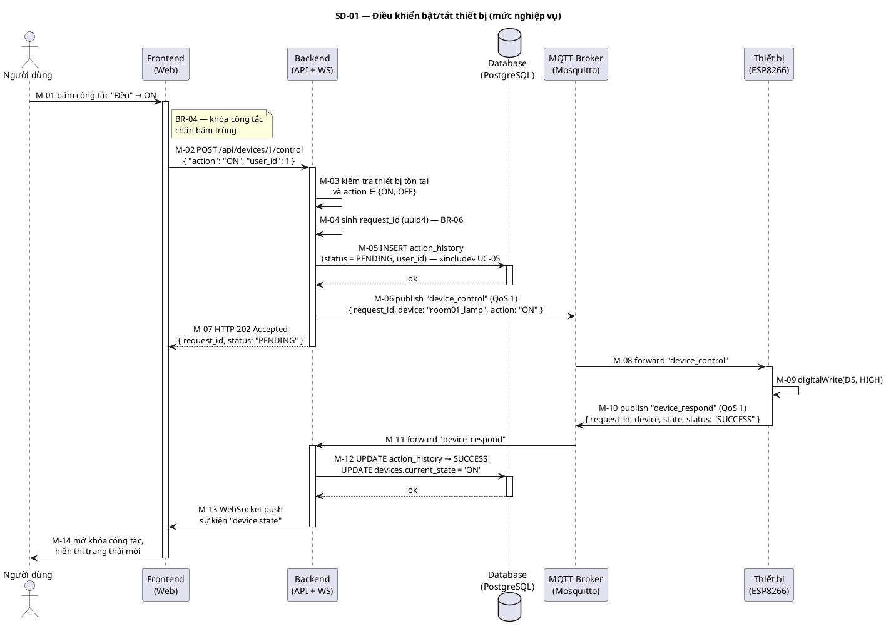

### 2.2 Bản Mermaid

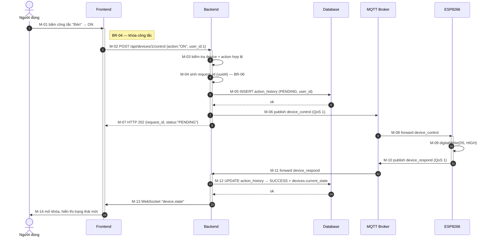

### 2.3 Bảng mô tả thông điệp

| Mã | Từ → Đến | Giao thức | Nội dung | Nguồn |
|---|---|---|---|---|
| M-01 | User → FE | Thao tác UI | Bấm công tắc | UC-02 bước 1 |
| M-02 | FE → BE | HTTP POST | `/api/devices/{id}/control`, body `{"action":"ON","user_id":1}` — `user_id` **tùy chọn** (BR-12) | UC-02 bước 2, FR-04, FR-18 |
| M-03 | BE → BE | — | Kiểm tra `devices_device` tồn tại, `is_active = true`, `action ∈ {ON,OFF}`, `user_id` hợp lệ nếu có | UC-02 bước 3, E3, E4 |
| M-04 | BE → BE | — | `uuid4()` | BR-06 |
| M-05 | BE → DB | SQL INSERT | `devices_actionhistory(device_id, user_id, request_id, action, status='PENDING', created_at)` — `user_id` có thể rỗng (BR-12) | UC-02 bước 5, BR-05 |
| M-06 | BE → Broker | MQTT pub | Topic `device_control`, QoS 1 | UC-02 bước 6 |
| M-07 | BE → FE | HTTP 202 | `{request_id, device_id, action, user, status:"PENDING"}` — `user` có thể `null` | §10 điểm ①|
| M-08 | Broker → HW | MQTT | Chuyển tiếp tới client đang subscribe | UC-02 bước 7 |
| M-09 | HW → HW | GPIO | `digitalWrite(pin, HIGH/LOW)` | UC-02 bước 8 |
| M-10 | HW → Broker | MQTT pub | Topic `device_respond`, QoS 1, kèm đúng `request_id` | UC-02 bước 9 |
| M-11 | Broker → BE | MQTT | Chuyển tiếp tới backend đang subscribe | UC-02 bước 10 |
| M-12 | BE → DB | SQL UPDATE | 2 bảng trong **một giao dịch** (`04-Database.md` §6.3) | UC-02 bước 10 |
| M-13 | BE → FE | WebSocket | Sự kiện `device.state` | UC-02 bước 11, FR-12 |
| M-14 | FE → User | UI | Mở khóa công tắc, thông báo thành công | UC-02 bước 12 |

### 2.4 Luồng ngoại lệ trên sơ đồ

Bản đầy đủ có thêm các khối `alt` dưới đây. Để sơ đồ chính dễ đọc, có thể vẽ riêng thành sơ đồ phụ khi đưa vào báo cáo.

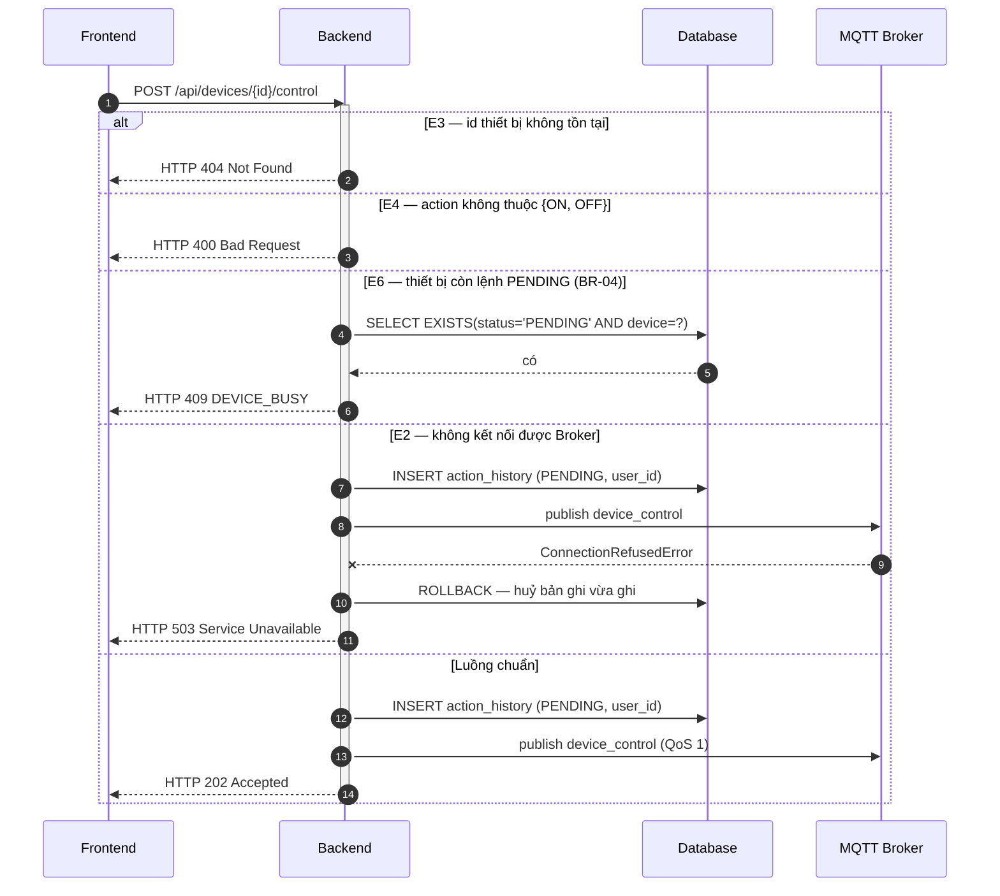

> **Nhánh E6 phải đứng trước nhánh chuẩn.** Truy vấn `EXISTS` kiểm tra lệnh đang chờ nằm **bên trong** `transaction.atomic()` và chạy **trước** lệnh `INSERT`, nếu không hai yêu cầu tới gần nhau vẫn kịp ghi hai bản ghi `PENDING`. Đây là phần máy chủ của BR-04 (`02-UseCase.md` UC-02 E6), bù cho việc khóa công tắc ở Frontend chỉ có hiệu lực trong một tab.
>
> **Chú ý thứ tự ở nhánh E2.** UC-02 quy định "không kết nối được broker thì **không** ghi bản ghi `action_history`". Nhưng luồng chính lại ghi `PENDING` **trước** khi publish (bước 5 trước bước 6). Hai điều này chỉ dung hòa được nếu toàn bộ view nằm trong `transaction.atomic()`: khi `publish()` ném ngoại lệ, giao dịch cuộn ngược và bản ghi `PENDING` biến mất. Đây là ràng buộc bắt buộc khi lập trình view ở tuần 3, không phải chi tiết tùy chọn.

### 2.5 Ghi chú thiết kế

**Vì sao M-07 trả về ngay mà không chờ phần cứng.** Nếu view giữ kết nối HTTP cho tới khi nhận `device_respond`, request sẽ treo tối đa 5 giây và chiếm một worker thread của `daphne` trong suốt thời gian đó. Trả `202 Accepted` ngay rồi đẩy kết quả qua WebSocket là mô hình bất đồng bộ đúng với bản chất của MQTT: **lệnh đi một đường, phản hồi về một đường khác**. Đây cũng là lý do `request_id` tồn tại — không có nó thì không ghép lại được hai đường này (BR-06).

**Vì sao `current_state` chỉ đổi ở M-12.** Xem `04-Database.md` §6.2: cột này phản ánh trạng thái vật lý đã xác nhận. Nếu cập nhật ngay ở M-05, giao diện sẽ báo đèn đang bật trong khi bóng đèn vẫn tối khi phần cứng mất kết nối.

**QoS 1 cho `device_control` và `device_respond`, QoS 0 cho `data_sensors`.** Lệnh điều khiển mất một lần là người dùng thấy hệ thống hỏng; số liệu cảm biến mất một mẫu trong 43.200 mẫu mỗi ngày thì không ai nhận ra. QoS 1 có chi phí bắt tay `PUBACK`, chỉ trả giá ở nơi thật sự cần.

---

## 3. SD-02 — ĐIỀU KHIỂN THIẾT BỊ, MỨC TRIỂN KHAI (UC-02)

> Cùng luồng nghiệp vụ với SD-01, nhưng mở hộp đen "Backend" thành hai tiến trình P1/P2 nối nhau qua Redis (`01-SRS.md` §2.2.1).

### 3.1 Mã nguồn PlantUML

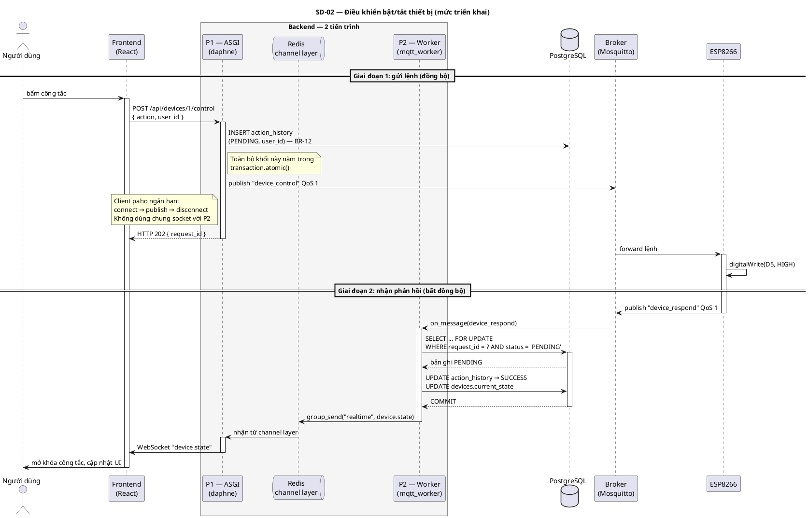

### 3.2 Bản Mermaid

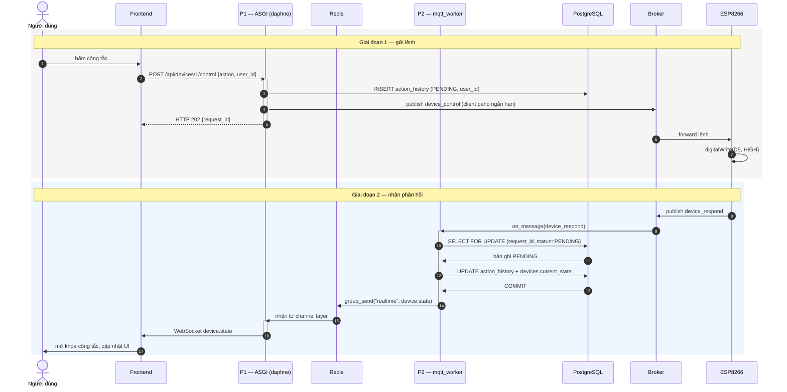

### 3.3 Ba điểm chỉ nhìn thấy ở mức triển khai

| # | Điểm | Giải thích |
|---|---|---|
| 1 | **P1 publish, P2 subscribe** | Lệnh đi ra từ tiến trình web, phản hồi về ở tiến trình worker. Hai tiến trình khác nhau chạm vào cùng một bản ghi `action_history` — đó là lý do phải có `request_id` trong CSDL chứ không giữ trạng thái trong bộ nhớ |
| 2 | **Redis là bắt buộc** | P2 không có kết nối WebSocket nào cả. Muốn đẩy dữ liệu tới trình duyệt, nó phải gửi qua channel layer để P1 phát tiếp. `InMemoryChannelLayer` chỉ hoạt động trong cùng một tiến trình nên sẽ im lặng không đẩy được gì |
| 3 | **Client paho ngắn hạn ở P1** | `connect → publish(qos=1) → disconnect` mỗi lần gọi API. Tốn vài mili-giây nhưng tránh hoàn toàn việc chia sẻ socket MQTT giữa hai tiến trình — một nguồn lỗi khó truy vết khi `daphne` chạy nhiều worker |

**Về `SELECT ... FOR UPDATE`:** khóa dòng ngăn xung đột giữa luồng xử lý phản hồi (mục này) và vòng quét timeout (SD-05) khi cả hai chạm vào cùng bản ghi tại đúng mốc 5 giây. Điều kiện `status = 'PENDING'` đặt ngay trong truy vấn khiến message đến muộn hoặc bị broker gửi lại ở QoS 1 sẽ ném `DoesNotExist` — worker bắt và bỏ qua, đúng luồng ngoại lệ E5.

---

## 4. SD-03 — THU THẬP VÀ TRUYỀN SỐ LIỆU CẢM BIẾN (UC-07)

> Luồng tự động, chu kỳ 2 giây (BR-01). Tác nhân chính là ESP8266, không có người dùng khởi xướng.

### 4.1 Mã nguồn PlantUML

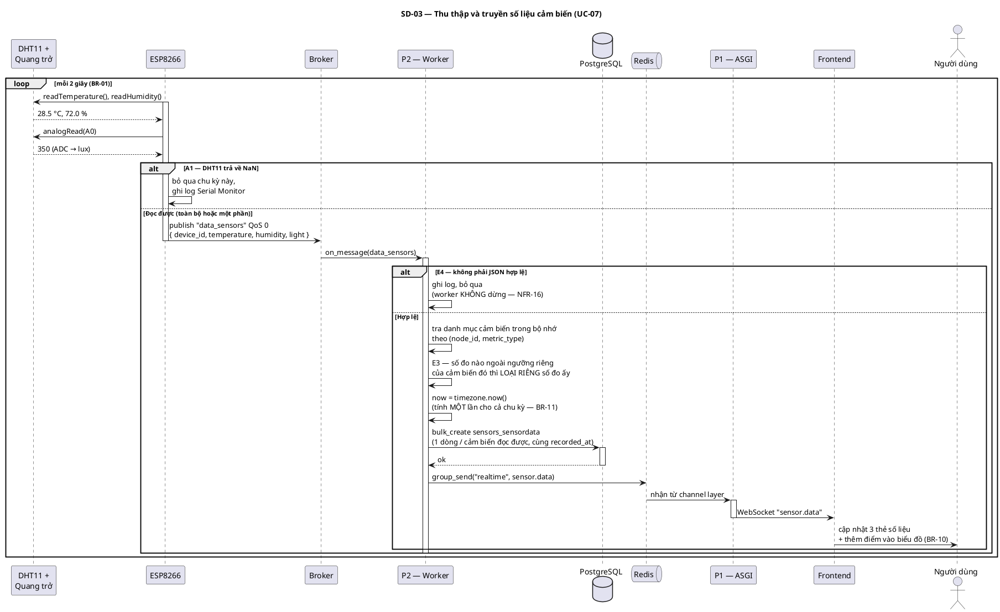

### 4.2 Bản Mermaid

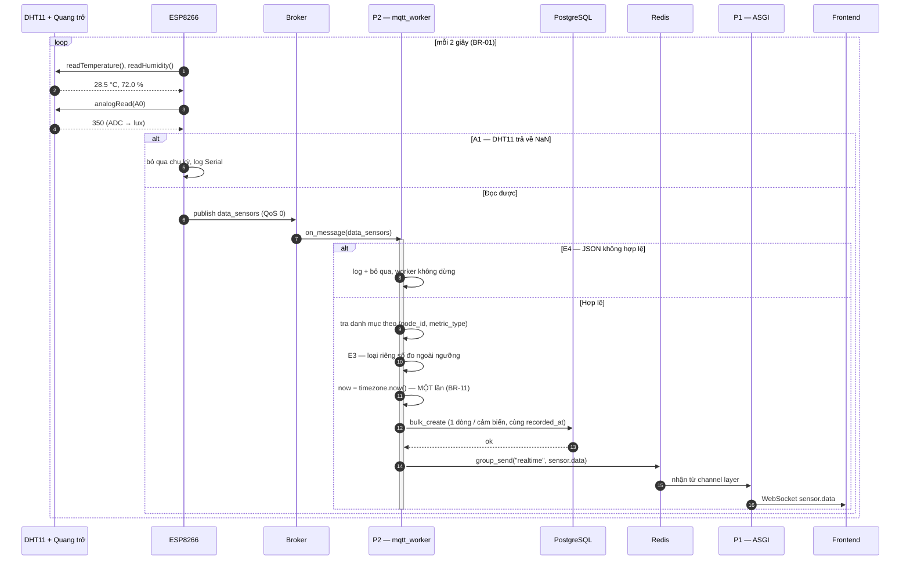

### 4.3 Ghi chú thiết kế

**`recorded_at` sinh ở P2, không lấy từ payload.** ESP8266 không có RTC; nếu lấy `timestamp` do thiết bị gửi thì mỗi lần thiết bị khởi động lại, mốc thời gian nhảy về 1970 và biểu đồ chạy lùi. Trường `timestamp` trong payload MQTT bị **bỏ qua có chủ đích** (`04-Database.md` §2.1, §7.1). Sai số do độ trễ mạng LAN ở mức mili-giây, không đáng kể so với chu kỳ 2 giây.

**Một message vào, ba bản ghi ra** *(đổi ở bản 2.0)*. Payload firmware **không đổi** — vẫn một message chứa cả ba số đo. P2 tra danh mục cảm biến để biết mỗi trường thuộc về cảm biến nào, rồi ghi mỗi số đo thành một bản ghi riêng (BR-11). Cho ESP publish ba message riêng sẽ nhân ba lưu lượng WiFi **và** khiến ba số đo mang ba mốc thời gian khác nhau.

**⚠️ `recorded_at` phải tính MỘT lần cho cả chu kỳ.** Đây là cái bẫy nguy hiểm nhất của luồng này. Nếu để cột `recorded_at` khai `auto_now_add=True`, Django gọi `timezone.now()` **riêng cho từng đối tượng** ở bước `pre_save` — kể cả trong `bulk_create` — nên ba bản ghi lệch nhau vài micro-giây. Hậu quả: biểu đồ Dashboard xoay bảng theo mốc thời gian sẽ thấy mỗi mốc chỉ có một đường có dữ liệu, hai đường kia rỗng. Phải dùng `default=timezone.now` và truyền mốc tường minh cho cả ba (`04-Database.md` §2.2).

**Ngưỡng BR-02 kiểm ở worker, theo từng cảm biến.** P2 đọc `min_value` / `max_value` của **chính cảm biến đó** từ danh mục — không còn hằng số ghi cứng trong mã. Số đo nào vượt ngưỡng thì **loại riêng số đo ấy**, hai số đo còn lại trong cùng chu kỳ vẫn được ghi (E3, khác bản 1.2 vốn loại cả bản ghi). Tầng CSDL chỉ giữ một ràng buộc nới rộng làm lưới an toàn, vì `CHECK` của PostgreSQL không tham chiếu được sang bảng danh mục (`04-Database.md` §2.4).

**Danh mục cảm biến nạp vào bộ nhớ một lần lúc worker khởi động**, khóa theo cặp `(node_id, metric_type)`. Tra CSDL cho từng message là thừa với một bảng 3 dòng gần như không đổi. Đổi lại: **thêm hoặc sửa cảm biến phải khởi động lại `mqtt_worker`**.

**Vì sao worker không được phép chết vì một message hỏng.** Một payload rác từ `mosquitto_pub` gõ nhầm mà làm dừng `mqtt_worker` thì toàn bộ hệ thống ngừng thu thập cho tới khi có người phát hiện. Mọi hàm `on_message` phải bọc `try/except Exception` ở mức ngoài cùng (NFR-16).

**Tần suất ghi.** 2 giây/message × 3 cảm biến ⇒ **129.600 bản ghi/ngày** ⇒ khoảng 3,9 triệu bản ghi/tháng. Đây là lý do bảng `sensors_sensordata` chỉ đánh index trên `(recorded_at, sensor_id)` và tận dụng ràng buộc `UNIQUE (sensor_id, recorded_at)` làm chỉ mục thứ hai, không đánh thêm trên cột `value` (`04-Database.md` §5.2).

---

## 5. SD-04 — MỞ DASHBOARD VÀ THIẾT LẬP REALTIME (UC-01)

### 5.1 Mã nguồn PlantUML

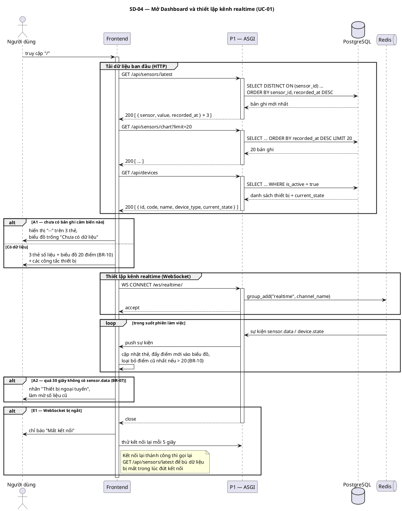

### 5.2 Bản Mermaid

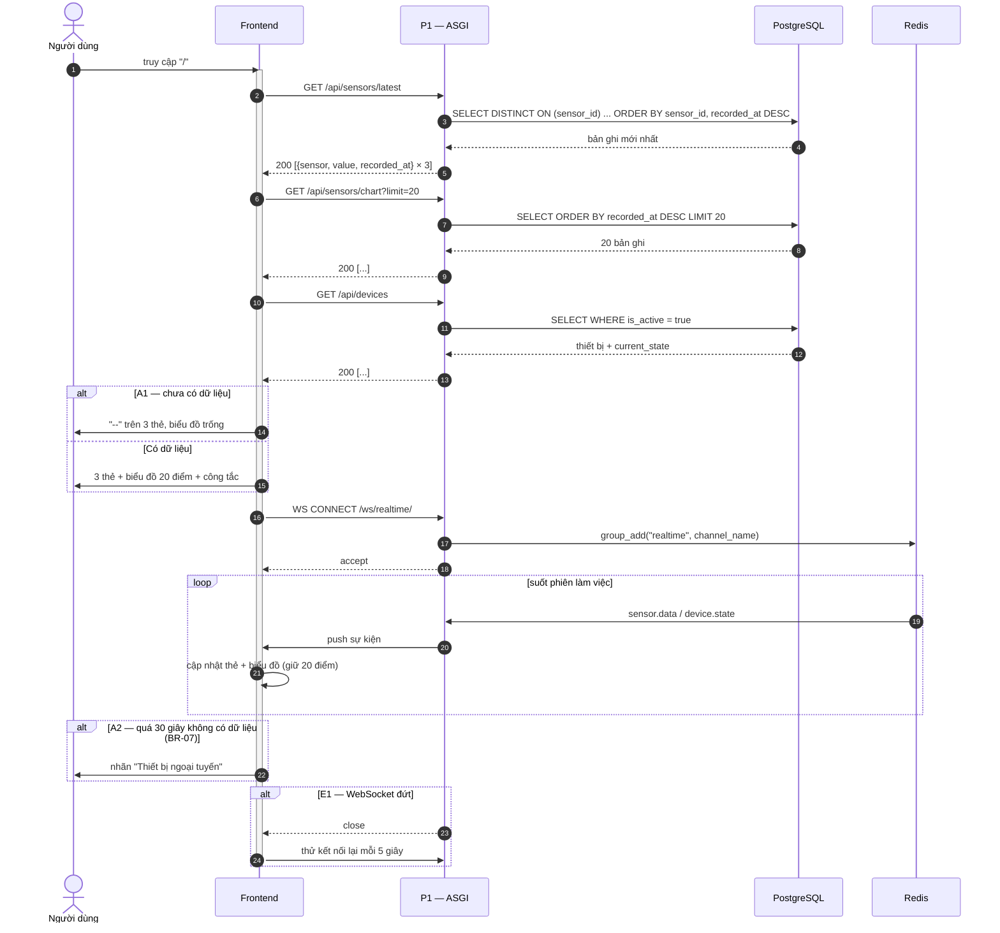

### 5.3 Ghi chú thiết kế

**Vì sao vẫn cần 3 lời gọi HTTP dù đã có WebSocket.** WebSocket chỉ đẩy dữ liệu **phát sinh sau** khi kết nối được thiết lập. Nếu chỉ dựa vào nó, người dùng mở trang sẽ thấy màn hình trống tới 2 giây trước khi mẫu đầu tiên về — và trống vô hạn nếu thiết bị đang ngoại tuyến. Ba lời gọi HTTP dựng **trạng thái ban đầu**, WebSocket lo phần **thay đổi tiếp theo**.

**Ba lời gọi HTTP chạy song song được.** Chúng độc lập với nhau, `Promise.all` rút thời gian tải xuống bằng lời gọi chậm nhất. Sơ đồ vẽ tuần tự cho dễ đọc; ở phần cài đặt nên chạy song song.

**BR-07 được phát hiện ở Frontend, không phải Backend.** Backend không có cách nào biết thiết bị đã ngoại tuyến trừ khi chủ động đếm giờ. Frontend vốn đã nhận sự kiện theo thời gian thực, chỉ cần một `setTimeout` đặt lại mỗi lần có `sensor.data` — 30 giây không được đặt lại thì hiện nhãn ngoại tuyến. Cách này không tốn thêm tài nguyên máy chủ.

**Vì sao gọi lại `/api/sensors/latest` sau khi kết nối lại (E1).** Trong lúc mất kết nối, các sự kiện đẩy đi đều rơi vào khoảng trống. Không tải lại thì biểu đồ có một quãng đứt và thẻ số liệu hiển thị giá trị cũ mà người dùng tưởng là mới.

---

## 6. SD-05 — PHÁT HIỆN TIMEOUT 5 GIÂY (BR-03)

> Luồng ngoại lệ E1 của UC-02. Đây là sơ đồ quan trọng nhất khi trình bày phần "xử lý lỗi" của đồ án.

### 6.1 Mã nguồn PlantUML

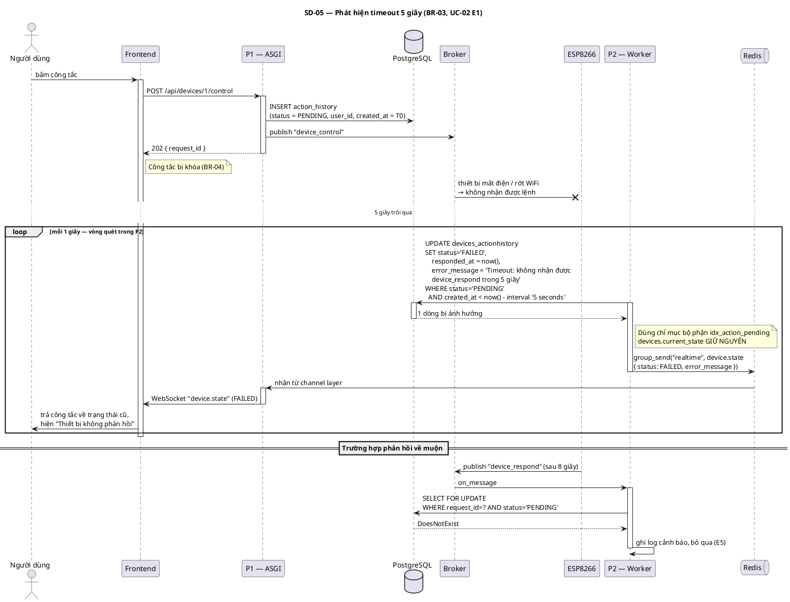

### 6.2 Bản Mermaid

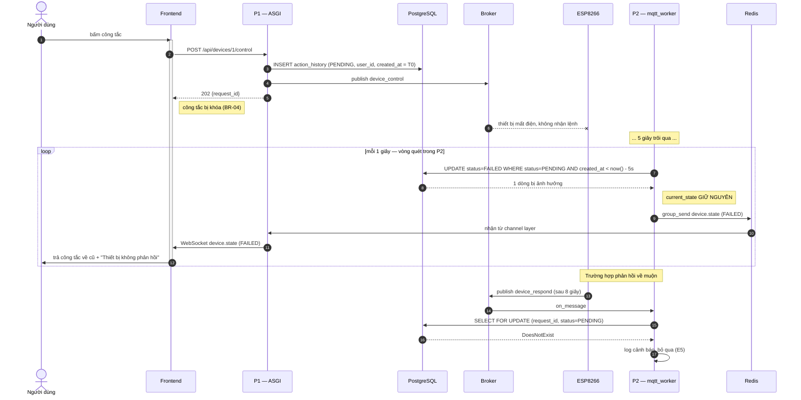

### 6.3 Ghi chú thiết kế

**Vì sao vòng quét trong worker chứ không phải `threading.Timer`.** Đã phân tích ở `04-Database.md` §5.3. Hai lý do quyết định: (1) `threading.Timer` sống trong bộ nhớ tiến trình web — khởi động lại `daphne` là mất sạch, các bản ghi `PENDING` mắc kẹt vĩnh viễn; (2) luồng nền trong Django dễ rò kết nối CSDL vì mỗi thread giữ một connection riêng không được đóng đúng cách. Vòng quét đọc trạng thái từ CSDL nên **tự phục hồi**: khởi động lại worker thì các bản ghi quá hạn vẫn bị quét ở lần lặp kế tiếp.

**Độ trễ tối đa là 6 giây, không phải 5.** Vòng quét chạy mỗi 1 giây, nên một bản ghi hết hạn ngay sau khi vòng quét vừa đi qua sẽ phải chờ tới lượt sau. Người dùng thấy thông báo lỗi sau 5–6 giây. Sai số này chấp nhận được và cần nói rõ trong báo cáo thay vì để người chấm tự phát hiện.

**`current_state` không đổi ở nhánh này.** Bóng đèn vẫn đang tắt về mặt vật lý; nếu cột này đổi theo ý định người dùng thì lần mở Dashboard sau sẽ hiển thị sai (`04-Database.md` §6.2).

**Chỉ mục bộ phận `idx_action_pending`.** Vòng quét chạy 86.400 lần/ngày trên một bảng lớn dần. Chỉ mục `WHERE status = 'PENDING'` chỉ chứa vài dòng ở trạng thái bình thường nên mỗi lần quét gần như không tốn gì.

**Frontend cũng cần một mốc thời gian dự phòng.** Nếu WebSocket đứt đúng lúc lệnh đang chạy, sự kiện `device.state` không bao giờ tới và công tắc sẽ khóa vĩnh viễn. Frontend đặt bộ đếm ~7 giây (biên trên của 6 giây phía máy chủ): hết giờ thì tự mở khóa công tắc và gọi lại `GET /api/devices` để lấy trạng thái thật.

---

## 7. SD-06 — TRA CỨU LỊCH SỬ CÓ LỌC VÀ PHÂN TRANG (UC-03, UC-04)

> Sơ đồ này áp dụng chung cho cả bảng số liệu cảm biến (UC-03) và bảng lịch sử thao tác (UC-05); chỉ khác endpoint và tên cột.

### 7.1 Mã nguồn PlantUML

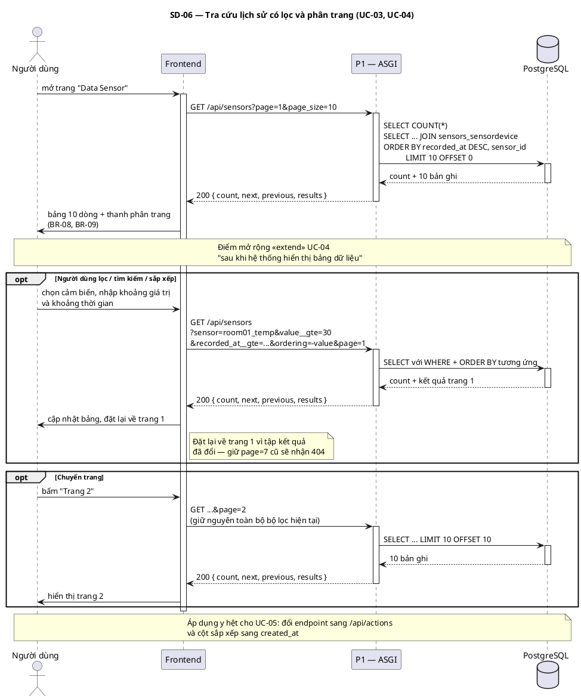

### 7.2 Bản Mermaid

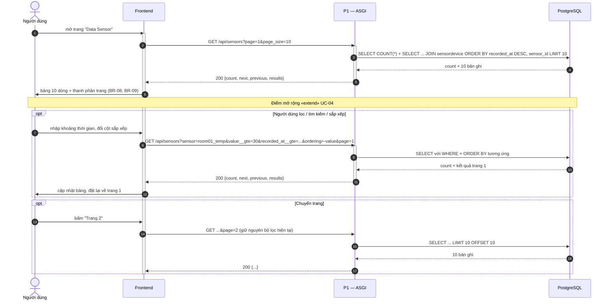

### 7.3 Ghi chú thiết kế

**Vì sao đặt lại về trang 1 khi đổi bộ lọc.** Người dùng đang ở trang 7 mà lọc lại còn 2 trang thì `page=7` trả về 404 của DRF. Đặt lại về trang 1 là hành vi chuẩn của mọi bảng dữ liệu.

**Bộ lọc và phân trang phải đi cùng nhau trong URL.** Nếu chuyển trang mà mất bộ lọc, người dùng thấy dữ liệu nhảy về toàn bộ tập — lỗi kinh điển. Giữ toàn bộ tham số trên query string cũng khiến trang có thể chia sẻ được bằng đường dẫn.

**Không dùng WebSocket ở màn hình này.** Bảng lịch sử là ảnh chụp tại một thời điểm. Nếu tự chèn dòng mới mỗi 2 giây thì dòng người dùng đang đọc sẽ trôi xuống liên tục.

**Bộ lọc theo khoảng giá trị** *(gọn lại ở bản 2.0)*. Ngoài khoảng thời gian, màn hình Data Sensor cho chọn một **cảm biến** rồi lọc theo khoảng giá trị: `?sensor=room01_temp&value__gte=30&value__lte=35`. Bản 1.1 dùng sáu tham số theo cột (`temperature__gte`…), nay còn hai. Khối `opt` trong sơ đồ đã bao phủ sẵn tình huống này — nó mô tả *"người dùng lọc / tìm kiếm / sắp xếp"* ở mức chung, chỉ khác tên tham số trên đường truyền, nên **mã PlantUML và ảnh `SD-06` không phải vẽ lại**.

Bốn điểm cần nhớ khi cài đặt màn hình này:

- **Một trang 10 bản ghi nay chỉ chứa 3⅓ chu kỳ**, vì mỗi chu kỳ là ba dòng (BR-11). Giao diện nên đặt sẵn lựa chọn `page_size` lớn hơn để một trang chứa số chu kỳ trọn vẹn.
- **`ORDER BY` phải gồm hai cột.** Ba dòng cùng chu kỳ có `recorded_at` giống hệt nhau; chỉ sắp theo thời gian thì thứ tự không xác định và **lật trang sẽ lặp dòng hoặc mất dòng**. Dùng `ORDER BY recorded_at DESC, sensor_id`. Khi người dùng đổi cột sắp xếp, backend vẫn phải nối thêm cột phá hòa (`05-API.md` §7.3).
- **Khoảng giá trị chỉ dùng được khi đã chọn cảm biến**, vì ba đại lượng có đơn vị khác nhau — `28 °C` và `28 lux` không so sánh chung được (UC-04 E4).
- **Cột `value` không có chỉ mục** (`04-Database.md` §5.2). Truy vấn quét tuần tự phần còn lại sau khi điều kiện `sensor` đã thu hẹp còn 1/3 — chấp nhận được ở quy mô đồ án, nhưng cần đo lại nếu bảng phình to.

*(Cảnh báo cũ về bản ghi có số đo `null` bị loại khỏi kết quả **đã hết hiệu lực**: cột `value` nay là `NOT NULL`.)*

---

## 8. TỔNG HỢP THÔNG ĐIỆP

### 8.1 Giao diện HTTP xuất hiện trong các sơ đồ

| Endpoint | Xuất hiện ở | UC | Ghi chú |
|---|---|---|---|
| `GET /api/sensors/devices` | SD-04 | UC-01, UC-03 | Danh mục cảm biến — Frontend dựng thẻ số liệu và dropdown lọc từ đây |
| `GET /api/sensors/latest` | SD-04 | UC-01 | **Mảng** số đo mới nhất của từng cảm biến |
| `GET /api/sensors/chart?limit=20` | SD-04 | UC-01 | BR-10 — `limit` đếm theo **chu kỳ** |
| `GET /api/sensors` | SD-06 | UC-03, UC-04 | Có `search` / `ordering` / `page` / lọc theo khoảng thời gian, cảm biến và khoảng giá trị (§7.3) |
| `GET /api/devices` | SD-04, SD-05 | UC-01 | Chỉ `is_active = true` |
| `POST /api/devices/{id}/control` | SD-01, SD-02, SD-05 | UC-02 | Trả `202`, xem §10 điểm ① |
| `GET /api/actions` | SD-06 *(biến thể)* | UC-05, UC-04 | Cùng khuôn với `/api/sensors` |
| `WS /ws/realtime/` | SD-02, SD-03, SD-04, SD-05 | UC-01, UC-02 | Nhóm `realtime` |

### 8.2 Sự kiện WebSocket

Toàn hệ thống chỉ dùng **đúng hai** sự kiện, giữ nguyên như `01-SRS.md` §4.4.

**`sensor.data`** — phát bởi P2 sau mỗi **chu kỳ** ghi thành công (SD-03). Một chu kỳ sinh ba bản ghi trong CSDL nhưng vẫn chỉ **một** sự kiện, vì một chu kỳ là một lần cập nhật của Dashboard. Hợp đồng này **giữ nguyên ở bản 2.0**, nên mã realtime của Frontend không phải sửa:
```json
{
  "type": "sensor.data",
  "device_id": "esp8266_room01",
  "temperature": 28.5,
  "humidity": 72.0,
  "light": 350,
  "recorded_at": "2026-08-17T10:30:02.451231Z"
}
```

**`device.state`** — phát bởi P2 khi một lệnh điều khiển kết thúc, dù thành công (SD-02) hay thất bại (SD-05):
```json
{
  "type": "device.state",
  "device_id": 1,
  "device": "room01_lamp",
  "current_state": "ON",
  "request_id": "3f2b8c1e-...",
  "status": "SUCCESS",
  "error_message": null
}
```

> **Quyết định:** trường hợp timeout **không** sinh ra sự kiện thứ ba (kiểu `device.error`) mà dùng lại `device.state` với `status = "FAILED"`, `error_message` có nội dung và `current_state` giữ nguyên giá trị cũ. Lý do: giữ đúng hợp đồng hai sự kiện đã công bố ở SRS, và Frontend chỉ cần **một** hàm xử lý duy nhất cho mọi kết cục của một lệnh — so khớp `request_id`, mở khóa công tắc, rồi đặt trạng thái theo `current_state` nhận được.

### 8.3 Thông điệp MQTT

| Topic | Hướng | QoS | Xuất hiện ở | Ánh xạ CSDL |
|---|---|---|---|---|
| `data_sensors` | ESP → P2 | 0 | SD-03 | `04-Database.md` §7.1 |
| `device_control` | P1 → ESP | 1 | SD-01, SD-02, SD-05 | §7.2 |
| `device_respond` | ESP → P2 | 1 | SD-01, SD-02, SD-05 | §7.3 |

---

## 9. MA TRẬN TRUY VẾT SD ↔ UC / BR

| Sơ đồ | Use case | Luồng bao phủ | Quy tắc nghiệp vụ |
|---|---|---|---|
| **SD-01** | UC-02, UC-05 *(«include»)* | Luồng chính; E2, E3, E4, E6 ở §2.4 | BR-04, BR-05, BR-06 |
| **SD-02** | UC-02 | Luồng chính, ở mức tiến trình; E5 | BR-05, BR-06 |
| **SD-03** | UC-07 | Luồng chính; A1, A2, E3, E4 | BR-01, BR-02, BR-10 |
| **SD-04** | UC-01 | Luồng chính; A1, A2, E1 | BR-07, BR-10 |
| **SD-05** | UC-02 | E1 (timeout), E5 (phản hồi muộn) | BR-03, BR-04 |
| **SD-06** | UC-03, UC-04, UC-05 | Luồng chính + điểm mở rộng | BR-08, BR-09 |

**Kiểm tra độ phủ:**

- **Use case:** UC-01 → SD-04 · UC-02 → SD-01/SD-02/SD-05 · UC-03 → SD-06 · UC-04 → SD-06 · UC-05 → SD-01 (ghi), SD-06 (đọc) · UC-07 → SD-03. **UC-06 (Profile) không có sequence riêng** — nó chỉ là một lời gọi `GET /api/profile` trả về dữ liệu tĩnh đọc từ `.env`, không có tương tác nhiều bước nào để vẽ.
- **Quy tắc nghiệp vụ:** BR-01 → BR-10 đều xuất hiện ở ít nhất một sơ đồ.

---

## 10. ĐIỂM CÒN CẦN CHỐT

| # | Vấn đề | Hiện đang giả định | Chốt ở đâu |
|---|---|---|---|
| ① | Mã trạng thái HTTP của `POST /api/devices/{id}/control` | `202 Accepted` — vì lệnh mới được tiếp nhận, chưa hoàn tất. `200 OK` cũng dùng được nhưng kém chính xác về ngữ nghĩa | `05-API.md` |
| ② | Frontend chờ tối đa bao lâu trước khi tự mở khóa công tắc | ~7 giây (biên trên 6 giây phía máy chủ + dự phòng mạng) | Đo lại khi có phần cứng, tuần 4 |
| ③ | Có gửi kèm `device_id` số trong sự kiện `device.state` không | Có gửi cả `device_id` (số) lẫn `device` (mã `code`) để Frontend không phải tra cứu | `05-API.md` |
| ④ | Chu kỳ vòng quét timeout | 1 giây | Tuần 3, đo tải thực tế của PostgreSQL |
| ⑤ | Nhóm WebSocket đặt tên `realtime` cho toàn hệ thống | Một nhóm duy nhất vì chỉ có một phòng. Lắp phòng thứ hai thì tách thành `room_<id>` | Khi mở rộng, xem `04-Database.md` §12.2 |

---

## 11. LỊCH SỬ PHIÊN BẢN

| Phiên bản | Ngày | Người sửa | Nội dung |
|---|---|---|---|
| **2.0** | **20/08/2026** | Nhóm thực hiện | **Đồng bộ theo `04-Database.md` v2.0.** ① **SD-03**: khối `alt` xử lý message viết lại — thêm bước tra danh mục cảm biến, tính `recorded_at` **một lần**, `bulk_create` nhiều dòng cùng mốc thời gian; nhánh E3 nay loại **riêng số đo** vượt ngưỡng thay vì cả bản ghi. §4.3 thêm cảnh báo về `auto_now_add`, ngưỡng theo từng cảm biến, và tần suất ghi 43.200 → **129.600 dòng/ngày**. ② **SD-04**: `/api/sensors/latest` đổi thành `DISTINCT ON (sensor_id)` trả mảng 3 phần tử; thêm `/api/sensors/devices` vào §8.1. ③ **SD-01**: M-02 và M-05 mang thêm `user_id` (BR-12); M-07 trả thêm `user`. ④ **SD-06**: truy vấn thêm `JOIN` và `ORDER BY` hai cột; ví dụ bộ lọc đổi sang `sensor` + `value__gte`; §7.3 viết lại 4 điểm cài đặt, gỡ cảnh báo về `NULL`. ⑤ Đổi tên mã `led1` → `room01_lamp`. **Mã PlantUML/Mermaid của 6 sơ đồ chỉ đổi nhãn thông điệp, cấu trúc lifeline và thứ tự trao đổi giữ nguyên — 6 ảnh `SD-0x` chỉ cần xuất lại nếu muốn nhãn khớp tuyệt đối** |
| **2.0.1** | **20/08/2026** | Nhóm thực hiện | **Vá chỗ sót của bản 2.0.** Bản 2.0 mới thêm `user_id` vào **một** chỗ (M-05 của SD-01, bản PlantUML) nên ba sơ đồ mô tả cùng một thao tác ghi CSDL lại nói ba kiểu khác nhau. Nay đồng bộ toàn bộ: SD-01 (M-02 thêm `user_id` ở cả PlantUML lẫn Mermaid, M-05 bản Mermaid), khối `alt` §2.4, **SD-02 §3.1 và §3.2**, SD-05 §6.1 và §6.2. ⚠️ **Phải xuất lại ảnh SD-01, SD-02, SD-05** — ba ảnh này có nhãn thay đổi; SD-03, SD-04, SD-06 không đổi |
| 1.0 | 14/08/2026 | Nhóm thực hiện | Bản đầu tiên: 6 sequence diagram (SD-01 → SD-06), bảng thông điệp, ma trận truy vết SD ↔ UC/BR |
| 1.1 | 17/08/2026 | Nhóm thực hiện | Bổ sung ghi chú về bộ lọc theo khoảng giá trị số đo ở SD-06 (§7.3) và §8.1. **Mã PlantUML/Mermaid của cả 6 sơ đồ giữ nguyên — không phải xuất lại ảnh** |
| 1.2 | 18/08/2026 | Nhóm thực hiện | Thêm nhánh **E6 — `409 DEVICE_BUSY`** vào khối `alt` luồng ngoại lệ ở §2.4 kèm ghi chú về thứ tự kiểm tra; cập nhật ma trận truy vết §9. Sửa ví dụ sự kiện `sensor.data` ở §8.2 cho khớp mốc thời gian chuẩn `2026-08-17T10:30:02.451231Z`. **Mã PlantUML của cả 6 sơ đồ chính giữ nguyên — khối `alt` §2.4 chỉ có bản Mermaid, không xuất ảnh** |
