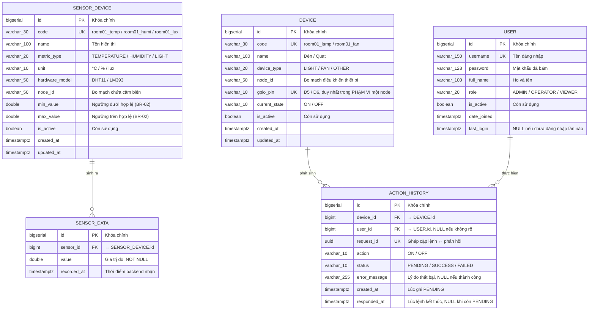
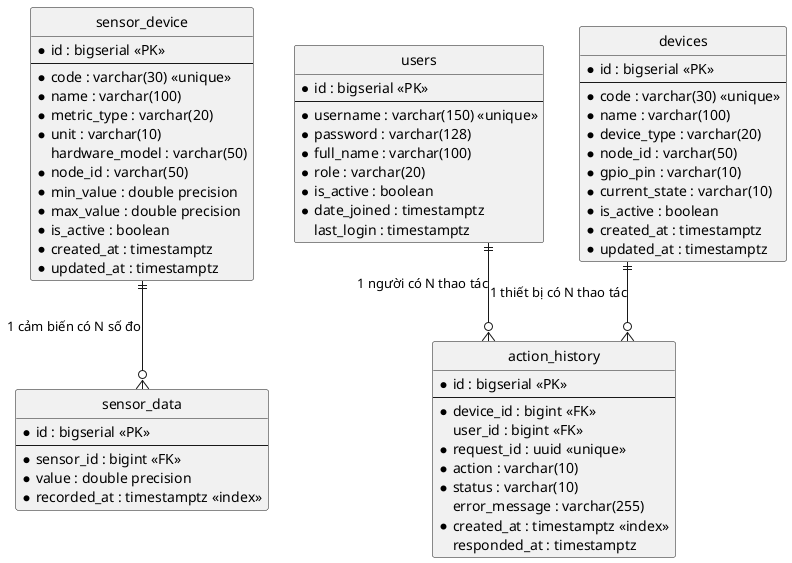
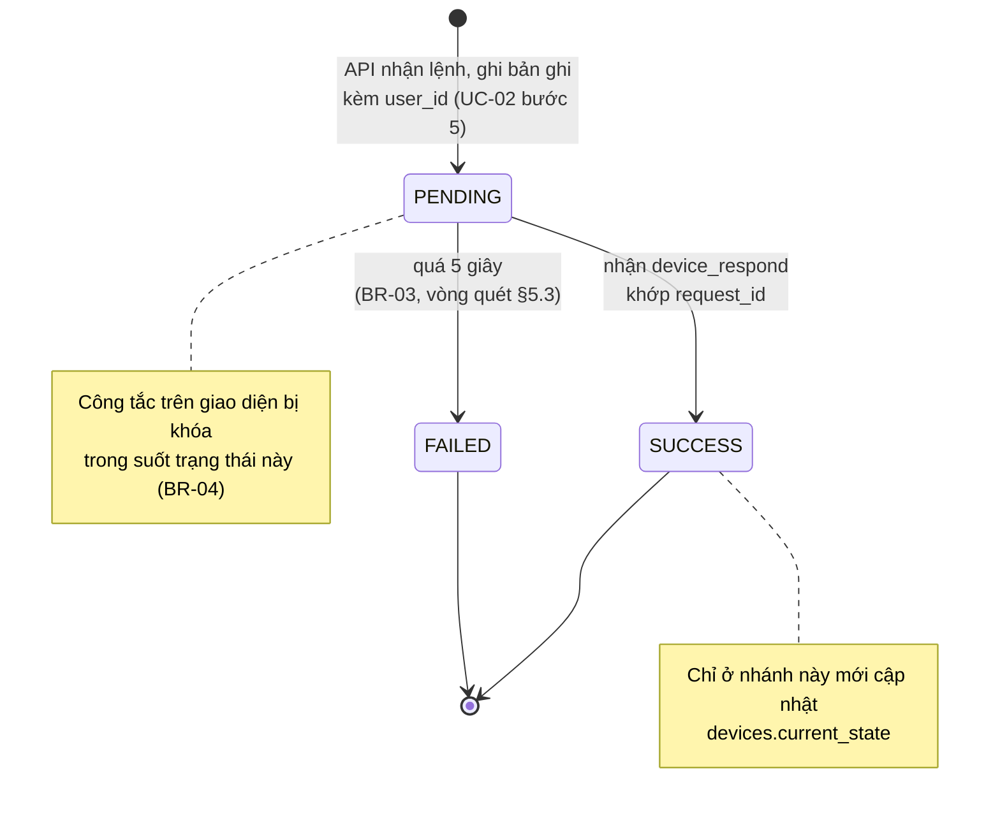

# THIẾT KẾ CƠ SỞ DỮ LIỆU

## Hệ thống giám sát và điều khiển môi trường phòng dựa trên IoT

| | |
|---|---|
| **Phiên bản** | 2.0 |
| **Ngày** | 20/08/2026 |
| **Hệ quản trị** | PostgreSQL 16 |
| **Tài liệu liên quan** | `01-SRS.md` (§6), `02-UseCase.md`, `03-Sequence.md`, `05-API.md` |
| **Vị trí trong báo cáo** | Chương 3 — Thiết kế chi tiết |

> ⚠️ **Bản 2.0 là thay đổi phá vỡ tương thích** so với bản 1.2. Ba điểm chính, theo yêu cầu của giảng viên sau buổi báo cáo ngày 20/08/2026:
> 1. Bảng số liệu cảm biến **không còn lưu cả cụm ba số đo trên một dòng**. Mỗi dòng nay là **một số đo của một cảm biến** (§2.3).
> 2. Thêm bảng danh mục cảm biến `sensors_sensordevice` (§4.2).
> 3. Thêm bảng người dùng `users_user` và cột `action_history.user_id` để trả lời câu hỏi *ai đã thao tác* (§4.5, §2.5).
>
> Tổng số bảng nghiệp vụ: **3 → 5**. Bốn tài liệu còn lại (`01-SRS.md`, `02-UseCase.md`, `03-Sequence.md`, `05-API.md`) và bản vẽ giao diện **chưa được cập nhật theo bản này** — danh sách việc phải làm ở §16.

---

## MỤC LỤC

1. [Giới thiệu](#1-giới-thiệu)
2. [Quy ước thiết kế](#2-quy-ước-thiết-kế)
3. [Sơ đồ thực thể — liên kết (ERD)](#3-sơ-đồ-thực-thể--liên-kết-erd)
4. [Từ điển dữ liệu](#4-từ-điển-dữ-liệu)
5. [Ràng buộc và chỉ mục](#5-ràng-buộc-và-chỉ-mục)
6. [Vòng đời trạng thái](#6-vòng-đời-trạng-thái)
7. [Ánh xạ MQTT payload sang cột dữ liệu](#7-ánh-xạ-mqtt-payload-sang-cột-dữ-liệu)
8. [Mã nguồn Django models](#8-mã-nguồn-django-models)
9. [DDL PostgreSQL tương đương](#9-ddl-postgresql-tương-đương)
10. [Dữ liệu khởi tạo](#10-dữ-liệu-khởi-tạo-seed)
11. [Truy vấn tiêu biểu](#11-truy-vấn-tiêu-biểu)
12. [Ước lượng dung lượng và hướng mở rộng](#12-ước-lượng-dung-lượng-và-hướng-mở-rộng)
13. [Ma trận truy vết](#13-ma-trận-truy-vết-bảng--ucfr)
14. [Điểm còn cần chốt](#14-điểm-còn-cần-chốt)
15. [Lịch sử phiên bản](#15-lịch-sử-phiên-bản)
16. [Ảnh hưởng lan sang tài liệu khác](#16-ảnh-hưởng-lan-sang-tài-liệu-khác)

---

## 1. GIỚI THIỆU

### 1.1 Mục đích

Tài liệu này đặc tả **mức thiết kế vật lý** của cơ sở dữ liệu: cấu trúc bảng, kiểu dữ liệu, ràng buộc, chỉ mục, dữ liệu khởi tạo và các truy vấn phục vụ từng use case. `01-SRS.md` §6 chỉ mô tả mô hình dữ liệu ở **mức khái niệm** (thực thể và quan hệ); tài liệu này là bản có hiệu lực đối với mọi chi tiết triển khai.

### 1.2 Vì sao chốt CSDL trước Sequence và API

Tên bảng, tên cột và tập giá trị hợp lệ xuất hiện lại trong `03-Sequence.md` (nhãn của các message ghi/đọc dữ liệu) và `05-API.md` (tên trường JSON). Chốt schema trước thì hai tài liệu sau không phải sửa lại.

Bản 2.0 là minh chứng ngược cho nguyên tắc này: schema đổi thì cả bốn tài liệu kia đều phải sửa theo (§16).

### 1.3 Phạm vi

Toàn bộ dữ liệu nghiệp vụ nằm trong **5 bảng**:

| # | Bảng | Vai trò | Nhịp ghi |
|---|---|---|---|
| 1 | `sensors_sensordevice` | Danh mục cảm biến — *cái gì đang đo* | Tĩnh, 3 dòng, seed |
| 2 | `sensors_sensordata` | Số đo — *đo được bao nhiêu, lúc nào* | ~129.600 dòng/ngày |
| 3 | `devices_device` | Thiết bị chấp hành — *cái gì bật/tắt được* | Tĩnh, 2 dòng, seed |
| 4 | `devices_actionhistory` | Lịch sử thao tác — *ai bật/tắt cái gì, kết quả ra sao* | Vài chục dòng/ngày |
| 5 | `users_user` | Người thao tác | Tĩnh, seed |

Hai thành phần sau **không** lưu dữ liệu nghiệp vụ và vì vậy không xuất hiện trong tài liệu này:

- **Redis** — chỉ đóng vai trò channel layer, truyền sự kiện giữa tiến trình MQTT worker và tiến trình ASGI. Dữ liệu trong Redis là tạm thời, mất đi không ảnh hưởng tính đúng đắn.
- **Thông tin trang Profile (UC-06)** — đọc từ biến môi trường / file cấu hình, không tạo bảng riêng. Lý do: dữ liệu tĩnh, chỉ một bản ghi, không có thao tác thêm/sửa/xóa từ giao diện.

Django vẫn tự tạo các bảng hệ thống (`auth_*`, `django_*`) khi migrate — chúng nằm ngoài thiết kế nghiệp vụ, chỉ phục vụ trang admin. Riêng bảng `auth_user` mặc định **không được dùng**: dự án thay bằng `users_user` (§2.5).

### 1.4 Ba khái niệm khác nhau, đừng lẫn

Đây là điểm dễ bị hỏi khi vấn đáp, vì cả ba đều hay được gọi chung là "thiết bị":

| Khái niệm | Ví dụ | Lưu ở đâu | Có bật/tắt được không |
|---|---|---|---|
| **Node** — bo mạch ESP8266 | `esp8266_room01` | `sensordevice.node_id` *(cột chuỗi)* | Không |
| **Cảm biến** — bộ phận đo một đại lượng | `room01_temp` (DHT11) | `sensors_sensordevice` *(bảng riêng)* | Không |
| **Thiết bị chấp hành** — đối tượng điều khiển | `room01_lamp` (Đèn phòng) | `devices_device` *(bảng riêng)* | Có |

Bản 1.2 chỉ tách được hai khái niệm cuối, còn node bị nhét vào cột `sensor_data.device_id` dạng chuỗi tự do. Bản 2.0 tách cả ba.

---

## 2. QUY ƯỚC THIẾT KẾ

| # | Quy ước | Chi tiết |
|---|---|---|
| 1 | **Tên bảng vật lý** | Do Django sinh tự động theo mẫu `<app>_<model viết thường>`. Không đặt `db_table` thủ công để tránh lệch giữa mã nguồn và CSDL |
| 2 | **Tên cột** | `snake_case`, thống nhất từ CSDL → API → giao diện, không đổi sang `camelCase` (§6 `CLAUDE.md`) |
| 3 | **Khóa chính** | `BigAutoField` (`bigserial`) trên cả 5 bảng. Bảng số đo tăng ~129.600 bản ghi/ngày nên `int4` sẽ tràn sau ~45 năm — `int8` là bắt buộc, không còn là lựa chọn cho đồng nhất như bản 1.2 |
| 4 | **Kiểu thời gian** | `timestamptz` (Django `DateTimeField` với `USE_TZ = True`). Lưu theo **UTC**, hiển thị theo `Asia/Ho_Chi_Minh` ở tầng giao diện |
| 5 | **Giá trị liệt kê** | Khai báo bằng `models.TextChoices` (ràng buộc ở tầng ứng dụng) **và** `CheckConstraint` (ràng buộc ở tầng CSDL). Không dùng kiểu `ENUM` của PostgreSQL vì thêm giá trị mới phải chạy DDL riêng |
| 6 | **Xóa dữ liệu** | Không xóa vật lý bản ghi lịch sử. Cảm biến, thiết bị hay người dùng ngừng sử dụng thì đặt `is_active = false` |
| 7 | **Thay đổi schema** | Chỉ qua Django migration, không sửa CSDL thủ công (NFR-15) |
| 8 | **Chuẩn hóa** | Toàn bộ schema đạt **3NF** — xem §2.6 cho hai chỗ dễ bị bắt bẻ |
| 9 | **`AUTH_USER_MODEL`** | Phải đặt `"users.User"` trong `settings.py` **trước lần `migrate` đầu tiên** — xem cảnh báo ở §2.5 |
| 10 | **Mã nghiệp vụ (`code`)** | Theo mẫu `<vị trí>_<vai trò>`: `room01_temp`, `room01_lamp` — xem §2.7 |

### 2.1 Quyết định: `recorded_at` do backend sinh, không lấy từ payload

*(Giữ nguyên từ bản 1.0)*

Payload topic `data_sensors` có trường `timestamp` (`01-SRS.md` §4.3), nhưng **hệ thống bỏ qua trường này**. Cột `recorded_at` được đặt bằng thời điểm backend nhận message.

**Lý do:** ESP8266 không có đồng hồ thời gian thực (RTC). Sau mỗi lần khởi động lại, `millis()` đếm từ 0; nếu không đồng bộ NTP thì `timestamp` do thiết bị gửi là vô nghĩa, và kể cả có NTP thì đồng hồ thiết bị vẫn có thể lệch so với máy chủ. Nếu lấy mốc thời gian từ thiết bị, biểu đồ trên Dashboard có thể nhảy lùi hoặc xuất hiện điểm ở tương lai.

**Sai số chấp nhận:** độ trễ truyền MQTT trong mạng LAN dưới 100 ms, nhỏ hơn nhiều so với chu kỳ lấy mẫu 2 giây (BR-01) nên không ảnh hưởng tới hình dạng biểu đồ.

### 2.2 ⚠️ Ba số đo cùng một chu kỳ phải mang **đúng một** giá trị `recorded_at`

Đây là ràng buộc mới của bản 2.0 và là cái bẫy lập trình nguy hiểm nhất của thiết kế này.

Một message trên `data_sensors` sinh ra **ba dòng**. Nếu ba dòng đó mang ba mốc thời gian lệch nhau vài micro-giây thì:

- biểu đồ Dashboard không xoay bảng (pivot) được — mỗi mốc chỉ có một đường, hai đường còn lại thành `null`;
- bảng Data Sensor sắp xếp theo thời gian sẽ xen kẽ lộn xộn giữa các chu kỳ.

**Cách phòng:** cột `recorded_at` **không được** khai `auto_now_add=True`. `auto_now_add` gọi `timezone.now()` **riêng cho từng đối tượng** ở bước `pre_save`, kể cả khi dùng `bulk_create`, nên ba dòng chắc chắn lệch nhau. Thiết kế dùng `default=timezone.now` và worker **tính mốc một lần rồi truyền tường minh cho cả ba dòng**:

```python
now = timezone.now()                      # tính MỘT lần
SensorData.objects.bulk_create([
    SensorData(sensor=s_temp,  value=28.5, recorded_at=now),
    SensorData(sensor=s_humi,  value=72.0, recorded_at=now),
    SensorData(sensor=s_light, value=350,  recorded_at=now),
])
```

Ràng buộc `UNIQUE (sensor_id, recorded_at)` ở §5.1 **không** phát hiện được lỗi này (ba dòng khác `sensor_id` nên vẫn hợp lệ), vì vậy phải kiểm bằng truy vấn ở §11.2.

### 2.3 Quyết định: mỗi dòng là **một số đo**, không phải một cụm ba số đo

Đây là thay đổi cốt lõi của bản 2.0.

| | Bản 1.2 | **Bản 2.0** |
|---|---|---|
| Một dòng | `(device_id, temperature, humidity, light, recorded_at)` | `(sensor_id, value, recorded_at)` |
| Thêm cảm biến thứ tư | `ALTER TABLE ADD COLUMN` + sửa serializer, filter, giao diện | Thêm **một dòng** vào bảng danh mục |
| Cảm biến hỏng một cái | Ghi dòng có cột `NULL` | **Không ghi dòng đó** |

**Ba cái được:**

1. **Cột `NULL` biến mất.** Luồng thay thế A2 của UC-07 (chỉ đọc được một phần cảm biến) trước đây phải ghi `humidity = NULL`; nay đơn giản là không chèn dòng cho cảm biến độ ẩm. Cột `value` do đó là `NOT NULL` — dòng tồn tại nghĩa là **đo được thật**.
2. **Hệ quả kéo theo: bẫy lọc theo khoảng giá trị cũng biến mất.** Bản 1.2 có một hành vi khó giải thích — `temperature__gte=30` và `temperature__lte=30` đều loại bỏ dòng có `temperature IS NULL`, làm `count` nhỏ hơn dự kiến mà không có lỗi nào. Không còn `NULL` thì không còn hiện tượng này.
3. **Bộ lọc gọn một nửa.** Sáu tham số `temperature__gte/lte`, `humidity__gte/lte`, `light__gte/lte` gộp thành **hai**: `sensor` + `value__gte/lte`. Dropdown "Cột ▾" trên bản vẽ đổi nhãn thành "Cảm biến ▾", cấu trúc giao diện không đổi.

**Ba cái mất — nói trước để không bị hỏi ngược:**

| Cái mất | Mức độ | Xử lý |
|---|---|---|
| Số dòng ×3 (43.200 → 129.600/ngày), dung lượng ~2,3× | Chấp nhận được ở quy mô đồ án | §12.1 |
| `CHECK` ngưỡng BR-02 ở tầng CSDL không còn chặt như cũ | Trung bình | §2.4 |
| Truy vấn Dashboard phức tạp hơn (`DISTINCT ON`, xoay bảng) | Thấp — PostgreSQL hỗ trợ sẵn | §11 |

**Về mặt lý thuyết CSDL:** bảng số đo nay là một **quan hệ đo (measurement relation)** dạng chuẩn — khóa nghiệp vụ là cặp `(sensor_id, recorded_at)`, thuộc tính duy nhất phụ thuộc vào khóa đó là `value`. Đây là mô hình quen thuộc của mọi hệ time-series, không phải EAV tùy tiện: `sensor_id` là khóa ngoại có kiểu, không phải một chuỗi tên thuộc tính tự do.

### 2.4 Hệ quả: ngưỡng BR-02 không còn `CHECK` được ở tầng CSDL

Bản 1.2 có ba ràng buộc `CHECK` cứng: `temperature BETWEEN -10 AND 60`, `humidity BETWEEN 0 AND 100`, `light BETWEEN 0 AND 2000`. Bản 2.0 chuyển ngưỡng vào hai cột `min_value` / `max_value` của **bảng danh mục** — mà `CHECK` của PostgreSQL **không tham chiếu được sang bảng khác**.

Ba phương án và lựa chọn:

| Phương án | Đánh giá |
|---|---|
| Ghi cứng ngưỡng theo `metric_type` trong `CHECK` | Mâu thuẫn với chính lý do tách bảng: thêm cảm biến mới lại phải chạy DDL |
| Viết `TRIGGER BEFORE INSERT` đọc bảng danh mục | Chặt nhất, nhưng thêm một chỗ chứa logic nghiệp vụ nằm ngoài Django, khó truy vết khi chấm bài |
| ✅ **Kiểm ở worker + một `CHECK` nới rộng làm lưới an toàn** | Chọn phương án này |

Cụ thể: worker đọc `min_value`/`max_value` của đúng cảm biến rồi loại số đo ngoài ngưỡng và ghi log kèm message gốc (UC-07 E3); CSDL giữ một ràng buộc thô `value BETWEEN -1000 AND 100000` chỉ để chặn dữ liệu rác hiển nhiên khi chèn tay qua `psql` hay Django admin.

**Phải sửa lời văn cho trung thực:** bản 1.2 quảng cáo BR-02 được bảo vệ "ở hai tầng ngang nhau". Bản 2.0 thì tầng CSDL **yếu hơn hẳn** tầng ứng dụng. Đừng để nguyên câu cũ trong báo cáo.

### 2.5 Quyết định: bảng người dùng dùng `AbstractUser`, chưa có màn hình đăng nhập

Giảng viên yêu cầu lưu **ai đã thao tác vào thiết bị**. Phạm vi hiện tại của đồ án (`01-SRS.md` §8.2) vẫn là **một người dùng, không đăng nhập**. Bản 2.0 giải quyết như sau:

| Việc | Bản 2.0 |
|---|---|
| Bảng người dùng | ✅ Có — `users_user`, kế thừa `AbstractUser` |
| Cột `action_history.user_id` | ✅ Có, cho phép `NULL` |
| Màn hình đăng nhập, phiên làm việc, phân quyền API | ❌ Chưa — ghi vào mục "hướng phát triển" |
| Cách xác định người thao tác | API `POST /api/devices/{id}/control` nhận thêm trường `user_id` **tùy chọn** trong body |

**Vì sao vẫn kế thừa `AbstractUser` dù chưa đăng nhập:**

1. Có sẵn cơ chế **băm mật khẩu**. Tự dựng bảng `users` rồi lưu mật khẩu dạng thô là lỗi bị trừ điểm chắc chắn, kể cả khi chưa dùng tới.
2. Có sẵn trang admin, `is_active`, `last_login` — không phải tự viết.
3. **Quan trọng nhất:** `AUTH_USER_MODEL` gần như **không đổi được sau khi đã migrate**. Django ghi khóa ngoại tới bảng người dùng vào nhiều bảng hệ thống ngay từ migration đầu tiên; đổi về sau phải xóa sạch cơ sở dữ liệu và tạo lại. Khai báo custom user **ngay từ đầu** là cách duy nhất để tuần sau bổ sung đăng nhập mà không phải làm lại.

> ⚠️ **Bẫy chết người khi cài ở tuần 3.** Đặt `AUTH_USER_MODEL = "users.User"` trong `settings.py` **trước khi chạy `migrate` lần đầu**, và app `users` phải có migration `0001_initial` trước mọi app khác. Chạy `migrate` một lần với user mặc định rồi mới khai báo thì Django báo `ValueError: The field admin.LogEntry.user was declared with a lazy reference to 'users.user'…` và cách sửa duy nhất là `DROP DATABASE` rồi làm lại.

**Vì sao `user_id` cho phép `NULL`:** có những lệnh không do người nào bấm — dữ liệu seed, lệnh thử bằng `mosquitto_pub` ở tuần 2, script kiểm thử tự động. Ép `NOT NULL` sẽ buộc phải bịa ra một "người dùng hệ thống" giả. Giao diện hiển thị `—` cho các dòng này (§4.5).

### 2.6 Hai chỗ dễ bị bắt bẻ về chuẩn hóa

**1. Cột `unit` phụ thuộc vào `metric_type` — có vi phạm 3NF không?**

Thoạt nhìn có: biết `metric_type = TEMPERATURE` là suy ra `unit = °C`, tức là phụ thuộc bắc cầu qua một thuộc tính không khóa. Nhưng phụ thuộc đó **không phải là ràng buộc của bài toán**: hai cảm biến ánh sáng hoàn toàn có thể lưu một cái theo `lux` và một cái theo giá trị ADC thô `0–1023` khi chưa hiệu chuẩn. Vì `metric_type` không xác định duy nhất `unit` trong tập ràng buộc thực tế, nó không phải determinant, và schema vẫn ở 3NF. Đổi lại, `unit` được lưu tường minh nên API trả về đơn vị cho từng cảm biến mà không cần bảng tra cứu ở frontend.

**2. `devices.current_state` vẫn là phi chuẩn hóa có chủ đích** — giữ nguyên lập luận của bản 1.2, xem §4.4.

### 2.7 Quy ước đặt mã nghiệp vụ `code`

Mọi mã nghiệp vụ theo mẫu **`<vị trí>_<vai trò>`**, viết thường, `snake_case`:

| | Phòng 1 *(đang làm)* | Phòng 2 *(nếu mở rộng)* |
|---|---|---|
| **Cảm biến** | `room01_temp` · `room01_humi` · `room01_lux` | `room02_temp` · `room02_humi` · `room02_lux` |
| **Thiết bị chấp hành** | `room01_lamp` · `room01_fan` | `room02_lamp` · `room02_fan` |
| **Node** *(`node_id`)* | `esp8266_room01` | `esp8266_room02` |

Phần định danh vị trí `room01` xuất hiện trong **cả ba**, nên nhìn bất kỳ mã nào cũng biết ngay nó thuộc phòng nào. Riêng `node_id` giữ thêm tiền tố `esp8266` vì nó đặt tên cho **bo mạch** (model + vị trí), còn `code` đặt tên cho **điểm đo hoặc thiết bị** (vị trí + vai trò).

**Ba lý do bỏ cách đặt tên phẳng `led1`, `led2`, `temp_01` của bản 1.2:**

1. **Mã phẳng không cho biết vị trí.** Lắp thêm phòng thứ hai thì có `led3`, `led4` — nhìn vào không biết cái nào ở đâu, phải tra bảng. Mã tự mô tả thì đọc log hay payload MQTT là hiểu ngay.
2. **`led2` đang mang tên "Quạt trần".** Một cái quạt có mã bắt đầu bằng `led` là mâu thuẫn hiển nhiên, chắc chắn bị hỏi khi vấn đáp. Mã mới gọi đúng tên vai trò: `lamp`, `fan`.
3. **Tránh trùng nghĩa chữ *light*.** Bản 1.2 có cảm biến `light_01` (ánh sáng) đứng cạnh thiết bị "đèn" — hai thứ khác hẳn nhau cùng một chữ. Cảm biến nay dùng đơn vị đo làm tên (`lux`), thiết bị dùng `lamp`.

**Ràng buộc kỹ thuật đã kiểm:** mã dài nhất là `room01_lamp` (11 ký tự), thừa sức trong `varchar(30)`. Payload `device_control` dài thêm khoảng 7 byte, tổng vẫn dưới 130 byte — an toàn trong bộ đệm 256 byte phải khai cho `arduino-mqtt` (§14.1).

**Thời điểm đổi:** làm ở phiên này, khi firmware và backend **chưa viết dòng nào**, nên chi phí chỉ là tìm–thay trong tài liệu. Để tới tuần 3 thì phải sửa đồng thời chuỗi so sánh trong firmware, dữ liệu seed và mọi ví dụ payload — đúng loại việc dễ sót một chỗ rồi mất buổi gỡ lỗi.

---

## 3. SƠ ĐỒ THỰC THỂ — LIÊN KẾT (ERD)

### 3.1 Bản Mermaid *(xem nhanh trên Markdown)*



### 3.2 Bản PlantUML *(dùng bản này để xuất ảnh chèn báo cáo)*



**Cách xuất ảnh:** dán mã vào <https://www.plantuml.com/plantuml/uml> → tải PNG → lưu đè `docs/img/erd.png`.

> ⚠️ **`docs/img/erd.png` hiện tại vẫn là sơ đồ 3 bảng của bản 1.2 — phải xuất lại.** Báo cáo tổng đang nhúng ảnh này ở mục 2.4.

### 3.3 Mô tả quan hệ

| Quan hệ | Bản số | Bắt buộc | Hành vi khi xóa |
|---|---|---|---|
| `sensor_device` → `sensor_data` | **1 : N** | Mỗi số đo **luôn** thuộc về đúng một cảm biến | `PROTECT` — không cho xóa cảm biến khi còn số đo |
| `devices` → `action_history` | **1 : N** | Mỗi bản ghi lịch sử **luôn** thuộc về đúng một thiết bị | `PROTECT` |
| `users` → `action_history` | **1 : N** | **Không bắt buộc** — `user_id` cho phép `NULL` (§2.5) | `PROTECT` |

**Vì sao `PROTECT` chứ không phải `CASCADE`:** NFR-06 yêu cầu không được mất bản ghi lịch sử. Nếu để `CASCADE`, xóa nhầm một thiết bị sẽ kéo theo toàn bộ lịch sử của nó; xóa nhầm một cảm biến sẽ xóa sạch số liệu đo. Quy ước số 6 (§2) đã chốt: ngừng sử dụng thì đặt `is_active = false`, không xóa.

**Vì sao quan hệ với `users` cũng `PROTECT`:** xóa một người dùng mà `CASCADE` thì lịch sử thao tác của người đó biến mất — đúng thứ mà cột này sinh ra để lưu. `SET_NULL` thì bản ghi còn nhưng mất thông tin ai làm. Cả hai đều đi ngược mục đích, nên chặn xóa.

---

## 4. TỪ ĐIỂN DỮ LIỆU

### 4.1 Bảng `users_user` — người thao tác

> Model Django: `users.User` (kế thừa `AbstractUser`) · Dữ liệu khởi tạo bằng migration (§10) · Đọc bởi UC-05

Các cột kế thừa từ `AbstractUser` (Django tự tạo):

| # | Cột | Kiểu PostgreSQL | NULL | Mô tả |
|---|---|---|---|---|
| 1 | `id` | `bigserial` | ✗ | Khóa chính |
| 2 | `password` | `varchar(128)` | ✗ | Mật khẩu đã băm (PBKDF2). Chưa dùng tới nhưng để sẵn (§2.5) |
| 3 | `last_login` | `timestamptz` | ✓ | `NULL` khi chưa đăng nhập lần nào |
| 4 | `is_superuser` | `boolean` | ✗ | Toàn quyền trang admin |
| 5 | `username` | `varchar(150)` | ✗ | Tên đăng nhập — `UNIQUE` |
| 6 | `first_name` / `last_name` | `varchar(150)` | ✗ | Kế thừa, **không dùng** — xem ghi chú bên dưới |
| 7 | `email` | `varchar(254)` | ✗ | Có thể để rỗng |
| 8 | `is_staff` | `boolean` | ✗ | Được vào trang admin |
| 9 | `is_active` | `boolean` | ✗ | `false` = ngừng sử dụng, giữ nguyên lịch sử |
| 10 | `date_joined` | `timestamptz` | ✗ | Thời điểm tạo tài khoản |

Các cột bổ sung của dự án:

| # | Cột | Kiểu PostgreSQL | NULL | Mặc định | Mô tả | Ràng buộc |
|---|---|---|---|---|---|---|
| 11 | `full_name` | `varchar(100)` | ✗ | `''` | Họ và tên đầy đủ, hiển thị ở cột "Người thao tác" | — |
| 12 | `role` | `varchar(20)` | ✗ | `'OPERATOR'` | `ADMIN` / `OPERATOR` / `VIEWER` | `CHECK` |

**Vì sao thêm `full_name` trong khi đã có `first_name` + `last_name`:** hai cột kế thừa được thiết kế cho tên phương Tây, tách họ và tên; ghép lại theo thứ tự đúng cho tên tiếng Việt phải viết thêm mã và vẫn sai với tên đệm dài. Một cột `full_name` là cách trung thực nhất. Hai cột kế thừa để trống, không thể bỏ vì `AbstractUser` khai báo chúng.

**Vì sao có cột `role` khi chưa phân quyền:** `role` hiện chỉ mang tính mô tả, hiển thị cạnh tên người thao tác. Nó là chỗ móc sẵn cho phần phân quyền ở hướng phát triển — `VIEWER` sẽ là vai không được gọi API điều khiển. Thêm một cột `varchar(20)` vào bảng vài dòng là chi phí bằng 0; thêm nó sau khi đã có dữ liệu thật thì tốn một migration kèm giá trị mặc định.

---

### 4.2 Bảng `sensors_sensordevice` — danh mục cảm biến

> Model Django: `sensors.SensorDevice` · Dữ liệu khởi tạo bằng migration (§10) · Đọc bởi UC-01, UC-03, UC-04, UC-07

| # | Cột | Kiểu PostgreSQL | NULL | Mặc định | Mô tả | Ràng buộc |
|---|---|---|---|---|---|---|
| 1 | `id` | `bigserial` | ✗ | tự tăng | Khóa chính kỹ thuật, dùng làm khóa ngoại và tham số lọc | `PRIMARY KEY` |
| 2 | `code` | `varchar(30)` | ✗ | — | Mã nghiệp vụ: `room01_temp`, `room01_humi`, `room01_lux` | `UNIQUE` |
| 3 | `name` | `varchar(100)` | ✗ | — | Tên hiển thị: `"Nhiệt độ phòng"` | — |
| 4 | `metric_type` | `varchar(20)` | ✗ | — | `TEMPERATURE` / `HUMIDITY` / `LIGHT` — dùng để ánh xạ payload MQTT (§7.1) | `CHECK`, `UNIQUE` cùng `node_id` |
| 5 | `unit` | `varchar(10)` | ✗ | — | Đơn vị hiển thị: `°C`, `%`, `lux` (§2.6) | — |
| 6 | `hardware_model` | `varchar(50)` | ✗ | `''` | Linh kiện thực tế: `DHT11`, `LM393` | — |
| 7 | `node_id` | `varchar(50)` | ✗ | `'esp8266_room01'` | Bo mạch chứa cảm biến (§1.4) | cột đầu của `UNIQUE (node_id, metric_type)` |
| 8 | `min_value` | `double precision` | ✗ | — | Ngưỡng dưới hợp lệ (BR-02) | `CHECK min < max` |
| 9 | `max_value` | `double precision` | ✗ | — | Ngưỡng trên hợp lệ (BR-02) | `CHECK min < max` |
| 10 | `is_active` | `boolean` | ✗ | `true` | `false` = cảm biến đã tháo, ẩn khỏi giao diện nhưng giữ số liệu cũ | — |
| 11 | `created_at` | `timestamptz` | ✗ | `now()` | | — |
| 12 | `updated_at` | `timestamptz` | ✗ | `now()` | Tự đặt lại mỗi lần lưu | — |

**Vì sao có cả `id` và `code`:** giống lập luận ở bảng thiết bị (§4.4). `id` dùng cho khóa ngoại và URL; `code` là chuỗi cố định không phụ thuộc thứ tự CSDL sinh ra, dùng khi cần nhắc tới cảm biến trong tài liệu, log và bộ lọc API (`?sensor=room01_temp` dễ đọc hơn `?sensor=1`).

**Vì sao `UNIQUE (node_id, metric_type)`:** ràng buộc này bảo đảm mỗi bo mạch chỉ có **một** cảm biến cho mỗi đại lượng, nhờ đó worker ánh xạ được trường `temperature` trong payload sang đúng một dòng của bảng này mà không cần firmware gửi kèm mã cảm biến (§7.1). Nếu sau này lắp hai cảm biến nhiệt độ trên cùng một node thì phải bỏ ràng buộc này **và** đổi payload để nêu rõ `code` — hai việc đi liền nhau, ghi ở §14.

**Vì sao ngưỡng BR-02 nằm ở đây thay vì ghi cứng trong mã:** hiệu chuẩn quang trở ở tuần 2 rất có thể làm đổi dải lux thực tế (§14.2). Ngưỡng là **dữ liệu cấu hình**, không phải logic — sửa một dòng trong bảng nhanh hơn sửa mã rồi chạy lại migration. Cái giá của lựa chọn này đã nói ở §2.4.

---

### 4.3 Bảng `sensors_sensordata` — số đo

> Model Django: `sensors.SensorData` · Ghi bởi MQTT worker (UC-07) · Đọc bởi UC-01, UC-03, UC-04

| # | Cột | Kiểu PostgreSQL | NULL | Mặc định | Mô tả | Ràng buộc |
|---|---|---|---|---|---|---|
| 1 | `id` | `bigserial` | ✗ | tự tăng | Khóa chính | `PRIMARY KEY` |
| 2 | `sensor_id` | `bigint` | ✗ | — | Cảm biến đã sinh ra số đo | `FK → sensors_sensordevice(id)`, `PROTECT` |
| 3 | `value` | `double precision` | **✗** | — | Giá trị đo, đơn vị lấy từ `sensor.unit` | `CHECK` nới rộng (§2.4) |
| 4 | `recorded_at` | `timestamptz` | ✗ | `timezone.now` | Thời điểm backend nhận message (§2.1) | `UNIQUE` cùng `sensor_id`; index giảm dần |

**Vì sao `value` là `NOT NULL`:** đây là cái được lớn nhất của bản 2.0. Ở bản 1.2, ba cột số đo đều cho phép `NULL` để phục vụ luồng UC-07 A2 (chỉ đọc được một phần cảm biến). Nay "không đo được" thể hiện bằng **sự vắng mặt của dòng**, đúng nghĩa hơn và không kéo theo các bất ngờ khi lọc (§2.3).

**Vì sao `value` là `double precision` cho cả ba đại lượng, kể cả ánh sáng vốn là số nguyên:** bảng chỉ có một cột giá trị nên phải chọn kiểu bao trùm được cả ba. Nhiệt độ và độ ẩm cần phần thập phân, vì vậy `double precision`. Giá trị lux vẫn được ghi dạng `350.0`; API làm tròn về số nguyên khi `metric_type = LIGHT` để hiển thị đúng như cũ. Đây là **cái giá bắt buộc** của mô hình một-dòng-một-số-đo, không phải sơ suất.

**Vì sao không có cột `unit` ở đây:** đơn vị phụ thuộc vào cảm biến, không phụ thuộc vào từng lần đo. Lưu lặp ở 129.600 dòng mỗi ngày là vi phạm chuẩn hóa và tốn ~10 byte/dòng vô ích. API lấy qua `select_related("sensor")`.

**Vì sao không còn cột `device_id` dạng chuỗi:** thông tin node đã chuyển lên `sensor.node_id` (§1.4). Truy vấn theo node nay đi qua khóa ngoại: `.filter(sensor__node_id="esp8266_room01")`.

---

### 4.4 Bảng `devices_device` — thiết bị chấp hành

> Model Django: `devices.Device` · Dữ liệu khởi tạo bằng migration (§10) · Đọc bởi UC-01, UC-02
> **Bản 2.0 không thay đổi bảng này.**

| # | Cột | Kiểu PostgreSQL | NULL | Mặc định | Mô tả | Ràng buộc |
|---|---|---|---|---|---|---|
| 1 | `id` | `bigserial` | ✗ | tự tăng | Khóa chính kỹ thuật, dùng trong URL `/api/devices/{id}/control` | `PRIMARY KEY` |
| 2 | `code` | `varchar(30)` | ✗ | — | Mã nghiệp vụ, chính là trường `device` trong payload MQTT | `UNIQUE` |
| 3 | `name` | `varchar(100)` | ✗ | — | Tên hiển thị trên giao diện, ví dụ `"Đèn phòng"` | — |
| 4 | `device_type` | `varchar(20)` | ✗ | `'OTHER'` | `LIGHT` / `FAN` / `OTHER` — quyết định biểu tượng trên giao diện | `CHECK` |
| 5 | `node_id` | `varchar(50)` | ✗ | `'esp8266_room01'` | Bo mạch có chân điều khiển thiết bị này (§4.4a) | cột đầu của `UNIQUE (node_id, gpio_pin)` |
| 6 | `gpio_pin` | `varchar(10)` | ✗ | — | Chân điều khiển trên bo mạch đó, ví dụ `"D5"` | `UNIQUE` **cùng** `node_id` |
| 7 | `current_state` | `varchar(10)` | ✗ | `'OFF'` | Trạng thái hiện tại: `ON` / `OFF` | `CHECK` |
| 8 | `is_active` | `boolean` | ✗ | `true` | `false` = thiết bị đã tháo, ẩn khỏi giao diện nhưng giữ lịch sử | — |
| 9 | `created_at` | `timestamptz` | ✗ | `now()` | Thời điểm tạo bản ghi | — |
| 10 | `updated_at` | `timestamptz` | ✗ | `now()` | Thời điểm cập nhật gần nhất, tự đặt lại mỗi lần lưu | — |

**Vì sao có cả `id` và `code`:** `id` là khóa kỹ thuật do Django sinh, dùng cho URL API và khóa ngoại. `code` là khóa nghiệp vụ, dùng trong payload MQTT vì firmware cần một chuỗi cố định để so sánh (`if (device == "room01_lamp")`), không nên phụ thuộc vào số thứ tự do CSDL sinh ra.

#### 4.4a Vì sao `gpio_pin` **không** được `UNIQUE` một mình

Hai thiết bị nối vào cùng một chân **trên cùng một bo mạch** là lỗi cấu hình phần cứng, và ràng buộc ở CSDL phải chặn được. Nhưng chân `D5` của bo phòng 1 và chân `D5` của bo phòng 2 là **hai chân vật lý khác nhau**, dùng cả hai là hoàn toàn hợp lệ.

Bản 1.2 khai `UNIQUE (gpio_pin)` trên toàn bảng, nên chỉ cần lắp bo mạch thứ hai là ràng buộc này **chặn oan** — không thể khai báo `room02_lamp` ở chân `D5`. Bản 2.0 sửa thành `UNIQUE (node_id, gpio_pin)`: duy nhất **trong phạm vi một bo**, đúng với thực tế phần cứng.

Ràng buộc này đối xứng với `UNIQUE (node_id, metric_type)` của bảng cảm biến (§4.2) — cùng một nguyên tắc: **một tài nguyên vật lý chỉ duy nhất trong phạm vi bo mạch sở hữu nó**, không phải trên toàn hệ thống.

**Vì sao bảng thiết bị cần `node_id`:** thiếu cột này thì hệ thống không biết `room02_lamp` nằm trên bo nào. Với một bo mạch thì suy ra được, nhưng đó là thông tin **ngầm** — thứ khiến việc mở rộng phải sửa schema thay vì thêm dữ liệu. Cột này cũng làm hai bảng danh mục đối xứng nhau: cảm biến và thiết bị chấp hành đều khai báo rõ mình thuộc bo nào.

**Hiện tại `node_id` chưa dùng để định tuyến MQTT.** Ba topic vẫn dùng chung cho mọi bo (§7.2); bo nào nhận lệnh mà không có thiết bị mang mã đó thì bỏ qua — cách này chạy đúng nhờ `code` duy nhất toàn cục, chỉ hơi tốn sóng. Khi nào thực sự có bo thứ hai thì tách topic theo bo (`device_control/room01`, backend subscribe `data_sensors/+`), và cột `node_id` đã sẵn sàng cho việc đó. Xem §14.10.

**Vì sao lưu `current_state` ở đây thay vì suy ra từ `action_history`:** truy vấn trạng thái hiện tại của N thiết bị nếu phải quét bảng lịch sử sẽ cần N truy vấn con lấy bản ghi `SUCCESS` mới nhất. Lưu sẵn một cột là **phi chuẩn hóa có chủ đích**, đổi lấy hiệu năng cho UC-01 vốn được gọi mỗi lần mở Dashboard. Cột này chỉ được cập nhật ở đúng **một chỗ** trong mã nguồn — hàm xử lý message `device_respond` của MQTT worker.

---

### 4.5 Bảng `devices_actionhistory` — lịch sử thao tác

> Model Django: `devices.ActionHistory` · Ghi bởi API view (UC-02), cập nhật bởi MQTT worker · Đọc bởi UC-05, UC-04
> **Bản 2.0 thêm cột `user_id`.**

| # | Cột | Kiểu PostgreSQL | NULL | Mặc định | Mô tả | Ràng buộc |
|---|---|---|---|---|---|---|
| 1 | `id` | `bigserial` | ✗ | tự tăng | Khóa chính | `PRIMARY KEY` |
| 2 | `device_id` | `bigint` | ✗ | — | Thiết bị được điều khiển | `FK → devices_device(id)`, `PROTECT` (§9.1) |
| 3 | **`user_id`** | `bigint` | **✓** | `NULL` | **Người đã thao tác.** `NULL` = lệnh không do người dùng giao diện phát ra (§2.5) | `FK → users_user(id)`, `PROTECT` |
| 4 | `request_id` | `uuid` | ✗ | `uuid4()` | Mã ghép cặp lệnh gửi đi với phản hồi nhận về (BR-06) | `UNIQUE` |
| 5 | `action` | `varchar(10)` | ✗ | — | Lệnh yêu cầu: `ON` / `OFF` | `CHECK` |
| 6 | `status` | `varchar(10)` | ✗ | `'PENDING'` | `PENDING` / `SUCCESS` / `FAILED` | `CHECK` |
| 7 | `error_message` | `varchar(255)` | ✓ | — | Lý do thất bại, ví dụ `"Timeout sau 5s"`; `NULL` khi không có lỗi | — |
| 8 | `created_at` | `timestamptz` | ✗ | `now()` | Thời điểm ghi bản ghi `PENDING` — cột mốc để tính timeout 5 giây (BR-03) | index giảm dần |
| 9 | `responded_at` | `timestamptz` | ✓ | — | Thời điểm lệnh **kết thúc**: lúc nhận `device_respond`, hoặc lúc vòng quét đánh dấu hết giờ. `NULL` khi còn `PENDING` | — |

**`user_id` được ghi một lần, không bao giờ đổi.** Nó do API view đặt ở bước tạo bản ghi `PENDING` (UC-02 bước 5). MQTT worker khi cập nhật sang `SUCCESS`/`FAILED` chỉ chạm vào `status`, `responded_at`, `error_message` — dùng `save(update_fields=[...])` để bảo đảm điều đó ở mức mã nguồn.

**Hiển thị khi `user_id IS NULL`:** giao diện ghi `—`, không ghi `"Hệ thống"` hay `"Ẩn danh"` — hai chữ này gợi ý rằng có một tài khoản tên như vậy, trong khi thực tế là *không biết ai*. Tài liệu API phải nói rõ trường `user` có thể là `null`.

**Vì sao `request_id` kiểu `uuid` chứ không phải `varchar`:** `uuid` chiếm 16 byte, so sánh nhanh hơn chuỗi 32–36 ký tự, và `uuid4()` đảm bảo duy nhất toàn cục mà không cần hỏi CSDL (BR-06). Khi publish lên MQTT, giá trị được chuyển thành chuỗi dạng `"3f2b8c1e-..."`.

**`responded_at` là "thời điểm kết thúc", không chỉ là "thời điểm nhận phản hồi":** ở nhánh timeout (§5.3) không hề có message `device_respond` nào, nhưng vòng quét **vẫn phải** đặt `responded_at = now()` — nếu để `NULL` thì bản ghi vi phạm ràng buộc `action_responded_consistency` (§5.1). Lựa chọn có chủ đích: nó khiến `SUCCESS` và `FAILED` đều là trạng thái kết thúc "đầy đủ", cột `latency_ms` luôn tính được.

**Vì sao không lưu `latency_ms`:** giá trị này suy ra được từ `responded_at - created_at`. Lưu thêm một cột dẫn xuất là vi phạm 3NF và tạo nguy cơ lệch dữ liệu. Model khai báo nó như một `@property`. Với lệnh hết giờ, giá trị luôn rơi vào dải **5.000–6.000 ms** — nó đo *thời gian chờ đã bỏ ra*, không phải thời gian phần cứng phản hồi.

**Vì sao không lưu `state` từ payload `device_respond`:** trong luồng chuẩn, `state` luôn bằng `action` đã yêu cầu; nếu lệch thì đó là lỗi firmware và worker ghi log cảnh báo. Trạng thái thực tế đã có ở `devices.current_state`.

---

## 5. RÀNG BUỘC VÀ CHỈ MỤC

### 5.1 Ràng buộc toàn vẹn — 18 ràng buộc

| Mã | Bảng | Loại | Nội dung | Nguồn |
|---|---|---|---|---|
| `user_username_unique` | `users_user` | UNIQUE | `username` *(kế thừa `AbstractUser`)* | §4.1 |
| `user_role_valid` | `users_user` | CHECK | `role IN ('ADMIN','OPERATOR','VIEWER')` | §4.1 |
| `sensordevice_code_unique` | `sensors_sensordevice` | UNIQUE | `code` | §4.2 |
| `sensordevice_node_metric_unique` | `sensors_sensordevice` | UNIQUE | `(node_id, metric_type)` — bảo đảm ánh xạ payload không nhập nhằng | §7.1 |
| `sensordevice_metric_valid` | `sensors_sensordevice` | CHECK | `metric_type IN ('TEMPERATURE','HUMIDITY','LIGHT')` | §4.2 |
| `sensordevice_range_valid` | `sensors_sensordevice` | CHECK | `min_value < max_value` | BR-02 |
| `sensordata_sensor_fk` | `sensors_sensordata` | FOREIGN KEY | `sensor_id → sensors_sensordevice(id)`, `PROTECT` | §3.3 |
| `sensordata_sensor_time_unique` | `sensors_sensordata` | UNIQUE | `(sensor_id, recorded_at)` — một cảm biến không thể có hai số đo cùng một thời điểm | §5.2 |
| `sensordata_value_sane` | `sensors_sensordata` | CHECK | `value BETWEEN -1000 AND 100000` — lưới an toàn thô, **không** phải BR-02 | §2.4 |
| `device_code_unique` | `devices_device` | UNIQUE | `code` | §4.4 |
| `device_node_gpio_unique` | `devices_device` | UNIQUE | `(node_id, gpio_pin)` — một chân chỉ duy nhất **trong phạm vi một bo mạch** | §4.4a |
| `device_state_valid` | `devices_device` | CHECK | `current_state IN ('ON','OFF')` | UC-02 E4 |
| `device_type_valid` | `devices_device` | CHECK | `device_type IN ('LIGHT','FAN','OTHER')` | §4.4 |
| `action_device_fk` | `devices_actionhistory` | FOREIGN KEY | `device_id → devices_device(id)` | §3.3 |
| `action_user_fk` | `devices_actionhistory` | FOREIGN KEY | `user_id → users_user(id)`, cho phép `NULL` | §2.5 |
| `action_request_id_unique` | `devices_actionhistory` | UNIQUE | `request_id` | BR-06 |
| `action_action_valid` | `devices_actionhistory` | CHECK | `action IN ('ON','OFF')` | UC-02 E4 |
| `action_status_valid` | `devices_actionhistory` | CHECK | `status IN ('PENDING','SUCCESS','FAILED')` | UC-05 |
| `action_responded_consistency` | `devices_actionhistory` | CHECK | `(status = 'PENDING' AND responded_at IS NULL) OR (status <> 'PENDING' AND responded_at IS NOT NULL)` | §6 |

*(Bảng có 19 dòng; `user_username_unique` do `AbstractUser` sinh ra chứ không do dự án khai báo, nên con số "18 ràng buộc của thiết kế" không đếm nó. Nêu rõ ở đây để khỏi bị bắt lỗi đếm — bản 1.2 từng gặp đúng chuyện này với số lượng chỉ mục.)*

**Về ràng buộc ngưỡng BR-02:** đọc §2.4 trước khi viết vào báo cáo. Bản 2.0 **không còn** kiểm ngưỡng ở tầng CSDL theo từng đại lượng; `sensordata_value_sane` chỉ chặn rác hiển nhiên.

`action_responded_consistency` bảo đảm không tồn tại bản ghi vừa `SUCCESS` vừa chưa có `responded_at`, tức chặn được lỗi quên đặt mốc thời gian. Ràng buộc này áp cho **cả** nhánh `FAILED`, và đó chính là lý do vòng quét timeout phải đặt `responded_at = now()` dù không nhận được phản hồi nào.

### 5.2 Chỉ mục

| Bảng | Chỉ mục | Cột | Phục vụ |
|---|---|---|---|
| `sensors_sensordata` | `idx_sensordata_recorded_desc` | `(recorded_at DESC, sensor_id)` | Sắp xếp mặc định (BR-09), lọc theo khoảng thời gian (UC-04), phân trang bảng Data Sensor |
| `sensors_sensordata` | *(tự sinh từ `UNIQUE`)* | `(sensor_id, recorded_at)` | Lấy số đo mới nhất của từng cảm biến (UC-01), vẽ biểu đồ theo cảm biến, lọc theo cảm biến (UC-04) |
| `sensors_sensordevice` | *(tự sinh từ `UNIQUE`)* | `code`, `(node_id, metric_type)` | Tra cứu khi worker ánh xạ payload (§7.1) |
| `devices_device` | *(tự sinh từ `UNIQUE`)* | `code`, `(node_id, gpio_pin)` | Hệ quả của ràng buộc `UNIQUE` |
| `devices_actionhistory` | `idx_action_created_desc` | `created_at DESC` | Sắp xếp mặc định của UC-05 (BR-09) |
| `devices_actionhistory` | `idx_action_dev_created` | `(device_id, created_at DESC)` | Lọc lịch sử theo thiết bị (UC-04) |
| `devices_actionhistory` | `idx_action_pending` | `created_at` **WHERE** `status = 'PENDING'` | Vòng quét timeout 5 giây (§5.3), kiểm tra thiết bị bận (UC-02 E6) |
| `devices_actionhistory` | *(tự sinh, `db_index`)* | `status` | Lọc theo trạng thái `FAILED` / `SUCCESS` (UC-04) |
| `devices_actionhistory` | *(tự sinh từ khóa ngoại)* | `user_id` | Lọc lịch sử theo người thao tác (UC-04) |
| `devices_actionhistory` | *(tự sinh từ `UNIQUE`)* | `request_id` | Tra cứu khi nhận `device_respond` |

Số lệnh `CREATE INDEX` khai báo tường minh trong DDL §9: **4**. Phần còn lại do PostgreSQL/Django tự sinh kèm ràng buộc `UNIQUE`, khóa ngoại và `db_index=True`.

**Ràng buộc `UNIQUE (sensor_id, recorded_at)` gánh hai vai.** Nó vừa là ràng buộc nghiệp vụ (một cảm biến không thể có hai số đo cùng thời điểm), vừa là **chỉ mục chính** cho mọi truy vấn theo cảm biến — kể cả truy vấn `DISTINCT ON` của Dashboard (§11 dòng 1). Đây là lý do thiết kế chọn `UNIQUE` thay vì một `Index` thường: cùng một cấu trúc B-tree, thêm ý nghĩa, không thêm chi phí ghi.

**Khóa ngoại `sensor_id` khai `db_index=False`.** Mặc định Django tạo một chỉ mục đơn cột cho mọi `ForeignKey`. Ở đây nó **trùng chức năng** với cột dẫn đầu của `UNIQUE (sensor_id, recorded_at)`, mà bảng này nhận 129.600 lượt ghi mỗi ngày — mỗi chỉ mục thừa là một lần ghi thừa cho từng dòng. Với `action_history.device_id` và `user_id` thì giữ nguyên chỉ mục tự sinh vì bảng chỉ vài chục dòng/ngày, tối ưu ở đó là vô nghĩa.

**Chỉ mục sắp xếp mặc định phải gồm cột thứ hai.** Đây là hệ quả mới của bản 2.0: ba dòng cùng một chu kỳ có **`recorded_at` giống hệt nhau**. Nếu chỉ `ORDER BY recorded_at DESC`, PostgreSQL được tự do trả về ba dòng đó theo thứ tự bất kỳ, và thứ tự có thể **khác nhau giữa hai lần gọi** — hậu quả là khi lật trang, có dòng xuất hiện hai lần còn dòng khác biến mất. Bản 1.2 không gặp vấn đề này vì mỗi chu kỳ chỉ có một dòng.

**Cột thứ hai là `sensor_id`, không phải `id`.** Cả hai đều làm thứ tự xác định duy nhất — `sensor_id` đủ tư cách nhờ ràng buộc `UNIQUE (sensor_id, recorded_at)`. Chọn `sensor_id` tăng dần vì nó cho ra thứ tự **đọc được** trên bảng Data Sensor: trong mỗi chu kỳ, ba dòng hiện theo đúng thứ tự danh mục *Nhiệt độ → Độ ẩm → Ánh sáng*. Dùng `-id` thì ra thứ tự ngược *Ánh sáng → Độ ẩm → Nhiệt độ*, đúng về kỹ thuật nhưng nhìn bảng thấy lộn xộn. Vì vậy `Meta.ordering = ["-recorded_at", "sensor_id"]`.

**Không đánh index trên `value`** *(giữ quyết định của bản 1.1, lập luận nay còn mạnh hơn)*. UC-04 có cho phép lọc theo khoảng giá trị, nhưng:

1. **Tỷ lệ đọc/ghi ngược hẳn nhau.** 129.600 lượt ghi mỗi ngày so với vài lượt lọc thủ công mỗi phiên.
2. **Độ chọn lọc thấp.** Nhiệt độ phòng dao động 25–32 °C nên `value >= 30` khớp phần lớn số dòng của cảm biến đó; PostgreSQL sẽ chọn quét tuần tự.
3. **Lọc theo giá trị hầu như luôn đi kèm lọc theo cảm biến** — `?sensor=room01_temp&value__gte=30`. Điều kiện `sensor_id` đã được phục vụ bởi `UNIQUE (sensor_id, recorded_at)`, thu hẹp còn 1/3 số dòng trước khi phải so sánh `value`.

**Điều kiện để xem lại:** bảng vượt ~1 triệu dòng, hoặc `EXPLAIN ANALYZE` (§11.2) cho thấy truy vấn lọc theo giá trị vượt 500 ms. Khi đó thêm chỉ mục ghép `(sensor_id, value)`, **không** thêm chỉ mục đơn cột trên `value`.

### 5.3 Cơ chế phát hiện timeout (BR-03)

*(Giữ nguyên từ bản 1.0 — bản 2.0 không đụng tới luồng này)*

Bản ghi `PENDING` phải chuyển sang `FAILED` sau 5 giây không có phản hồi. Có hai cách làm; đồ án chọn cách thứ hai:

| Phương án | Cách làm | Đánh giá |
|---|---|---|
| A — Hẹn giờ trong tiến trình web | View `POST .../control` tạo một `threading.Timer(5)` | Mất hiệu lực nếu tiến trình web khởi động lại; luồng nền trong Django dễ rò kết nối CSDL |
| **B — Vòng quét trong MQTT worker** ✅ | Worker chạy vòng lặp phụ mỗi 1 giây: `UPDATE ... WHERE status='PENDING' AND created_at < now() - interval '5 seconds'` | Tập trung toàn bộ logic vòng đời ở một tiến trình; tự khôi phục sau khi khởi động lại vì trạng thái nằm trong CSDL |

Truy vấn của vòng quét dùng `idx_action_pending`, cập nhật đồng thời `status = 'FAILED'`, `responded_at = now()` và `error_message = 'Timeout: không nhận được device_respond trong 5 giây'`. Cột `user_id` **không** bị chạm tới.

**Xử lý phản hồi đến muộn:** nếu `device_respond` về sau khi bản ghi đã bị đánh `FAILED`, worker phát hiện `status <> 'PENDING'` và bỏ qua message, chỉ ghi log — đúng theo luồng ngoại lệ E5 của UC-02. Đây cũng là cơ chế chống xử lý trùng khi broker gửi lại message ở QoS 1.

---

## 6. VÒNG ĐỜI TRẠNG THÁI

### 6.1 Vòng đời một bản ghi `action_history`



`SUCCESS` và `FAILED` là **trạng thái cuối** — bản ghi không bao giờ quay lại `PENDING`. `device_id` và `user_id` được đặt ở bước tạo và không đổi trong suốt vòng đời.

### 6.2 Quy tắc cập nhật `devices.current_state`

| Kết quả lệnh | `action_history.status` | `devices.current_state` |
|---|---|---|
| Thiết bị xác nhận đã thực thi | `SUCCESS` | Cập nhật thành giá trị `action` |
| Hết thời gian chờ | `FAILED` | **Giữ nguyên** |
| Không kết nối được broker | *(không ghi bản ghi)* | **Giữ nguyên** |

Nguyên tắc: `current_state` phản ánh **trạng thái vật lý đã được xác nhận** của phần cứng, không phải ý định của người dùng.

### 6.3 Tính nguyên tử khi xử lý `device_respond`

```python
with transaction.atomic():
    action = (ActionHistory.objects
              .select_for_update()
              .get(request_id=rid, status=ActionHistory.Status.PENDING))
    action.status = ActionHistory.Status.SUCCESS
    action.responded_at = timezone.now()
    action.save(update_fields=["status", "responded_at"])   # KHÔNG đụng user_id

    device = action.device
    device.current_state = action.action
    device.save(update_fields=["current_state", "updated_at"])
```

`select_for_update()` khóa dòng cho tới khi giao dịch kết thúc, ngăn trường hợp vòng quét timeout và luồng xử lý phản hồi cùng chạm vào một bản ghi tại đúng thời điểm 5 giây. Điều kiện `status=PENDING` đặt ngay trong truy vấn khiến bản ghi đã xử lý sẽ ném `DoesNotExist` — worker bắt ngoại lệ này và ghi log theo E5.

### 6.4 Ghi một chu kỳ số đo — ba dòng trong một giao dịch

```python
now = timezone.now()                               # §2.2 — tính MỘT lần
rows = []
for field, value in payload.items():               # temperature / humidity / light
    sensor = catalog.get(node_id, FIELD_TO_METRIC.get(field))
    if sensor is None or value is None:
        continue                                   # UC-07 A2 — bỏ qua, không ghi NULL
    if not (sensor.min_value <= value <= sensor.max_value):
        log.warning("Ngoài ngưỡng BR-02: %s", raw_message)   # UC-07 E3
        continue
    rows.append(SensorData(sensor=sensor, value=value, recorded_at=now))

if rows:
    SensorData.objects.bulk_create(rows)           # 1 câu INSERT, 1 giao dịch ngầm
```

**Vì sao `bulk_create` chứ không phải ba lần `.save()`:** ba lần `save()` là ba vòng đi–về tới PostgreSQL cho mỗi chu kỳ 2 giây, tức 129.600 vòng mỗi ngày thay vì 43.200. `bulk_create` gộp thành **một** câu `INSERT` nhiều dòng, và tự chạy trong một giao dịch nên không thể xảy ra tình trạng ghi được nhiệt độ mà mất độ ẩm giữa chừng.

**Vì sao loại từng số đo chứ không loại cả chu kỳ khi có giá trị ngoài ngưỡng:** ở bản 1.2, một số đo hỏng làm mất cả dòng gồm ba đại lượng (UC-07 E3 ghi rõ "loại bỏ cả bản ghi"). Bản 2.0 chỉ bỏ đúng số đo hỏng, hai số đo còn lại vẫn được lưu — nhất quán với luồng A2 vốn đã cho phép ghi một phần. **Đây là thay đổi hành vi, phải sửa mô tả UC-07 E3 trong `02-UseCase.md`** (§16).

---

## 7. ÁNH XẠ MQTT PAYLOAD SANG CỘT DỮ LIỆU

### 7.1 Topic `data_sensors` → `sensors_sensordata`

**Payload của firmware không đổi** — vẫn một message JSON chứa cả ba số đo:

```json
{"device_id": "esp8266_room01", "temperature": 28.5, "humidity": 72.0, "light": 350}
```

**Vì sao không cho ESP publish ba message riêng** (mỗi cảm biến một message, khớp một–một với dòng CSDL): làm vậy nhân ba lưu lượng MQTT và số lần thức dậy của bộ thu phát WiFi, mà ba message tới backend ở ba thời điểm khác nhau nên **`recorded_at` sẽ lệch nhau** — vi phạm §2.2. Việc tách một chu kỳ thành ba dòng thuộc về backend, không thuộc về firmware.

Ánh xạ do worker thực hiện:

| Trường JSON | Ánh xạ tới | Xử lý |
|---|---|---|
| `device_id` | `sensor.node_id` | Thiếu thì dùng mặc định `esp8266_room01` |
| `temperature` | cảm biến có `metric_type = TEMPERATURE` cùng `node_id` | Kiểm ngưỡng `min_value`/`max_value` của **đúng cảm biến đó**; ngoài ngưỡng → bỏ **số đo này**, ghi log (E3) |
| `humidity` | `metric_type = HUMIDITY` | Như trên |
| `light` | `metric_type = LIGHT` | Như trên |
| `timestamp` | — | **Bỏ qua** (§2.1) |
| — | `recorded_at` | Backend đặt bằng `timezone.now()`, **dùng chung cho cả ba dòng** (§2.2) |

Bảng tra cứu tên trường → `metric_type` nằm trong mã worker:

```python
FIELD_TO_METRIC = {
    "temperature": SensorDevice.MetricType.TEMPERATURE,
    "humidity":    SensorDevice.MetricType.HUMIDITY,
    "light":       SensorDevice.MetricType.LIGHT,
}
```

**Danh mục cảm biến được nạp vào bộ nhớ một lần lúc worker khởi động**, khóa theo `(node_id, metric_type)` — nhờ ràng buộc `sensordevice_node_metric_unique` nên khóa này là duy nhất. Không tra CSDL cho từng message: 43.200 chu kỳ/ngày × 3 lần tra là hoàn toàn thừa với một bảng 3 dòng gần như không đổi. Đổi lại, **thêm hoặc sửa cảm biến phải khởi động lại worker** — ghi rõ trong tài liệu vận hành, và đây là chủ ý chứ không phải sơ suất.

**Trường không có cảm biến tương ứng** (ví dụ firmware gửi thêm `pressure` khi bảng danh mục chưa có) → bỏ qua và ghi log một lần, không làm dừng worker (NFR-16).

### 7.2 `action_history` → topic `device_control`

| Cột CSDL | Trường JSON | Xử lý |
|---|---|---|
| `request_id` | `request_id` | Chuyển `uuid` sang chuỗi |
| `device.code` | `device` | Lấy qua khóa ngoại, **không** gửi `id` số |
| `action` | `action` | Gửi nguyên `ON` / `OFF` |
| `user_id` | — | **Không gửi.** Firmware không cần biết ai bấm; gửi thêm chỉ làm payload dài ra trong khi bộ đệm `arduino-mqtt` chỉ 256 byte (§14.1) |

### 7.3 Topic `device_respond` → cập nhật `action_history`

| Trường JSON | Dùng để | Xử lý |
|---|---|---|
| `request_id` | Tra cứu bản ghi | Không tìm thấy hoặc đã xử lý → bỏ qua, ghi log (E5) |
| `status` | Quyết định trạng thái cuối | `SUCCESS` → cập nhật; giá trị khác → `FAILED` kèm `error_message` |
| `state` | Đối chiếu | Lệch với `action` → ghi log cảnh báo, không lưu (§4.5) |
| `device` | Đối chiếu | Kiểm tra khớp `device.code` của bản ghi |

---

## 8. MÃ NGUỒN DJANGO MODELS

> **Thứ tự migrate bắt buộc:** `users` → `sensors` → `devices`. App `users` phải có `0001_initial` **trước** mọi app khác vì `AUTH_USER_MODEL` (§2.5).

### 8.1 `apps/users/models.py`

```python
from django.contrib.auth.models import AbstractUser
from django.db import models


class User(AbstractUser):
    """Người thao tác trên hệ thống.

    Kế thừa AbstractUser để dùng lại cơ chế băm mật khẩu, trang admin và
    `is_active`. Đồ án chưa có màn hình đăng nhập (§2.5) nhưng khai báo
    custom user ngay từ đầu vì AUTH_USER_MODEL gần như không đổi được
    sau lần migrate đầu tiên.
    """

    class Role(models.TextChoices):
        ADMIN = "ADMIN", "Quản trị"
        OPERATOR = "OPERATOR", "Người vận hành"
        VIEWER = "VIEWER", "Chỉ xem"

    full_name = models.CharField(
        max_length=100, blank=True, verbose_name="Họ và tên"
    )
    role = models.CharField(
        max_length=20,
        choices=Role.choices,
        default=Role.OPERATOR,
        verbose_name="Vai trò",
    )

    class Meta:
        verbose_name = "Người dùng"
        verbose_name_plural = "Người dùng"
        ordering = ["id"]
        constraints = [
            models.CheckConstraint(
                condition=models.Q(role__in=["ADMIN", "OPERATOR", "VIEWER"]),
                name="user_role_valid",
            ),
        ]

    def __str__(self):
        return self.full_name or self.username
```

```python
# config/settings.py — BẮT BUỘC có trước lần migrate đầu tiên
AUTH_USER_MODEL = "users.User"
```

### 8.2 `apps/sensors/models.py`

```python
from django.db import models
from django.utils import timezone


class SensorDevice(models.Model):
    """Danh mục cảm biến: cái gì đang đo, đo đại lượng nào, đơn vị gì,
    ngưỡng hợp lệ tới đâu."""

    class MetricType(models.TextChoices):
        TEMPERATURE = "TEMPERATURE", "Nhiệt độ"
        HUMIDITY = "HUMIDITY", "Độ ẩm"
        LIGHT = "LIGHT", "Ánh sáng"

    code = models.CharField(
        max_length=30, unique=True, verbose_name="Mã cảm biến"
    )
    name = models.CharField(max_length=100, verbose_name="Tên hiển thị")
    metric_type = models.CharField(
        max_length=20, choices=MetricType.choices, verbose_name="Đại lượng đo"
    )
    unit = models.CharField(max_length=10, verbose_name="Đơn vị")
    hardware_model = models.CharField(
        max_length=50, blank=True, verbose_name="Model phần cứng"
    )
    node_id = models.CharField(
        max_length=50,
        default="esp8266_room01",
        verbose_name="Mã bo mạch",
    )
    min_value = models.FloatField(verbose_name="Ngưỡng dưới hợp lệ")   # BR-02
    max_value = models.FloatField(verbose_name="Ngưỡng trên hợp lệ")   # BR-02
    is_active = models.BooleanField(default=True, verbose_name="Đang sử dụng")
    created_at = models.DateTimeField(auto_now_add=True)
    updated_at = models.DateTimeField(auto_now=True)

    class Meta:
        verbose_name = "Cảm biến"
        verbose_name_plural = "Cảm biến"
        ordering = ["id"]
        constraints = [
            models.UniqueConstraint(
                fields=["node_id", "metric_type"],
                name="sensordevice_node_metric_unique",
            ),
            models.CheckConstraint(
                condition=models.Q(
                    metric_type__in=["TEMPERATURE", "HUMIDITY", "LIGHT"]
                ),
                name="sensordevice_metric_valid",
            ),
            models.CheckConstraint(
                condition=models.Q(min_value__lt=models.F("max_value")),
                name="sensordevice_range_valid",
            ),
        ]

    def __str__(self):
        return f"{self.name} ({self.code}) — {self.unit}"


class SensorData(models.Model):
    """Một số đo của MỘT cảm biến tại MỘT thời điểm.

    Một message trên topic `data_sensors` sinh ra ba bản ghi ở đây; cả ba
    phải mang cùng một giá trị `recorded_at` (§2.2).
    """

    sensor = models.ForeignKey(
        SensorDevice,
        on_delete=models.PROTECT,      # NFR-06
        related_name="readings",
        db_index=False,                # đã có UNIQUE(sensor, recorded_at), §5.2
        verbose_name="Cảm biến",
    )
    value = models.FloatField(verbose_name="Giá trị đo")
    recorded_at = models.DateTimeField(
        default=timezone.now,          # KHÔNG dùng auto_now_add — xem §2.2
        verbose_name="Thời điểm ghi nhận",
    )

    class Meta:
        verbose_name = "Số đo cảm biến"
        verbose_name_plural = "Số đo cảm biến"
        ordering = ["-recorded_at", "sensor_id"]    # BR-09 + §5.2
        indexes = [
            models.Index(
                fields=["-recorded_at", "sensor_id"],
                name="idx_sensordata_recorded_desc",
            ),
        ]
        constraints = [
            models.UniqueConstraint(
                fields=["sensor", "recorded_at"],
                name="sensordata_sensor_time_unique",
            ),
            models.CheckConstraint(
                condition=models.Q(value__gte=-1000, value__lte=100000),
                name="sensordata_value_sane",       # lưới an toàn thô, §2.4
            ),
        ]

    def __str__(self):
        return (f"{self.recorded_at:%d/%m/%Y %H:%M:%S} — "
                f"{self.sensor.code} = {self.value}")
```

> **Lưu ý phiên bản:** từ Django 5.1, tham số của `CheckConstraint` là `condition`. Django ≤ 5.0 dùng `check`. Cài nhầm bản 5.0 thì cả năm model đều báo `TypeError`.

### 8.3 `apps/devices/models.py`

```python
import uuid

from django.conf import settings
from django.db import models


class Device(models.Model):
    """Thiết bị chấp hành bật/tắt được từ giao diện (đèn, quạt)."""

    class DeviceType(models.TextChoices):
        LIGHT = "LIGHT", "Đèn"
        FAN = "FAN", "Quạt"
        OTHER = "OTHER", "Khác"

    class State(models.TextChoices):
        ON = "ON", "Bật"
        OFF = "OFF", "Tắt"

    code = models.CharField(
        max_length=30, unique=True, verbose_name="Mã thiết bị"
    )
    name = models.CharField(max_length=100, verbose_name="Tên hiển thị")
    device_type = models.CharField(
        max_length=20,
        choices=DeviceType.choices,
        default=DeviceType.OTHER,
        verbose_name="Loại thiết bị",
    )
    node_id = models.CharField(
        max_length=50,
        default="esp8266_room01",
        verbose_name="Mã bo mạch",
    )
    gpio_pin = models.CharField(
        max_length=10, verbose_name="Chân GPIO"
    )   # KHÔNG unique=True — duy nhất theo cặp (node_id, gpio_pin), §4.4a
    current_state = models.CharField(
        max_length=10,
        choices=State.choices,
        default=State.OFF,
        verbose_name="Trạng thái hiện tại",
    )
    is_active = models.BooleanField(default=True, verbose_name="Đang sử dụng")
    created_at = models.DateTimeField(auto_now_add=True)
    updated_at = models.DateTimeField(auto_now=True)

    class Meta:
        verbose_name = "Thiết bị"
        verbose_name_plural = "Thiết bị"
        ordering = ["id"]
        constraints = [
            models.UniqueConstraint(
                fields=["node_id", "gpio_pin"],
                name="device_node_gpio_unique",      # §4.4a
            ),
            models.CheckConstraint(
                condition=models.Q(current_state__in=["ON", "OFF"]),
                name="device_state_valid",
            ),
            models.CheckConstraint(
                condition=models.Q(device_type__in=["LIGHT", "FAN", "OTHER"]),
                name="device_type_valid",
            ),
        ]

    def __str__(self):
        return f"{self.name} ({self.code}) — {self.current_state}"


class ActionHistory(models.Model):
    """Một lần điều khiển thiết bị. Sinh ở trạng thái PENDING khi API
    nhận lệnh, kết thúc ở SUCCESS hoặc FAILED (BR-05)."""

    class Action(models.TextChoices):
        ON = "ON", "Bật"
        OFF = "OFF", "Tắt"

    class Status(models.TextChoices):
        PENDING = "PENDING", "Đang chờ"
        SUCCESS = "SUCCESS", "Thành công"
        FAILED = "FAILED", "Thất bại"

    device = models.ForeignKey(
        Device,
        on_delete=models.PROTECT,      # NFR-06: không mất lịch sử
        related_name="actions",
        verbose_name="Thiết bị",
    )
    user = models.ForeignKey(
        settings.AUTH_USER_MODEL,      # KHÔNG viết thẳng "users.User"
        on_delete=models.PROTECT,
        null=True, blank=True,         # §2.5 — lệnh không do người dùng phát
        related_name="actions",
        verbose_name="Người thao tác",
    )
    request_id = models.UUIDField(
        default=uuid.uuid4, unique=True, editable=False,
        verbose_name="Mã yêu cầu",     # BR-06
    )
    action = models.CharField(
        max_length=10, choices=Action.choices, verbose_name="Hành động"
    )
    status = models.CharField(
        max_length=10,
        choices=Status.choices,
        default=Status.PENDING,
        db_index=True,
        verbose_name="Trạng thái",
    )
    error_message = models.CharField(
        max_length=255, null=True, blank=True, verbose_name="Lý do thất bại"
    )
    created_at = models.DateTimeField(
        auto_now_add=True, verbose_name="Thời điểm gửi lệnh"
    )
    responded_at = models.DateTimeField(
        null=True, blank=True, verbose_name="Thời điểm kết thúc lệnh"
    )   # nhận device_respond, hoặc lúc vòng quét đánh dấu timeout (§4.5)

    class Meta:
        verbose_name = "Lịch sử thao tác"
        verbose_name_plural = "Lịch sử thao tác"
        ordering = ["-created_at"]             # BR-09
        indexes = [
            models.Index(
                fields=["-created_at"], name="idx_action_created_desc"
            ),
            models.Index(
                fields=["device", "-created_at"], name="idx_action_dev_created"
            ),
            models.Index(
                fields=["created_at"],
                name="idx_action_pending",
                condition=models.Q(status="PENDING"),   # §5.3
            ),
        ]
        constraints = [
            models.CheckConstraint(
                condition=models.Q(action__in=["ON", "OFF"]),
                name="action_action_valid",
            ),
            models.CheckConstraint(
                condition=models.Q(status__in=["PENDING", "SUCCESS", "FAILED"]),
                name="action_status_valid",
            ),
            models.CheckConstraint(
                condition=(
                    models.Q(status="PENDING", responded_at__isnull=True)
                    | ~models.Q(status="PENDING") & models.Q(
                        responded_at__isnull=False
                    )
                ),
                name="action_responded_consistency",
            ),
        ]

    @property
    def latency_ms(self):
        """Độ trễ thực thi, tính khi cần thay vì lưu thành cột (§4.5)."""
        if self.responded_at is None:
            return None
        return int((self.responded_at - self.created_at).total_seconds() * 1000)

    def __str__(self):
        return f"#{self.id} {self.device.code} {self.action} — {self.status}"
```

**Vì sao dùng `settings.AUTH_USER_MODEL` chứ không `from users.models import User`:** đây là quy ước bắt buộc của Django. Import trực tiếp sẽ tạo phụ thuộc vòng giữa hai app và làm migration của `devices` ghim cứng vào một model người dùng cụ thể — đúng thứ khiến việc đổi model người dùng về sau trở nên bất khả thi.

---

## 9. DDL POSTGRESQL TƯƠNG ĐƯƠNG

> Đây là schema mà `makemigrations` + `migrate` sinh ra, đã lược bớt các cột hệ thống của `AbstractUser` không liên quan. Đưa vào **phụ lục báo cáo** để minh họa; **không chạy tay** — mọi thay đổi phải qua migration (NFR-15).
> Xem schema thật bằng: `python manage.py sqlmigrate sensors 0001`

```sql
-- ========== Bảng 1: người dùng ==========
CREATE TABLE users_user (
    id           bigserial    PRIMARY KEY,
    password     varchar(128) NOT NULL,
    last_login   timestamptz,
    is_superuser boolean      NOT NULL DEFAULT false,
    username     varchar(150) NOT NULL UNIQUE,
    first_name   varchar(150) NOT NULL DEFAULT '',
    last_name    varchar(150) NOT NULL DEFAULT '',
    email        varchar(254) NOT NULL DEFAULT '',
    is_staff     boolean      NOT NULL DEFAULT false,
    is_active    boolean      NOT NULL DEFAULT true,
    date_joined  timestamptz  NOT NULL,
    full_name    varchar(100) NOT NULL DEFAULT '',
    role         varchar(20)  NOT NULL DEFAULT 'OPERATOR',

    CONSTRAINT user_role_valid
        CHECK (role IN ('ADMIN', 'OPERATOR', 'VIEWER'))
);

-- ========== Bảng 2: danh mục cảm biến ==========
CREATE TABLE sensors_sensordevice (
    id             bigserial    PRIMARY KEY,
    code           varchar(30)  NOT NULL UNIQUE,
    name           varchar(100) NOT NULL,
    metric_type    varchar(20)  NOT NULL,
    unit           varchar(10)  NOT NULL,
    hardware_model varchar(50)  NOT NULL DEFAULT '',
    node_id        varchar(50)  NOT NULL DEFAULT 'esp8266_room01',
    min_value      double precision NOT NULL,
    max_value      double precision NOT NULL,
    is_active      boolean      NOT NULL DEFAULT true,
    created_at     timestamptz  NOT NULL,
    updated_at     timestamptz  NOT NULL,

    CONSTRAINT sensordevice_node_metric_unique UNIQUE (node_id, metric_type),
    CONSTRAINT sensordevice_metric_valid
        CHECK (metric_type IN ('TEMPERATURE', 'HUMIDITY', 'LIGHT')),
    CONSTRAINT sensordevice_range_valid
        CHECK (min_value < max_value)
);

-- ========== Bảng 3: số đo ==========
CREATE TABLE sensors_sensordata (
    id          bigserial        PRIMARY KEY,
    sensor_id   bigint           NOT NULL,
    value       double precision NOT NULL,
    recorded_at timestamptz      NOT NULL,

    CONSTRAINT sensordata_sensor_fk FOREIGN KEY (sensor_id)
        REFERENCES sensors_sensordevice (id)
        DEFERRABLE INITIALLY DEFERRED,
    CONSTRAINT sensordata_sensor_time_unique UNIQUE (sensor_id, recorded_at),
    CONSTRAINT sensordata_value_sane
        CHECK (value BETWEEN -1000 AND 100000)
);

-- Chỉ mục cho sắp xếp mặc định. Phải gồm cột thứ hai vì ba số đo cùng một chu
-- kỳ có recorded_at giống hệt nhau, thiếu nó thì phân trang không ổn định.
-- Chọn sensor_id tăng dần để bảng đọc theo thứ tự danh mục (§5.2).
CREATE INDEX idx_sensordata_recorded_desc
    ON sensors_sensordata (recorded_at DESC, sensor_id);
-- Cố ý KHÔNG tạo chỉ mục đơn cột trên sensor_id: đã có cột dẫn đầu của
-- ràng buộc UNIQUE ở trên (db_index=False trong model).

-- ========== Bảng 4: thiết bị chấp hành ==========
CREATE TABLE devices_device (
    id            bigserial    PRIMARY KEY,
    code          varchar(30)  NOT NULL UNIQUE,
    name          varchar(100) NOT NULL,
    device_type   varchar(20)  NOT NULL DEFAULT 'OTHER',
    node_id       varchar(50)  NOT NULL DEFAULT 'esp8266_room01',
    gpio_pin      varchar(10)  NOT NULL,
    current_state varchar(10)  NOT NULL DEFAULT 'OFF',
    is_active     boolean      NOT NULL DEFAULT true,
    created_at    timestamptz  NOT NULL,
    updated_at    timestamptz  NOT NULL,

    -- Chân GPIO duy nhất TRONG PHẠM VI một bo mạch, không phải toàn bảng:
    -- D5 của bo phòng 1 và D5 của bo phòng 2 là hai chân khác nhau (§4.4a).
    CONSTRAINT device_node_gpio_unique UNIQUE (node_id, gpio_pin),
    CONSTRAINT device_state_valid
        CHECK (current_state IN ('ON', 'OFF')),
    CONSTRAINT device_type_valid
        CHECK (device_type IN ('LIGHT', 'FAN', 'OTHER'))
);

-- ========== Bảng 5: lịch sử thao tác ==========
CREATE TABLE devices_actionhistory (
    id            bigserial   PRIMARY KEY,
    device_id     bigint      NOT NULL,
    user_id       bigint,                  -- NULL = không rõ ai thao tác (§2.5)
    request_id    uuid        NOT NULL UNIQUE,
    action        varchar(10) NOT NULL,
    status        varchar(10) NOT NULL DEFAULT 'PENDING',
    error_message varchar(255),
    created_at    timestamptz NOT NULL,
    responded_at  timestamptz,

    CONSTRAINT action_device_fk FOREIGN KEY (device_id)
        REFERENCES devices_device (id)
        DEFERRABLE INITIALLY DEFERRED,
    CONSTRAINT action_user_fk FOREIGN KEY (user_id)
        REFERENCES users_user (id)
        DEFERRABLE INITIALLY DEFERRED,
    CONSTRAINT action_action_valid
        CHECK (action IN ('ON', 'OFF')),
    CONSTRAINT action_status_valid
        CHECK (status IN ('PENDING', 'SUCCESS', 'FAILED')),
    CONSTRAINT action_responded_consistency
        CHECK ((status =  'PENDING' AND responded_at IS NULL)
            OR (status <> 'PENDING' AND responded_at IS NOT NULL))
);

CREATE INDEX idx_action_created_desc
    ON devices_actionhistory (created_at DESC);
CREATE INDEX idx_action_dev_created
    ON devices_actionhistory (device_id, created_at DESC);
CREATE INDEX idx_action_pending
    ON devices_actionhistory (created_at)
    WHERE status = 'PENDING';

-- Django tự sinh thêm: chỉ mục cho khóa ngoại user_id, và hai chỉ mục cho
-- db_index=True trên cột status (một btree thường, một varchar_pattern_ops
-- phục vụ các phép so khớp LIKE 'abc%').
CREATE INDEX devices_actionhistory_user_id_idx
    ON devices_actionhistory (user_id);
CREATE INDEX devices_actionhistory_status_idx
    ON devices_actionhistory (status);
CREATE INDEX devices_actionhistory_status_like
    ON devices_actionhistory (status varchar_pattern_ops);
```

### 9.1 Ghi chú: `on_delete=PROTECT` **không** sinh ra `ON DELETE RESTRICT`

Django **luôn** tạo khóa ngoại không kèm mệnh đề `ON DELETE`, tức là hành vi mặc định `NO ACTION` của PostgreSQL. Tham số `on_delete` là quy tắc **ở tầng ứng dụng**: khi gọi `.delete()`, Django tự kiểm tra và ném `ProtectedError` trước khi chạm tới CSDL.

Hệ quả thực tế: xóa bằng Django ORM hoặc trang admin thì bị chặn đúng như thiết kế; xóa bằng lệnh `DELETE` trực tiếp trong `psql` thì PostgreSQL vẫn chặn nhờ ràng buộc khóa ngoại (`NO ACTION` cũng từ chối xóa dòng cha còn dòng con tham chiếu), chỉ khác thông báo lỗi. Cả hai đường đều an toàn cho NFR-06.

### 9.2 Ghi chú: cột `user_id` trên bảng đã có dữ liệu

Nếu tuần 3 đã chạy hệ thống rồi mới thêm cột này, migration phải để `null=True` — đúng như thiết kế. Thêm một cột `NOT NULL` không có giá trị mặc định vào bảng đã có dữ liệu sẽ khiến `migrate` dừng lại hỏi giá trị điền cho các dòng cũ, và mọi giá trị bịa ra ở đó đều là dữ liệu sai. `NULL` mang đúng nghĩa "không biết ai đã thao tác" — vốn là sự thật với các bản ghi phát sinh trước khi có bảng người dùng.

---

## 10. DỮ LIỆU KHỞI TẠO (SEED)

Ba nhóm dữ liệu phải có sẵn trước khi hệ thống chạy, vì giao diện không có chức năng thêm cảm biến / thiết bị / người dùng (nằm ngoài phạm vi 7 use case).

### 10.1 Cách thực hiện — data migration

Dùng data migration thay vì fixture hay chèn tay, để `migrate` trên máy mới là có dữ liệu ngay và không tạo bản ghi trùng khi chạy lại.

```python
# apps/sensors/migrations/0002_seed_sensors.py
from django.db import migrations

SEED = [
    {"code": "room01_temp",  "name": "Nhiệt độ phòng", "metric_type": "TEMPERATURE",
     "unit": "°C",  "hardware_model": "DHT11", "min_value": -10, "max_value": 60},
    {"code": "room01_humi",  "name": "Độ ẩm phòng",    "metric_type": "HUMIDITY",
     "unit": "%",   "hardware_model": "DHT11", "min_value": 0,   "max_value": 100},
    {"code": "room01_lux", "name": "Ánh sáng phòng", "metric_type": "LIGHT",
     "unit": "lux", "hardware_model": "LM393", "min_value": 0,   "max_value": 2000},
]


def create_sensors(apps, schema_editor):
    SensorDevice = apps.get_model("sensors", "SensorDevice")
    for item in SEED:
        SensorDevice.objects.get_or_create(code=item["code"], defaults=item)


def remove_sensors(apps, schema_editor):
    SensorDevice = apps.get_model("sensors", "SensorDevice")
    SensorDevice.objects.filter(code__in=[i["code"] for i in SEED]).delete()


class Migration(migrations.Migration):
    dependencies = [("sensors", "0001_initial")]
    operations = [migrations.RunPython(create_sensors, remove_sensors)]
```

Migration seed người dùng làm tương tự nhưng **phải đặt mật khẩu bằng `set_password()`**, không gán thẳng vào cột `password` — gán thẳng sẽ lưu chuỗi thô và mọi lần đăng nhập sau này đều thất bại:

```python
def create_users(apps, schema_editor):
    User = apps.get_model("users", "User")
    from django.contrib.auth.hashers import make_password
    User.objects.get_or_create(
        username="admin",
        defaults={
            "full_name": "Lưu Đức Anh",
            "role": "ADMIN",
            "is_staff": True,
            "is_superuser": True,
            "password": make_password("doi-mat-khau-nay"),
        },
    )
```

> Trong data migration **không dùng được** `User.objects.create_user()`: `apps.get_model()` trả về model lịch sử không có manager tùy chỉnh. Vì vậy phải gọi `make_password()` trực tiếp.

### 10.2 Dữ liệu sau khi seed

**`users_user`**

| id | username | full_name | role | is_staff |
|---|---|---|---|---|
| 1 | `admin` | Lưu Đức Anh | `ADMIN` | `true` |
| 2 | `operator` | Người vận hành | `OPERATOR` | `false` |

*(Tên và tài khoản ở đây cần đối chiếu với thông tin thật — xem §14.6.)*

**`sensors_sensordevice`**

| id | code | name | metric_type | unit | hardware_model | node_id | min | max |
|---|---|---|---|---|---|---|---|---|
| 1 | `room01_temp` | Nhiệt độ phòng | `TEMPERATURE` | °C | DHT11 | `esp8266_room01` | −10 | 60 |
| 2 | `room01_humi` | Độ ẩm phòng | `HUMIDITY` | % | DHT11 | `esp8266_room01` | 0 | 100 |
| 3 | `room01_lux` | Ánh sáng phòng | `LIGHT` | lux | LM393 | `esp8266_room01` | 0 | 2000 |

**`devices_device`** *(không đổi so với bản 1.2)*

| id | code | name | device_type | node_id | gpio_pin | current_state | is_active |
|---|---|---|---|---|---|---|---|
| 1 | `room01_lamp` | Đèn phòng | `LIGHT` | `esp8266_room01` | `D5` | `OFF` | `true` |
| 2 | `room01_fan` | Quạt trần | `FAN` | `esp8266_room01` | `D6` | `OFF` | `true` |

Ánh xạ chân GPIO khớp với bảng giao diện phần cứng `01-SRS.md` §4.2. Trạng thái ban đầu là `OFF` vì `pinMode(D5, OUTPUT)` trên ESP8266 đặt chân về mức `LOW` sau khi khởi động.

### 10.3 Thêm cảm biến thứ tư

Đây là chỗ bản 2.0 hơn hẳn bản 1.2 — trước kia phải `ALTER TABLE` thêm cột rồi sửa serializer, bộ lọc và giao diện.

1. Thêm một dòng vào `sensors_sensordevice` với `code` chưa trùng và cặp `(node_id, metric_type)` chưa trùng.
2. Bổ sung trường tương ứng vào payload firmware và một dòng vào `FIELD_TO_METRIC` (§7.1).
3. **Khởi động lại `mqtt_worker`** để nạp lại danh mục.

Giao diện tự sinh thêm thẻ số liệu và một đường trên biểu đồ vì Dashboard dựng danh sách từ dữ liệu API trả về, không ghim cứng ba đại lượng.

### 10.4 Thêm thiết bị chấp hành thứ ba (FR-16)

1. Thêm một bản ghi vào `devices_device` với `code` chưa trùng và cặp `(node_id, gpio_pin)` chưa trùng.
2. Khai báo chân đó trong mảng ánh xạ của firmware và gọi `pinMode(..., OUTPUT)`.
3. Nạp lại firmware.

**Thêm hẳn một phòng thứ hai** thì làm ba nhóm việc, không nhóm nào phải sửa schema:

| Việc | Số dòng thêm vào |
|---|---|
| Khai báo bo mạch mới: `node_id = "esp8266_room02"` | *(không có bảng riêng — `node_id` chỉ là giá trị)* |
| 3 cảm biến `room02_temp`, `room02_humi`, `room02_lux` | 3 dòng `sensors_sensordevice` |
| Đèn và quạt `room02_lamp`, `room02_fan` — **được phép dùng lại chân `D5`, `D6`** | 2 dòng `devices_device` |

Nhờ `UNIQUE (node_id, gpio_pin)` thay vì `UNIQUE (gpio_pin)`, bo thứ hai dùng đúng sơ đồ đấu nối như bo thứ nhất mà CSDL không chặn (§4.4a). Bản 1.2 sẽ báo lỗi trùng khóa ngay ở bước này.

---

## 11. TRUY VẤN TIÊU BIỂU

| # | Use case | Endpoint | Truy vấn Django ORM | Chỉ mục dùng tới |
|---|---|---|---|---|
| 1 | UC-01 | `GET /api/sensors/latest` | `SensorData.objects.order_by("sensor_id","-recorded_at").distinct("sensor_id")` | `sensordata_sensor_time_unique` |
| 2 | UC-01 | `GET /api/sensors/chart?limit=20` | Xem §11.1 | `idx_sensordata_recorded_desc` |
| 3 | UC-01 | `GET /api/devices` | `Device.objects.filter(is_active=True)` | *(quét tuần tự — bảng 2 dòng)* |
| 4 | UC-03 | `GET /api/sensors?page=1` | `SensorData.objects.select_related("sensor")` + phân trang DRF | `idx_sensordata_recorded_desc` |
| 5 | UC-04 | `GET /api/sensors?sensor=room01_temp` | `.filter(sensor__code="room01_temp")` | `sensordata_sensor_time_unique` |
| 6 | UC-04 | `GET /api/sensors?recorded_at__gte=…&…lte=…` | `.filter(recorded_at__range=(a, b))` | `idx_sensordata_recorded_desc` |
| 7 | UC-04 | `GET /api/sensors?sensor=room01_temp&value__gte=30` | `.filter(sensor__code="room01_temp", value__gte=30)` | `sensordata_sensor_time_unique` *(lọc `value` bằng quét — §5.2)* |
| 8 | UC-03 | *(danh mục cảm biến)* | `SensorDevice.objects.filter(is_active=True)` | *(quét tuần tự — bảng 3 dòng)* |
| 9 | UC-05 | `GET /api/actions?page=1` | `ActionHistory.objects.select_related("device", "user")` | `idx_action_created_desc` |
| 10 | UC-04 | `GET /api/actions?device=1&status=FAILED` | `.filter(device_id=1, status="FAILED")` | `idx_action_dev_created` |
| 11 | UC-04 | `GET /api/actions?user=2` | `.filter(user_id=2)` | chỉ mục tự sinh của khóa ngoại |
| 12 | UC-02 | *(nội bộ worker)* | `.select_for_update().get(request_id=rid, status="PENDING")` | index của `UNIQUE request_id` |
| 13 | UC-02 | *(vòng quét §5.3)* | `.filter(status="PENDING", created_at__lt=now-5s).update(...)` | `idx_action_pending` |
| 14 | UC-02 E6 | `POST /api/devices/{id}/control` *(kiểm tra bận)* | `.filter(device=d, status="PENDING").exists()` | `idx_action_pending` |
| 15 | UC-07 | *(worker nạp danh mục)* | `SensorDevice.objects.filter(is_active=True)` — **một lần lúc khởi động** | *(quét tuần tự)* |

### 11.1 Ba truy vấn cần viết tay

**Số đo mới nhất của từng cảm biến (Dashboard, 3 thẻ số liệu).** `DISTINCT ON` là cú pháp riêng của PostgreSQL, Django hỗ trợ qua `.distinct("sensor_id")`:

```sql
SELECT DISTINCT ON (sd.sensor_id)
       sd.sensor_id, s.code, s.name, s.unit, sd.value, sd.recorded_at
FROM   sensors_sensordata sd
JOIN   sensors_sensordevice s ON s.id = sd.sensor_id
WHERE  s.is_active
ORDER  BY sd.sensor_id, sd.recorded_at DESC;
-- Kỳ vọng EXPLAIN: Index Scan dùng sensordata_sensor_time_unique, 3 dòng kết quả
```

**Dữ liệu biểu đồ — 20 mốc thời gian gần nhất, đủ cả ba đường.** Không được viết `ORDER BY recorded_at DESC LIMIT 60`: nếu một cảm biến bị thiếu số đo ở vài chu kỳ thì 60 dòng đó **không** phủ đúng 20 mốc, biểu đồ sẽ lệch. Phải chốt tập mốc trước:

```sql
SELECT sd.sensor_id, sd.value, sd.recorded_at
FROM   sensors_sensordata sd
WHERE  sd.recorded_at >= (
           SELECT min(recorded_at) FROM (
               SELECT DISTINCT recorded_at
               FROM   sensors_sensordata
               ORDER  BY recorded_at DESC
               LIMIT  20
           ) t
       )
ORDER  BY sd.recorded_at;      -- tăng dần: Recharts vẽ theo thứ tự mảng
```

Kết quả tối đa 60 dòng, backend **xoay bảng** thành `[{t, temperature, humidity, light}, …]` trước khi trả về. Mốc nào thiếu số đo thì trường đó là `null` — chính là cách đường biểu đồ đứt đúng chỗ (UC-07 A2).

**Vì sao backend xoay bảng chứ không để frontend làm:** frontend đã dựng sẵn theo hình dạng này từ bản 1.2, giữ nguyên thì không phải sửa mã biểu đồ. Quan trọng hơn, quy ước "thiếu số đo thì trả `null`" chỉ nên tồn tại ở **một** chỗ; để frontend tự suy ra là thêm một nơi phải nhớ quy ước.

### 11.2 Bốn phép kiểm chứng khi làm UAT

```sql
-- 1. Sắp xếp mặc định có dùng index chứ không quét tuần tự
EXPLAIN ANALYZE
SELECT * FROM sensors_sensordata ORDER BY recorded_at DESC, id DESC LIMIT 10;
-- Kỳ vọng: "Index Scan Backward using idx_sensordata_recorded_desc"

-- 2. Ba số đo cùng chu kỳ PHẢI cùng một recorded_at (§2.2)
--    Đếm số mốc thời gian không đủ 3 cảm biến trong 1 giờ gần nhất.
SELECT count(*) FROM (
    SELECT recorded_at FROM sensors_sensordata
    WHERE  recorded_at > now() - interval '1 hour'
    GROUP  BY recorded_at HAVING count(*) <> 3
) t;
-- Kỳ vọng: gần 0. Con số lớn và tăng đều = đang dùng auto_now_add, sai §2.2.
-- Con số nhỏ, rải rác = cảm biến lỗi vài chu kỳ, đúng UC-07 A2.

-- 3. Chi phí lọc theo giá trị (KHÔNG có index trên value — §5.2)
EXPLAIN ANALYZE
SELECT * FROM sensors_sensordata sd
JOIN   sensors_sensordevice s ON s.id = sd.sensor_id
WHERE  s.code = 'room01_temp' AND sd.value >= 30
ORDER  BY sd.recorded_at DESC LIMIT 10;
-- Chấp nhận được nếu "Execution Time" < 500 ms (NFR-03)

-- 4. Tính nhất quán trạng thái: không được có bản ghi nào vi phạm
SELECT count(*) FROM devices_actionhistory
WHERE (status = 'PENDING') <> (responded_at IS NULL);
-- Kỳ vọng: 0
```

### 11.3 Hai điểm hiệu năng cần lưu ý

**Bắt buộc `select_related` ở truy vấn số 4 và số 9.** Bảng Data Sensor hiển thị cột "Cảm biến" lấy từ `sensor.name`, bảng Action History hiển thị "Thiết bị" và "Người thao tác". Không có `select_related`, mỗi dòng sinh thêm truy vấn phụ — 10 dòng thành 21 truy vấn ở bảng lịch sử (bài toán N+1). Bản 2.0 làm vấn đề này **nặng hơn** bản 1.2 vì bảng số đo trước kia không có khóa ngoại nào.

**`COUNT(*)` của phân trang là phép quét đắt nhất, và nay đắt gấp ba.** DRF `PageNumberPagination` gọi `COUNT(*)` để tính trường `count`, trên bảng nay có 129.600 dòng/ngày. Ở quy mô đồ án (dưới ~1 triệu bản ghi) vẫn nằm trong ngưỡng 500 ms của NFR-03. Nếu vượt, phương án thay thế là `CursorPagination` — bỏ tổng số bản ghi, đổi lấy thời gian phản hồi không phụ thuộc kích thước bảng.

---

## 12. ƯỚC LƯỢNG DUNG LƯỢNG VÀ HƯỚNG MỞ RỘNG

### 12.1 Tốc độ tăng trưởng

Chu kỳ 2 giây (BR-01) × 3 cảm biến → 90 bản ghi/phút → **129.600 bản ghi/ngày**.

| Thành phần | Ước lượng/bản ghi | Mỗi ngày | Mỗi tháng | Mỗi năm |
|---|---|---|---|---|
| Dữ liệu bảng `sensor_data` | ~56 B | ~7,3 MB | ~220 MB | ~2,7 GB |
| `idx_sensordata_recorded_desc` | ~24 B | ~3,1 MB | ~93 MB | ~1,1 GB |
| `sensordata_sensor_time_unique` | ~28 B | ~3,6 MB | ~108 MB | ~1,3 GB |
| **Tổng** | ~108 B | **~14 MB** | **~420 MB** | **~5,1 GB** |

*(Bao gồm 24 byte tuple header và phần đệm căn chỉnh của PostgreSQL. Đây là ước lượng bậc độ lớn, không phải số đo.)*

**So với bản 1.2:** ~6 MB/ngày → ~14 MB/ngày, tức **~2,3 lần**. Số dòng tăng 3 lần nhưng dung lượng chỉ tăng 2,3 lần vì mỗi dòng mới gọn hơn hẳn — không còn cột `device_id varchar(50)` lặp lại ở từng dòng.

Bảng `action_history` tăng theo thao tác người dùng — vài chục bản ghi mỗi ngày. Ba bảng danh mục cố định vài dòng.

**Kết luận:** trong thời gian làm đồ án (khoảng 4 tháng, thiết bị không chạy liên tục 24/7), tổng dung lượng dưới **1,5 GB**. Không cần biện pháp đặc biệt. Nhưng nếu hệ thống chạy thật cả năm thì con số 5 GB đã đủ lớn để phải tính tới §12.2 — bản 1.2 thì chưa.

### 12.2 Ba hướng mở rộng nếu chạy dài hạn

Ghi lại ở đây để trả lời được câu hỏi "hệ thống chạy một năm thì sao", **không triển khai trong đồ án**:

| Hướng | Cách làm | Đánh đổi |
|---|---|---|
| **Giảm tần suất ghi** | Vẫn nhận 2 giây/lần để đẩy WebSocket, nhưng chỉ ghi CSDL 30 giây/lần hoặc khi số đo đổi quá ngưỡng. Bản 2.0 làm được điều này **theo từng cảm biến** — nhiệt độ đổi chậm thì ghi thưa, ánh sáng đổi nhanh thì ghi dày | Dashboard vẫn mượt; mất chi tiết ở thang giây |
| **Xóa dữ liệu cũ theo chính sách** | Tác vụ định kỳ xóa bản ghi cũ hơn 90 ngày, sau khi tổng hợp sang bảng `sensor_data_hourly (sensor_id, hour, avg, min, max)` | Giữ được xu hướng dài hạn; mất số liệu thô |
| **Phân mảnh bảng theo thời gian** | `PARTITION BY RANGE (recorded_at)` theo tháng, kết hợp chỉ mục **BRIN** thay cho B-tree | Xóa dữ liệu cũ chỉ tốn một lệnh `DROP PARTITION`; BRIN nhỏ hơn B-tree hàng chục lần vì dữ liệu ghi tuần tự theo thời gian. Đổi lại: Django không hỗ trợ sẵn phân mảnh, phải viết migration thủ công |

---

## 13. MA TRẬN TRUY VẾT BẢNG ↔ UC/FR

| Bảng / Cột | UC | FR | NFR / BR |
|---|---|---|---|
| `sensor_device` *(toàn bộ)* | UC-01, UC-03, UC-04, UC-07 | FR-01, FR-07, **FR-17** | BR-02 |
| `sensor_device.min_value/max_value` | UC-07 | FR-14 | BR-02, NFR-14 |
| `sensor_device.node_id` + UNIQUE | UC-07 | FR-16 | — |
| `sensor_data` *(toàn bộ)* | UC-01, UC-03, UC-04, UC-07 | FR-01, FR-07 | **BR-11** |
| `sensor_data.value` NOT NULL | UC-04, UC-07 | FR-10, FR-11 | BR-02 |
| `sensor_data.recorded_at` + index | UC-01, UC-03, UC-04 | FR-11 | BR-09, NFR-03 |
| `sensor_data` UNIQUE `(sensor, recorded_at)` | UC-01, UC-07 | — | **BR-11** |
| `users` *(toàn bộ)* | UC-05 | **FR-18** | — |
| `devices` *(toàn bộ)* | UC-01, UC-02 | FR-04, FR-16 | NFR-13 |
| `devices.current_state` | UC-01, UC-02 | FR-06 | — |
| `devices.node_id` + `UNIQUE (node_id, gpio_pin)` | UC-02 | FR-16 | — |
| `action_history` *(toàn bộ)* | UC-02, UC-04, UC-05 | FR-08 | BR-05, NFR-06 |
| **`action_history.user_id`** | **UC-02, UC-05** | **FR-18** | NFR-06 |
| `action_history.request_id` UNIQUE | UC-02 | FR-05, FR-06 | BR-06 |
| `action_history.status` + `idx_action_pending` | UC-02, UC-05 | FR-09 | BR-03, BR-04 |
| `action_history.created_at` + index | UC-05, UC-04 | FR-11 | BR-09 |
| Khóa ngoại `PROTECT` *(cả 3 quan hệ)* | UC-03, UC-05 | FR-08 | NFR-06 |

> ⚠️ **Ba mã in đậm chưa tồn tại trong `01-SRS.md` và `02-UseCase.md`** — đây là yêu cầu và quy tắc mới do bản 2.0 sinh ra, phải bổ sung ngược lên hai tài liệu đó, nếu không chúng thành "mồ côi" đúng như bài học §0.2g của `CLAUDE.md`:
>
> | Mã đề xuất | Nội dung |
> |---|---|
> | **FR-17** | Hệ thống quản lý danh mục cảm biến; mỗi cảm biến có mã, tên, đại lượng đo, đơn vị và ngưỡng hợp lệ riêng |
> | **FR-18** | Hệ thống ghi nhận người thao tác cho mỗi lệnh điều khiển và hiển thị ở màn hình lịch sử |
> | **BR-11** | Mỗi số đo của mỗi cảm biến được lưu thành một bản ghi riêng; các số đo trong cùng một chu kỳ mang cùng một mốc thời gian |

**Kiểm tra bao phủ:** mọi FR có liên quan tới lưu trữ (FR-01, 04, 05, 06, 07, 08, 09, 11, 14, 16, 17, 18) đều được ít nhất một thành phần schema hỗ trợ. FR-02, FR-03, FR-10, FR-12, FR-13, FR-15 là yêu cầu ở tầng trình bày hoặc truyền thông, không phát sinh cấu trúc lưu trữ mới.

---

## 14. ĐIỂM CÒN CẦN CHỐT

| # | Vấn đề | Phương án mặc định | Cần làm gì |
|---|---|---|---|
| 1 | `request_id` kiểu UUID dài 36 ký tự — firmware ESP8266 phải xử lý chuỗi này trong bộ nhớ hẹp | Giữ UUID đầy đủ; payload khoảng 110 byte. ⚠️ `arduino-mqtt` mặc định chỉ cấp bộ đệm **128 byte** nên phải khai `MQTTClient client(256);` | Đo lại ở tuần 2; nếu chật thì rút gọn còn 8 ký tự đầu và đổi cột sang `varchar(8)` |
| 2 | Ngưỡng ánh sáng tối đa 2000 lux (BR-02) | Giữ nguyên, **nay là dữ liệu trong bảng** nên sửa không cần migration | Đối chiếu dải thực tế của quang trở sau khi hiệu chuẩn ở tuần 2, cập nhật `room01_lux.max_value` |
| 3 | Có ghi mọi số đo hay lấy mẫu thưa hơn — nay là 129.600 dòng/ngày | Ghi toàn bộ, 2 giây/lần | Xem lại nếu demo chạy nhiều ngày liên tục (§12.2) |
| 4 | Trạng thái thiết bị sau khi ESP8266 khởi động lại | CSDL vẫn giữ `current_state` cũ, có thể lệch với phần cứng | Cân nhắc cho firmware publish trạng thái ban đầu lên `device_respond` khi boot — quyết định ở tuần 2 |
| 5 | Cột `value` **không có index** trong khi UC-04 cho phép lọc theo giá trị (§5.2) | Chấp nhận quét tuần tự; ưu tiên tốc độ ghi | Chạy phép đo 3 ở §11.2 vào tuần 3. Vượt 500 ms thì thêm chỉ mục ghép `(sensor_id, value)` |
| 6 | **Tài khoản seed** — tên và mật khẩu ban đầu | `admin` / `operator`, họ tên lấy theo thông tin sinh viên | Đối chiếu với thông tin thật (cùng nhóm việc đang treo ở `CLAUDE.md` §0.3 về MSSV và họ tên) |
| 7 | **Ai là người thao tác khi chưa có đăng nhập** | API nhận `user_id` tùy chọn trong body; thiếu thì ghi `NULL` | Chốt cùng `05-API.md`: giao diện có ô chọn người thao tác hay luôn gửi tài khoản mặc định |
| 8 | **Hai cảm biến cùng đại lượng trên một node** | Bị chặn bởi `UNIQUE (node_id, metric_type)` | Nếu tuần 2 cần, phải bỏ ràng buộc **và** đổi payload để nêu rõ `code` cảm biến (§4.2) |
| 9 | **Ánh sáng lưu dạng `double precision`** trong khi bản 1.2 là `integer` | API làm tròn khi hiển thị | Kiểm ở tuần 3 xem giá trị có hiện thành `350.0` ở chỗ nào trên giao diện không |
| 10 | **Định tuyến MQTT khi có bo mạch thứ hai** — ba topic hiện dùng chung cho mọi bo, nên mọi bo đều nhận mọi lệnh `device_control` | Giữ 3 topic chung. Chạy **đúng** nhờ `code` duy nhất toàn cục: bo không có thiết bị mang mã đó thì bỏ qua | Chỉ tách topic theo bo (`device_control/room01`, backend subscribe `data_sensors/+`) khi thực sự lắp bo thứ hai. Cột `node_id` ở cả hai bảng danh mục đã sẵn sàng cho việc đó (§4.4a) |
| 11 | **Đổi quy ước đặt mã** (§2.7) chưa lan sang 4 tài liệu còn lại, bản vẽ và bộ dữ liệu mẫu | Bảng đối chiếu tên cũ ↔ tên mới ở §16 | Tìm–thay theo bảng đó, **trước khi** viết firmware ở tuần 2 |

---

## 15. LỊCH SỬ PHIÊN BẢN

| Phiên bản | Ngày | Người sửa | Nội dung |
|---|---|---|---|
| **2.0** | **20/08/2026** | *(tên SV)* | **Thay đổi phá vỡ tương thích theo yêu cầu của giảng viên.** ① Tách `sensor_data` thành hai bảng: danh mục `sensors_sensordevice` và số đo `sensors_sensordata`, mỗi dòng số đo nay là **một số đo của một cảm biến** thay vì cụm ba số đo (§2.3); bỏ toàn bộ cột `NULL`, bỏ cột `device_id` dạng chuỗi. ② Thêm bảng `users_user` kế thừa `AbstractUser` và cột `action_history.user_id` cho phép `NULL` (§2.5) — **chưa có màn hình đăng nhập**. ③ Ngưỡng BR-02 chuyển vào cột `min_value`/`max_value`, kéo theo `CHECK` ở tầng CSDL yếu đi (§2.4). ④ Thêm ràng buộc `UNIQUE (sensor_id, recorded_at)` gánh luôn vai chỉ mục chính; chỉ mục sắp xếp mặc định thêm cột `sensor_id` để phân trang ổn định **và** để bảng đọc theo thứ tự danh mục (§5.2). ⑤ **Bảng `devices_device` thêm cột `node_id`**, đổi `UNIQUE (gpio_pin)` thành `UNIQUE (node_id, gpio_pin)` — ràng buộc cũ chặn oan ngay khi lắp bo mạch thứ hai (§4.4a). ⑥ **Đổi quy ước đặt mã nghiệp vụ** sang `<vị trí>_<vai trò>`: `led1`→`room01_lamp`, `temp_01`→`room01_temp`… (§2.7, bảng đối chiếu ở §16). ⚠️ Phải xuất lại `docs/img/erd.png`; bốn tài liệu còn lại chưa cập nhật (§16) |
| 1.2 | 18/08/2026 | *(tên SV)* | Làm rõ ngữ nghĩa cột `responded_at` — đổi từ "thời điểm nhận `device_respond`" sang "thời điểm lệnh kết thúc", giải thích vì sao nhánh timeout vẫn phải ghi mốc này và ý nghĩa của `latency_ms` 5.000–6.000 ms. Thêm truy vấn kiểm tra thiết bị bận cho UC-02 E6. Kiểu dữ liệu, ràng buộc, chỉ mục và DDL giữ nguyên |
| 1.1 | 17/08/2026 | *(tên SV)* | Viết lại lý do không đánh index 3 cột số đo sau khi UC-04 bổ sung lọc theo khoảng giá trị; thêm 2 truy vấn tiêu biểu, 1 phép đo `EXPLAIN ANALYZE`, 1 điểm cần chốt. Schema giữ nguyên |
| 1.0 | 13/08/2026 | *(tên SV)* | Khởi tạo: ERD, 3 bảng, 12 ràng buộc, 7 chỉ mục, models Django, DDL, seed, ma trận truy vết |

---

## 16. ẢNH HƯỞNG LAN SANG TÀI LIỆU KHÁC

### 16.1 Bảng đối chiếu tên cũ ↔ tên mới

Việc đổi tên (§2.7) thuần túy là tìm–thay. Làm theo đúng bảng này, **không** đổi `node_id`:

| Loại | Tên cũ (bản 1.2) | **Tên mới (bản 2.0)** |
|---|---|---|
| Cảm biến nhiệt độ | `temp_01` | `room01_temp` |
| Cảm biến độ ẩm | `humi_01` | `room01_humi` |
| Cảm biến ánh sáng | `light_01` | `room01_lux` |
| Đèn phòng | `led1` | `room01_lamp` |
| Quạt trần | `led2` | `room01_fan` |
| Node | `esp8266_room01` | *(giữ nguyên)* |

⚠️ Cẩn thận hai chỗ khi tìm–thay:

- Chuỗi `led1` / `led2` xuất hiện trong **ví dụ payload MQTT**, **mã mẫu firmware** (`if (device == "led1")`) và **ảnh chụp bản vẽ** — chỗ cuối phải sửa bằng cách sửa HTML rồi chụp lại, không sửa được bằng tìm–thay.
- Chuỗi `light_01` đổi thành `room01_lux` chứ **không** phải `room01_light` — cố ý, để không trùng nghĩa với thiết bị đèn (§2.7 lý do 3).

### 16.2 Danh sách tài liệu phải sửa

> ✅ **Toàn bộ mục 1–8 đã đồng bộ xong trong cùng phiên làm việc 20/08/2026.** Bảng giữ lại để truy vết phạm vi ảnh hưởng của bản 2.0 — hữu ích khi cần giải thích vì sao năm tài liệu cùng đổi phiên bản một lúc. Việc duy nhất còn lại là **dựng lại bản Word** từ `BaoCao.md` và **chụp lại bốn ảnh màn hình** từ các file bản vẽ HTML.

| # | Tài liệu | Việc phải sửa |
|---|---|---|
| 1 | `01-SRS.md` | §6 mô hình dữ liệu mức khái niệm: 3 → 5 thực thể · thêm **FR-17**, **FR-18** · §8.2 phạm vi: đang ghi "không có bảng người dùng" · BR-02 mô tả lại theo §2.4 · thêm **BR-11** · **§4.2 bảng giao diện phần cứng và §4.3 ví dụ payload: đổi tên mã theo §16.1** |
| 2 | `02-UseCase.md` | UC-03 đổi cột bảng · UC-04 đổi bộ lọc (6 tham số → 2) và bỏ chú thích về bản ghi `NULL` · UC-05 thêm cột "Người thao tác" · **UC-07 E3 đổi hành vi**: loại từng số đo thay vì loại cả bản ghi (§6.4) · UC-02 thêm bước ghi `user_id` · thêm BR-11 |
| 3 | `05-API.md` | `/api/sensors/latest` trả **mảng** thay vì object (ảnh hưởng quy tắc `204`) · `/api/sensors` đổi trường trả về và bộ lọc · `/api/sensors/chart` giữ hình dạng cũ nhưng đổi cách dựng (§11.1) · endpoint mới `/api/sensors/devices` · `/api/actions` thêm trường `user` có thể `null` · `POST .../control` nhận `user_id` tùy chọn · cập nhật bộ ca kiểm thử |
| 4 | `03-Sequence.md` | SD-04 (luồng số liệu cảm biến): thêm bước tra danh mục và ghi 3 dòng · SD-06: đổi tên cột · SD-01: thêm `user_id` vào bước ghi `PENDING` |
| 5 | `CLAUDE.md` §0.2f | **Bộ dữ liệu mẫu chuẩn phải tính lại** — 20 mốc × 3 cảm biến = 60 dòng; tổng `12.045` bản ghi cũ tương ứng **36.134** số đo mới (12.045 × 3 trừ 1 số đo độ ẩm bị thiếu ở mốc `17:29:54`) |
| 6 | `docs/wireframe/*.html` | Bảng Data Sensor đổi cột thành **ID · Cảm biến · Giá trị · Đơn vị · Thời gian**; bộ lọc đổi thành "Cảm biến ▾" + 2 ô giá trị; Action History thêm cột "Người thao tác" |
| 7 | `docs/img/erd.png` | Xuất lại từ PlantUML §3.2 |
| 8 | `docs/BaoCao.md` | §2.4 toàn bộ phần CSDL · §3.2 các use case bị đổi · §3.6 phần API · rồi dựng lại Word |

**Ngoài các việc riêng ghi ở cột bên phải, cả 8 mục đều phải chạy thêm bước tìm–thay theo bảng §16.1.**

**Thứ tự khuyến nghị:** 1 → 2 → 3 → 4 (theo đúng chuỗi phụ thuộc đã dùng từ đầu dự án: SRS chốt yêu cầu, Use Case chốt luồng, API chốt hợp đồng, Sequence vẽ lại theo hợp đồng đó), rồi mới tới 5–8 là khâu đóng gói.

**Một mốc phải giữ:** việc đổi tên ở §16.1 phải xong **trước khi viết dòng firmware đầu tiên ở tuần 2**. Sau thời điểm đó, mỗi mã đổi tên là phải sửa đồng thời chuỗi so sánh trong firmware, dữ liệu seed và mọi ví dụ payload trong tài liệu — nạp lại firmware mà quên sửa CSDL thì lệnh điều khiển im lặng không có tác dụng, không có thông báo lỗi nào.
